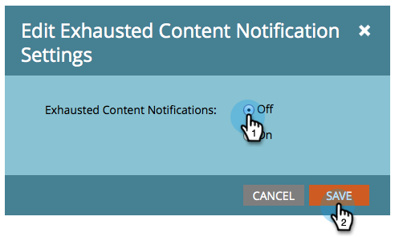

# Abgelaufene Inhaltsbenachrichtigungen deaktivieren und aktivieren {#disable-and-enable-exhausted-content-notifications}

Wenn Benutzer alle Inhalte in einem Stream ausfüllen, kann Marketo Ihnen eine Benachrichtigung senden. Sie können die Benachrichtigungen je nach Bedarf deaktivieren/aktivieren. So geht es.

1. Navigieren Sie zu **Marketingaktivitäten**.

   

1. Wählen Sie ein Interaktionsprogramm aus und klicken Sie auf die Schaltfläche **Einrichtung** Registerkarte.

   

1. Doppelklicken **Abgelaufene Inhaltsbenachrichtigungen**.

   

1. Auswählen **Aus** (oder **on**) und klicken Sie auf **Speichern**.

   

   Super! Wenn Sie Benachrichtigungen aktivieren, sehen Sie etwas im Stream selbst und erhalten eine E-Mail-Benachrichtigung.
