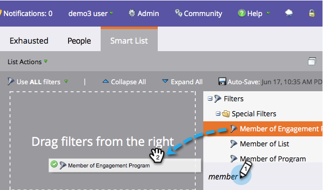
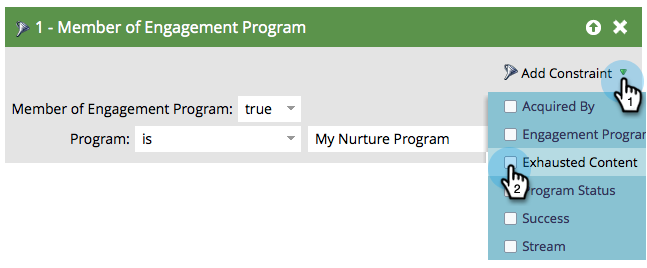

# Personen mit abgelaufenem Inhalt {#people-who-have-exhausted-content}

Wenn eine Person alle Inhalte in einem Stream erhalten hat, hat sie alle Möglichkeiten ausgeschöpft und wartet untätig, bis mehr hinzugefügt wird. Man kann Menschen finden, die auf verschiedene Arten &quot;erschöpft&quot; sind.

## Filter &quot;Mitglied des Interaktionsprogramms&quot; {#member-of-engagement-program-filter}

1. Erstellen Sie eine neue intelligente Liste und ziehen Sie dann den Filter **Mitglied des Interaktionsprogramms** .

   

1. Wählen Sie das Interaktionsprogramm aus, in dem Sie erschöpfte Personen finden.

   

1. Wählen Sie unter **Beschränkung hinzufügen** die Option **Abgelaufener Inhalt** aus.

   

1. Setzen Sie **abgelaufener Inhalt** auf **true**.

   

   Führen Sie einfach diese intelligente Liste aus, um die Liste der Personen anzuzeigen, die alle Inhalte im Stream, in dem sie sich befinden, ausgeschöpft haben.

## Registerkarte &quot;Mitglieder&quot; {#members-tab}

1. Wechseln Sie zu **Marketingaktivitäten**.

   

1. Wählen Sie Ihr Interaktionsprogramm aus und gehen Sie zur Registerkarte **Mitglieder** .

   

1. Beachten Sie die Spalte **Abgelaufener Inhalt**.

   

   Dies zeigt Ihnen Personen, die alle Inhalte erschöpft haben, und diejenigen, die dies nicht getan haben.

## Stream {#stream}

1. Auf der Registerkarte Streams im Stream selbst können Sie außerdem die Gesamtzahl der Personen anzeigen, die keinen Inhalt mehr haben.

   

   >[!NOTE]
   >
   >Diese Zahl wird unmittelbar nach jedem Spiel aktualisiert.
