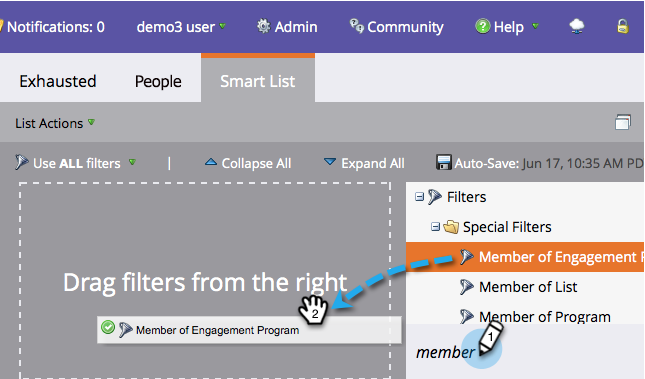
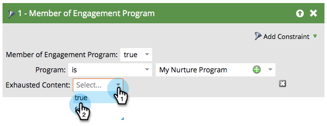
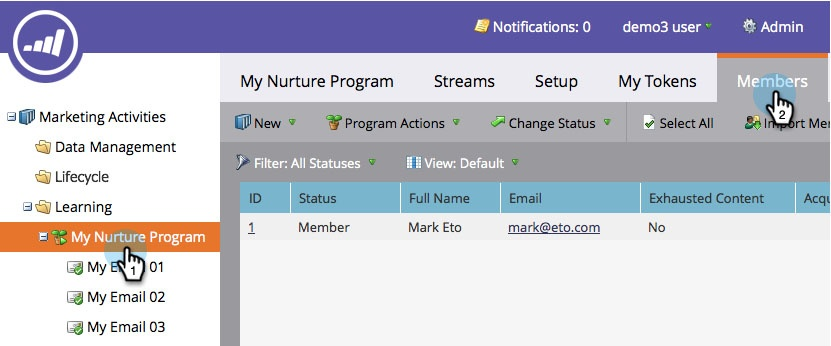
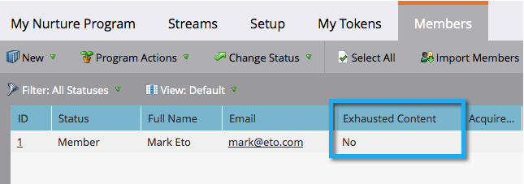
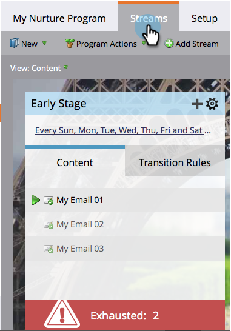

# Personen mit erschöpften Inhalten {#people-who-have-exhausted-content}

Wenn eine Person jedes Inhaltselement in einem Stream erhalten hat, hat sie alle Möglichkeiten ausgeschöpft und wartet inaktiv, bis mehr hinzugefügt wird. Man kann Menschen, die „erschöpft“ sind, auf verschiedene Weise finden.

## Filter „Mitglied des Interaktionsprogramms“ {#member-of-engagement-program-filter}

1. Erstellen Sie eine neue Smart-Liste und suchen Sie dann den Filter **[!UICONTROL Mitglied des Interaktionsprogramms]** und ziehen Sie ihn hinein.

   

1. Suchen Sie das Interaktionsprogramm, in dem erschöpfte Personen gefunden werden können, und wählen Sie es aus.

   

1. Wählen **[!UICONTROL unter &quot;]** hinzufügen“ **[!UICONTROL Erschöpfter Inhalt]**.

   

1. Legen Sie **[!UICONTROL Erschöpfter Inhalt]** auf **[!UICONTROL true]** fest.

   

   Führen Sie einfach diese Smart-Liste aus, um die Liste der Personen anzuzeigen, die alle Inhalte in dem Stream, in dem sie sich befinden, ausgeschöpft haben.

## Mitglieder-Registerkarte {#members-tab}

1. Navigieren Sie zu **[!UICONTROL Marketing-Aktivitäten]**.

   

1. Wählen Sie Ihr Interaktionsprogramm aus und wechseln Sie zur Registerkarte **[!UICONTROL Mitglieder]** .

   

1. Beachten Sie die Spalte **[!UICONTROL Erschöpfter Inhalt]**.

   

   Dies zeigt euch Menschen, die alle Inhalte erschöpft haben und diejenigen, die das nicht getan haben.

## Stream {#stream}

1. Sie können die Gesamtzahl der Personen, die den Inhalt ausgeschöpft haben, auch auf der Registerkarte [!UICONTROL Streams] im Stream selbst sehen.

   

   >[!NOTE]
   >
   >Diese Nummer wird sofort nach jedem Cast aktualisiert.
