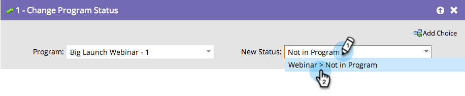

# Entfernen eines Mitglieds aus einem Interaktionsprogramm {#remove-a-member-from-an-engagement-program}

Entschuldigung! Wie sind die Leute da reingekommen? Sie können Mitglieder aus einem Interaktionsprogramm mit dem **[!UICONTROL Programmstatus ändern]** entfernen.

>[!TIP]
>
>Verwenden Sie dies nicht, um Inhalte für eine Person anzuhalten. Dadurch werden alle Zuordnungen in Analytics eliminiert. Erfahren Sie mehr darüber, wie Sie [Personen in einem Interaktionsprogramm anhalten](/help/marketo/product-docs/email-marketing/drip-nurturing/using-engagement-programs/pause-people-in-an-engagement-program.md).

## Flow-Schritt {#flow-step}

1. Ziehen Sie den **[!UICONTROL Programmstatus ändern]** in den Flussschritt.

   

   Wählen Sie den Status **[!UICONTROL Nicht im Programm]**.

   

   Groovy. Alle Mitglieder, die Sie in der [Smart-Liste](/help/marketo/product-docs/core-marketo-concepts/smart-lists-and-static-lists/creating-a-smart-list/create-a-smart-list.md) definiert haben, sind nicht mehr in diesem Interaktionsprogramm.

## Benutzer anhalten  {#pause-people}

Manchmal möchten Sie Personen einfach in einem Interaktionsprogramm anhalten und nicht entfernen. Dies geschieht mit der **[!UICONTROL Kadenz des Änderungsprogramms]**.

>[!MORELIKETHIS]
>
>[Personen in einem Interaktionsprogramm anhalten](/help/marketo/product-docs/email-marketing/drip-nurturing/using-engagement-programs/pause-people-in-an-engagement-program.md)
