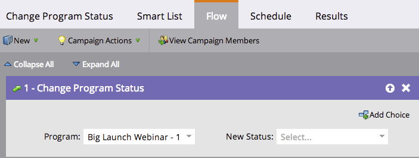

# Entfernen Sie ein Mitglied aus einem Interaktions-Programm {#remove-a-member-from-an-engagement-program}

Ups! Wie sind diese Leute da hineingekommen? Sie können Mitglieder mit dem Textfluss **Programm-Status ändern** aus einem Interaktions-Programm entfernen.

>[!TIP]
>
>Verwenden Sie dies nicht, um Inhalte für eine Person anzuhalten. Dadurch werden alle Zuordnungen in der Analyse beseitigt.  Erfahren Sie mehr darüber, wie [Personen in einem Interaktions-Programm](pause-people-in-an-engagement-program.md) angehalten werden.

## Flussschritt {#flow-step}

1. Ziehen Sie in den Textfluss **Ändern des Programm-Status**.

   

   Wählen Sie den Status **Nicht im Programm**.

   

   Groovy. Alle Mitglieder, die Sie in der [intelligenten Liste](../../../../product-docs/core-marketo-concepts/smart-lists-and-static-lists/creating-a-smart-list/create-a-smart-list.md) definiert haben, befinden sich nicht mehr in diesem Interaktions-Programm.

## Personen {#pause-people} anhalten

Manchmal möchten Sie die Leute einfach in einem Interaktions-Programm anhalten und nicht entfernen. Dies geschieht mit dem Programm **Interaktion ändern - Kadenz**.

>[!MORELIKETHIS]
>
>* [Anhalten von Personen in einem Interaktions-Programm](pause-people-in-an-engagement-program.md)

