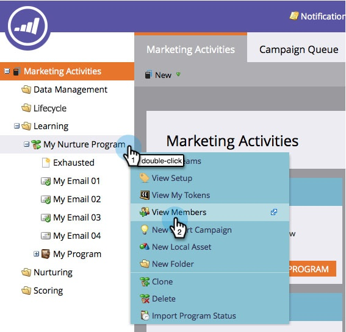

# Siehe „Mitglieder eines Interaktionsprogramms“ {#see-members-of-an-engagement-program}

Sie können die Mitglieder eines Interaktionsprogramms schnell sehen. Und so geht das.

1. Klicken Sie in Ihrem Interaktionsprogramm mit der rechten Maustaste darauf und wählen Sie **[!UICONTROL Mitglieder anzeigen]**.

   

   >[!NOTE]
   >
   >Der [Erschöpfter Inhalt](/help/marketo/product-docs/email-marketing/drip-nurturing/creating-an-engagement-program/understanding-engagement-programs.md) Spaltenwert wird nach jeder Umwandlung aktualisiert.

1. Sie können nun alle Mitglieder Ihres Programms sehen.

   
