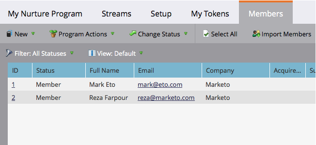

# Siehe Mitglieder eines Interaktionsmediums {#see-members-of-an-engagement-program}

Sie können schnell die Mitglieder eines Interaktions-Programms sehen. So geht es.

1. Klicken Sie in Ihrem Interaktions-Programm mit der rechten Maustaste und wählen Sie **Ansichten-Mitglieder.**

   

   >[!NOTE]
   >
   >Der Spaltenwert [Abgelaufener Inhalt](../../../../product-docs/email-marketing/drip-nurturing/creating-an-engagement-program/understanding-engagement-programs.md) wird nach jeder Besetzung aktualisiert.

1. Sie können nun alle Mitglieder Ihres Programms sehen.

   

