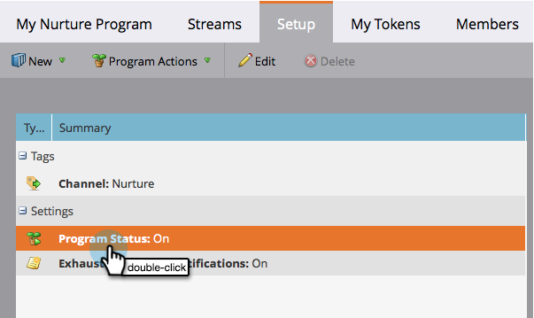

# Aktivieren und Deaktivieren eines Interaktionsprogramms {#turn-an-engagement-program-on-and-off}

Sie können ein Interaktionsprogramm mit einem Mausklick deaktivieren. Dadurch wird verhindert, dass Inhalte gesendet werden. So geht&#39;s.

1. Navigieren Sie **Marketing-Aktivitäten**.

   

1. Wählen Sie das Interaktionsprogramm aus und klicken Sie auf **Setup**.

   >[!NOTE]
   >
   >Interaktionsprogramme sind standardmäßig aktiviert, es sei denn, Sie überschreiten Ihr Abonnementlimit.

   

1. Doppelklicken Sie auf **Programmstatus**.

   

1. Wählen Sie **Aus** und klicken Sie auf **Speichern**.

   

Los geht&#39;s! Sie können sie in den gleichen Schritten wieder aktivieren.
