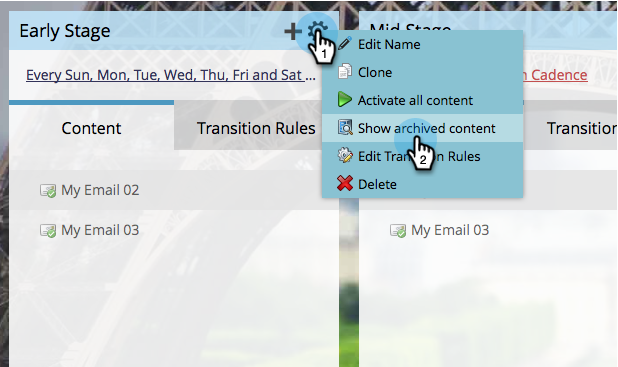

# Archivieren und Aufheben der Archivierung von Stream-Inhalten {#archive-and-unarchive-stream-content}

Wenn Sie ein Inhaltselement nicht mehr in einem Stream verwenden möchten, können Sie es entweder [entfernen](/help/marketo/product-docs/email-marketing/drip-nurturing/using-stream-content/remove-stream-content.md) oder archivieren. So archivieren Sie Inhalte.

>[!TIP]
>
>Durch Entfernen wird der gesamte verknüpfte Verlauf zerstört, er bleibt bei der Archivierung erhalten.

## Stream-Inhalte archivieren {#archive-stream-content}

1. Wählen Sie Ihr Interaktionsprogramm aus und wechseln Sie zur Registerkarte **[!UICONTROL Streams]** .

   

1. Bewegen Sie den Mauszeiger über die E-Mail, die Sie archivieren möchten, und klicken Sie dann unter dem Zahnradsymbol auf **[!UICONTROL Archivieren]**.

   

   Das ist alles! Denken Sie daran, Archiv, wenn Sie die Geschichte bewahren wollen.

## Archivierung von Stream-Inhalten aufheben {#unarchive-stream-content}

1. Wählen Sie Ihr Interaktionsprogramm aus und wechseln Sie zur Registerkarte **[!UICONTROL Streams]** .

   

1. Klicken Sie auf das Zahnradsymbol für Ihren Stream und dann auf **[!UICONTROL Archivierten Inhalt anzeigen]**.

   

1. Jetzt, da Sie den archivierten Inhalt sehen können, klicken Sie auf das Zahnradsymbol für den Inhalt, dessen Archivierung Sie aufheben möchten, und klicken Sie dann auf **[!UICONTROL Archivierung aufheben]**.

   

   Perfekt! Jetzt kann dieser Inhalt priorisiert und aktiviert werden.
