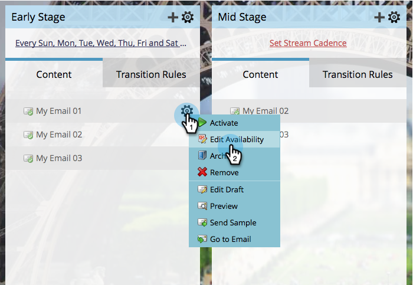

# Verfügbarkeit von Stream-Inhalten bearbeiten {#edit-availability-of-stream-content}

Sie können einen Zeitrahmen festlegen, innerhalb dessen der Inhalt in Ihrem Stream aktiv sein soll. So geht es.

1. Wählen Sie Ihr Interaktionsprogramm aus und navigieren Sie zu **Streams** Registerkarte.

   

1. Klicken Sie auf das Zahnradsymbol für das Inhaltselement, das Sie planen möchten, und wählen Sie dann **Verfügbarkeit bearbeiten**.

   

1. Wählen Sie **Aktiv ab** date, dann die **Aktiv bis** Datum und Klicken **Speichern**.

   

   >[!TIP]
   >
   >Sie können **Aktiv bis** leer, um Inhalte für immer verfügbar zu machen.

   Perfekt! Neben dem geplanten Inhalt wird das Uhrensymbol angezeigt. Sie wird entsprechend dem von Ihnen festgelegten Zeitplan aktiv und inaktiv.

   
