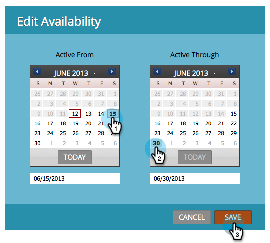

# Bearbeiten der Verfügbarkeit von Stream-Content {#edit-availability-of-stream-content}

Sie können einen Zeitrahmen festlegen, in dem der Inhalt in Ihrem Stream aktiv sein soll. So geht&#39;s.

1. Wählen Sie Ihr Interaktionsprogramm aus und wechseln Sie zur Registerkarte **[!UICONTROL Streams]** .

   

1. Klicken Sie auf das Zahnradsymbol für das Inhaltselement, das Sie planen möchten, und wählen Sie dann **[!UICONTROL Verfügbarkeit bearbeiten]**.

   

1. Wählen Sie Ihr **[!UICONTROL Aktives Von]**-Datum und dann das **[!UICONTROL Aktiv]** Bis-Datum aus und klicken Sie auf **[!UICONTROL Speichern]**.

   

   >[!TIP]
   >
   >Sie können **[!UICONTROL Aktiv durch]** leer lassen, um Inhalte für immer verfügbar zu machen.

   Neben dem geplanten Inhalt wird das Uhrensymbol angezeigt. Er wird gemäß dem von Ihnen festgelegten Zeitplan aktiv und inaktiv.

   
