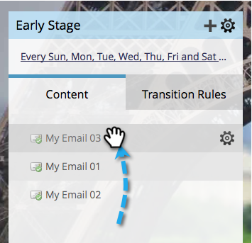

# Priorisieren von Stream-Inhalten {#prioritize-stream-content}

Nachdem Sie Inhalte zu Ihrem Stream hinzugefügt haben, sollten Sie die Priorität ändern. Der Inhalt wird bei jeder Besetzung immer von oben nach unten bereitgestellt, und es werden keine Inhalte zweimal an dieselbe Person gesendet.

1. Navigieren Sie zu **[!UICONTROL Marketing-Aktivitäten]**.

   

1. Wählen Sie Ihr Interaktionsprogramm aus und klicken Sie auf die Registerkarte **[!UICONTROL Streams]**.

   

1. Ziehen Sie den Inhalt per Drag-and-Drop in die gewünschte Reihenfolge.

   

   >[!NOTE]
   >
   >Die Priorität wird zum Zeitpunkt der Umwandlung immer von oben nach unten gelesen.

