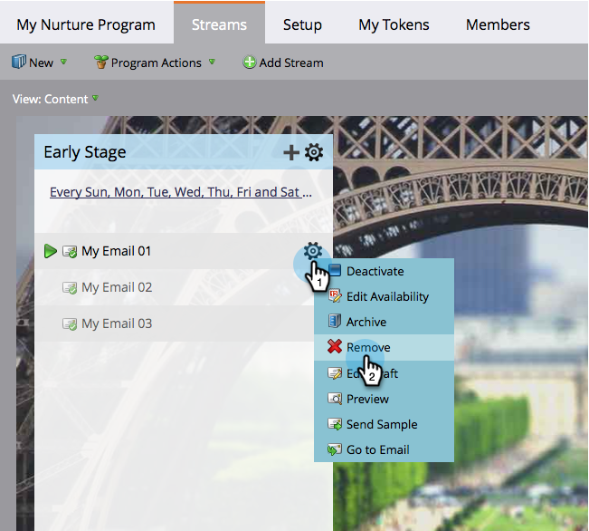

# Entfernen von Stream-Inhalten {#remove-stream-content}

Sie können ein Inhaltselement entweder entfernen oder archivieren. Im Gegensatz zum Entfernen von Stream[Inhalten behält &#x200B;](/help/marketo/product-docs/email-marketing/drip-nurturing/using-stream-content/archive-and-unarchive-stream-content.md)Archivierung) den gesamten mit dem Inhalt verknüpften Verlauf bei. Wenn Sie nichts dagegen haben, den historischen Status einiger Inhalte zu verlieren und ihn entfernen möchten, finden Sie hier eine Anleitung.

1. Navigieren Sie zu **[!UICONTROL Marketing-Aktivitäten]**.

   

1. Wählen Sie Ihr Interaktionsprogramm aus und klicken Sie dann auf die Registerkarte **[!UICONTROL Streams]**.

   

1. Bewegen Sie den Mauszeiger über den Inhalt, den Sie entfernen möchten, klicken Sie auf das Zahnradsymbol, wenn es angezeigt wird, und klicken Sie auf **[!UICONTROL Entfernen]**.

   

   >[!CAUTION]
   >
   >Entfernen Sie Inhalte nur, wenn Ihnen der Verlauf egal ist. Wenn Sie die Geschichte erhalten möchten, [&#x200B; Sie sie &#x200B;](/help/marketo/product-docs/email-marketing/drip-nurturing/using-stream-content/archive-and-unarchive-stream-content.md).

   Jetzt wissen Sie, wie Sie ein Inhaltselement entfernen können.
