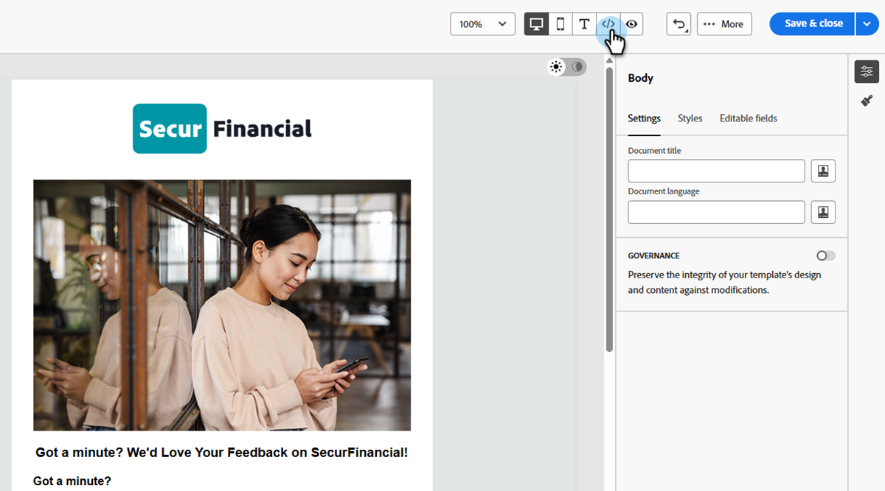
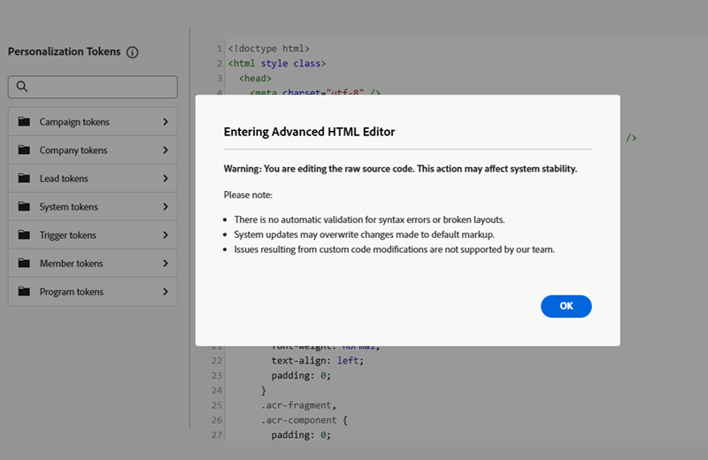
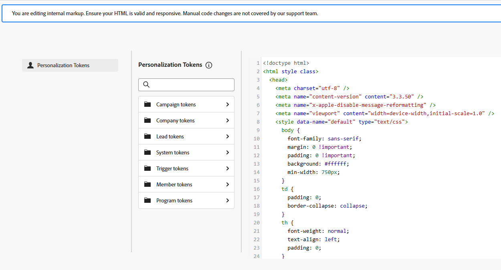

# Bearbeiten von E-Mail-Vorlagen mit dem erweiterten HTML-Editor {#advanced-html-mode}

Im erweiterten HTML-Modus können Sie den Roh-Quell-Code von E-Mail-Vorlagen direkt über die [!DNL Marketo Engage] E-Mail-Designer-Benutzeroberfläche anzeigen und bearbeiten.

Mit dieser Funktion können Sie erweiterte Ausdrücke direkt in die Quelle einfügen. Wenn Sie zur visuellen Ansicht (Desktop) zurückkehren, wird der Inhalt erneut gerendert, damit Sie überprüfen können, wie er aussieht, und die Bearbeitung in jeder Ansicht fortsetzen können.

## Schutzmechanismen {#guardrails}

Wenn Sie den erweiterten HTML-Editor verwenden, schützen die folgenden Leitplanken die Inhaltskompatibilität und definieren Erwartungen.

* Der erweiterte HTML-Editor **validiert** Code nicht. Syntaxfehler oder fehlerhafte Layouts werden nicht geprüft. Überprüfen Sie Ihre Inhalte sorgfältig, bevor Sie sie speichern.

* Zukünftige Systemaktualisierungen können Änderungen überschreiben, die Sie am Standard-Markup vornehmen. **Ihre Änderungen bleiben möglicherweise nicht erhalten**.

* [!DNL Adobe] Support **kann Probleme nicht beheben oder**), die durch benutzerdefinierten Code und manuelle Änderungen verursacht werden. Erstellen Sie eine Sicherungskopie Ihres Inhalts, für den Fall, dass Sie ihn wiederherstellen müssen.

* In der erweiterten HTML-Ansicht können keine Inhalte simuliert werden. Zur Desktop-Ansicht wechseln, um eine Vorschau des Inhalts anzuzeigen.

* Um die Inhaltskompatibilität sicherzustellen, **Sie können nicht speichern** in der erweiterten HTML-Ansicht. Wechseln Sie zurück zur Desktop-Ansicht, wenn Sie zum Speichern Ihrer Änderungen bereit sind.

## Zugriff auf den erweiterten HTML-Modus {#access-html-mode}

Gehen Sie wie folgt vor, um den erweiterten HTML-Editor zu öffnen und Ihre Vorlagenquelle zu bearbeiten.

1. Öffnen oder [Erstellen einer E-Mail](/help/marketo/product-docs/email-marketing/email-designer/email-template-authoring.md#create-an-email-template)Vorlage in der E-Mail-Designer.

1. Klicken Sie _Bildschirm „E_ Mail-Vorlage bearbeiten“ oben rechts auf die Schaltfläche HTML .

   {width="800" zoomable="yes"}

1. Beim ersten Öffnen des erweiterten HTML-Editors wird eine Warnmeldung angezeigt. Klicken Sie abschließend **[!UICONTROL OK]**.

   

   >[!NOTE]
   >
   >Diese Warnung wird angezeigt, wenn Sie den erweiterten HTML-Editor zum ersten Mal öffnen und monatlich zurücksetzen.

1. Der erweiterte HTML-Editor wird angezeigt.

   {width="800" zoomable="yes"}

1. Fügen Sie die gewünschten Änderungen an Ihrem E-Mail-Inhalt hinzu.

   >[!WARNING]
   >
   >Achten Sie darauf, den richtigen HTML- und CSS-Code einzugeben, da es keinen Syntaxvalidierungsprozess gibt und der Adobe-Support HTML-Bearbeitungen nicht unterstützen kann.

1. Inhaltssimulation und -speicherung sind in der erweiterten HTML-Ansicht aus Kompatibilitätsgründen nicht verfügbar. Wechseln Sie zurück zur Desktop-Ansicht, um eine Vorschau Ihres Inhalts anzuzeigen und Ihre Änderungen zu speichern.

   {width="800" zoomable="yes"}

   >[!NOTE]
   >
   >Ihre Bearbeitungen bleiben beim Wechseln der Ansichten erhalten.
