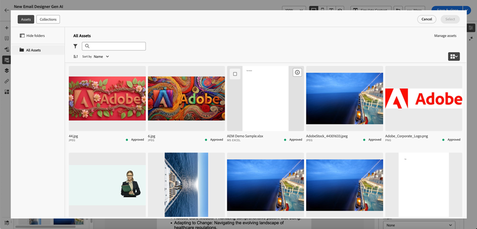

# Arbeiten mit Experience Manager-Assets {#work-with-experience-manager-assets}

Mithilfe von Adobe Experience Manager Assets können Sie Marketing- und Kreativ-Workflows zusammenführen. Sie ist nativ in Marketo Engage integriert, sodass Sie einfach auf _Assets as a Cloud Service_ zugreifen können, um digitale Assets zu entdecken und zum Ausfüllen Ihrer Nachrichten zu verwenden.

Adobe Experience Manager _Assets as a Cloud Service_ bietet eine benutzerfreundliche Cloud-Lösung für effizientes Digital Asset Management und Dynamic Media-Betrieb. Weitere Informationen finden Sie in der Dokumentation zu [&#128279;](https://experienceleague.adobe.com/de/docs/experience-manager-cloud-service/content/assets/overview)Adobe Experience Manager as a Cloud Service.

>[!PREREQUISITES]
>
>* Lizenzen für _Assets as a Cloud Service_ und Dynamic Media sind für die Integration erforderlich. Stellen Sie sicher[ dass „Dynamic Media mit Open API aktiviert ist](https://experienceleague.adobe.com/de/docs/experience-manager-cloud-service/content/assets/dynamicmedia/dynamic-media-open-apis/dynamic-media-open-apis-overview#enable-dynamic-media-open-apis). Je nach Vertrag und Konfiguration ist der Zugriff auf Adobe Experience Manager _Assets as a Cloud Service_ beim Entwerfen visueller Inhalte direkt über Marketo Engage möglich.

>[!NOTE]
>
>Derzeit werden in Marketo Engage nur Bild-Assets von _0&rbrace;Adobe Experience Manager Assets unterstützt._ Änderungen an den Assets müssen über das zentrale Adobe Experience Manager Assets-Repository vorgenommen werden. [Weitere Informationen](https://experienceleague.adobe.com/de/docs/experience-manager-cloud-service/content/assets/manage/manage-digital-assets){target="_blank"}

## Link zu Ihren AEM Cloud Services {#link-to-your-aem-cloud-services}

Bevor Sie diese Funktion verwenden können, müssen Sie zunächst AEM Cloud Services mit Adobe Marketo Engage verknüpfen.

+++AEM Cloud Services und Marketo Engage verknüpfen

>[!NOTE]
>
>**Administratorberechtigungen erforderlich**

1. Wechseln Sie in Marketo Engage zum Bereich **Admin** und wählen Sie **Adobe Experience Manager** in der linken Navigationsstruktur aus.

   {width="800" zoomable="yes"}

1. Klicken Sie **Bearbeiten** neben _Adobe Experience Manager Cloud Services_.

   {width="400" zoomable="yes"}

1. Ein oder mehrere Repositorys auswählen.

   {width="800" zoomable="yes"}

   >[!NOTE]
   >
   >* Es werden nur Repositorys aufgelistet, die derselben IMS-Organisation zugeordnet wurden wie Ihr Marketo Engage-Abonnement.
   >
   >* Marketo Engage unterstützt nur Repositorys aus der Bereitstellungsebene. Wenn Sie die Autorenebene verwenden und diese konvertieren möchten, wenden Sie sich an den [Adobe Experience Manager-Support](https://experienceleague.adobe.com/de/docs/experience-manager-cloud-manager/content/overview/help-resources).

1. Sie müssen ein [Dienstanmeldeinformationszertifikat“ hinzufügen](https://experienceleague.adobe.com/de/docs/experience-manager-learn/getting-started-with-aem-headless/authentication/service-credentials) um das Repository zu konfigurieren. Klicken Sie auf die Schaltfläche **+ Zertifikat hinzufügen**.

   {width="800" zoomable="yes"}

1. Ziehen Sie Ihr Zertifikat per Drag-and-Drop (nur JSON-Datei) oder wählen Sie es von Ihrem Computer aus. Klicken Sie abschließend **Hinzufügen**.

   {width="600" zoomable="yes"}

1. Das konfigurierte Repository wird unten zusammen mit Status und Gültigkeit angezeigt. Klicken Sie auf die Schaltfläche mit den Auslassungspunkten (**…**), um das Zertifikat anzuzeigen. Andernfalls sind Sie fertig.

   {width="700" zoomable="yes"}

Jetzt können alle Bilder aus der Digital Asset Management-Bibliothek in diesem Repository über die Marketo Engage E-Mail-Designer aufgerufen werden.

+++

## Arbeiten mit AEM-Assets {#working-with-aem-assets}

Wenn Sie diese digitalen Assets verwenden, werden die neuesten Änderungen in _Assets as a Cloud Service_ über verknüpfte Verweise automatisch an Live-E-Mail-Kampagnen weitergegeben. Wenn Bilder in _Adobe Experience Manager Assets as a Cloud Service_ gelöscht werden, werden sie in Ihren E-Mails mit einem beschädigten Verweis angezeigt. Wenn Assets, die derzeit in Marketo Engage verwendet werden, geändert oder gelöscht werden, werden die E-Mail-Autoren über die Bildänderungen benachrichtigt. Alle Änderungen an den Assets müssen im Adobe Experience Manager Assets Central Repository vorgenommen werden.

### Verwenden von AEM Assets als Bildquelle {#use-aem-assets-as-the-image-source}

Wenn Ihre Umgebung über eine oder mehrere Asset-Repository-Verbindungen verfügt, können Sie AEM Assets als Quelle für Assets festlegen, wenn Sie Details für eine E-Mail, E-Mail-Vorlage oder ein visuelles Fragment erstellen oder anzeigen.

* Wählen Sie beim Erstellen neuer Inhalte `AEM Assets` als **[!UICONTROL Image Source]**-Element im Dialogfeld aus.

{width="400" zoomable="yes"}

* Wählen Sie beim Öffnen einer vorhandenen Inhaltsressource `AEM Assets` im Bereich _[!UICONTROL Hauptteil]_ auf der rechten Seite.

{width="700" zoomable="yes"}

### Zugriff auf Assets für das Authoring {#access-assets-for-authoring}

>[!IMPORTANT]
>
>Ein Administrator muss Benutzer, die Zugriff auf Assets benötigen, zu den Produktprofilen &quot;Assets Consumer Users“ und/oder &quot;Assets Users“ hinzufügen. [Weitere Informationen](https://experienceleague.adobe.com/de/docs/experience-manager-cloud-service/content/security/ims-support#managing-products-and-user-access-in-admin-console)

Klicken Sie im visuellen Inhaltseditor auf das Symbol _Experience Manager Asset-_ in der linken Seitenleiste. Dadurch wird das Bedienfeld „Tools“ in eine Liste der verfügbaren Assets im ausgewählten Repository geändert.

{width="700" zoomable="yes"}

Wenn Sie über mehr als ein verbundenes AEM-Repository verfügen, klicken Sie auf die Schaltfläche **[!UICONTROL Verwalten als]**, um das Repository auszuwählen, das Sie verwenden möchten.

{width="700" zoomable="yes"}

Wählen Sie das gewünschte Repository aus.

{width="500" zoomable="yes"}

Es gibt mehrere Methoden zum Hinzufügen eines Bild-Assets zur visuellen Arbeitsfläche:

* Ziehen Sie eine Miniaturansicht per Drag-and-Drop aus dem linken Navigationsbereich.

{width="700" zoomable="yes"}

* Fügen Sie der Arbeitsfläche eine Bildkomponente hinzu und klicken Sie auf **[!UICONTROL Durchsuchen]**, um das Dialogfeld _[!UICONTROL Assets auswählen]_ zu öffnen.

  Im Dialogfeld können Sie ein Bild aus dem ausgewählten Repository auswählen.

  Es stehen mehrere Tools zur Verfügung, mit denen Sie das benötigte Asset finden können.

{width="700" zoomable="yes"}

* Ändern Sie **[!UICONTROL Repository]** oben rechts.

* Klicken Sie **[!UICONTROL oben rechts auf]** Assets verwalten“, um das Assets-Repository in einer anderen Browser-Registerkarte zu öffnen und AEM Assets-Verwaltungstools zu verwenden.

* Klicken Sie oben rechts auf _Ansichtstyp_, um die Anzeige in **[!UICONTROL Listenansicht]**, **[!UICONTROL Rasteransicht]**, **[!UICONTROL Galerieansicht]** oder **[!UICONTROL Wasserfallansicht]** zu ändern.

* Klicken Sie auf _Symbol „Sortierreihenfolge_, um die Sortierreihenfolge zwischen aufsteigender und absteigender Reihenfolge zu ändern.

* Klicken Sie auf **[!UICONTROL Menüpfeil]** Sortieren nach“, um die Sortierkriterien in **[!UICONTROL Name]**, **[!UICONTROL Size]** oder **[!UICONTROL Modified]** zu ändern.

* Klicken Sie _oben links auf_ Filter), um die angezeigten Elemente nach Ihren Kriterien zu filtern.

* Geben Sie im Suchfeld Text ein, um die angezeigten Elemente nach einer Übereinstimmung mit dem Asset-Namen zu filtern.

{width="700" zoomable="yes"}
