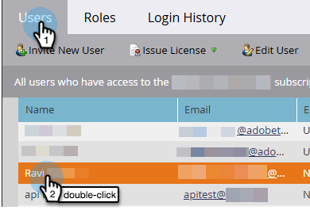

# Verwenden des KI-Assistenten {#use-ai-assistant}

Der KI-Assistent in der Marketo Engage Email Designer hilft Ihnen beim Erstellen zeitgemäßer, leistungsstarker und intuitiver E-Mails. Dies wird durch die generative KI-Technologie und die Prompt-Bibliothek von Adobe zusammen mit Firefly für die Bildgenerierung erreicht, die bei der Erstellung geeigneter Inhalte für eine bestimmte Rolle/Einkaufsgruppe, Marketing-Journey-Phase, Kommunikationsstrategie, Ton usw. hilft. Bestimmte Marken-Assets können auch zum Erstellen von Inhalten verwendet werden.

>[!PREREQUISITES]
>
>Der KI-Assistent ist nicht standardmäßig aktiviert. Sie müssen zunächst den [Core Gen-AI-Bedingungen und den Zusatzbedingungen](https://www.adobe.com/legal/terms/enterprise-licensing/genai-ww.html){target="_blank"} zustimmen, um die Gen-AI-Funktion in E-Mail-Designer nutzen zu können. Weitere Informationen erhalten Sie beim Adobe Account Team (Ihrem Account Manager).

## Berechtigungen einrichten {#set-up-permissions}

_Nach_ der oben genannten Voraussetzung müssen Marketo-Admins Zugriff auf bestimmte Benutzende/Rollen anwenden, bevor Benutzende die GenAI-Schaltflächen sehen.

1. Klicken Sie in Marketo Engage auf **Admin** und wählen Sie **Benutzer und Rollen** aus.

   

1. Doppelklicken Sie auf **Registerkarte** Rollen“ auf die gewünschte Rolle.

   

1. Aktivieren _unter „Access Design_&quot; das Kontrollkästchen **Access AI Assistant** und klicken Sie auf **Speichern**.

   

1. Klicken Sie auf die Registerkarte Benutzer und wählen Sie den Benutzer aus, dem Sie Zugriff gewähren möchten.

   

1. Wählen Sie die in Schritt 3 ausgewählte Rolle und ggf. den gewünschten Arbeitsbereich aus. Klicken Sie auf **Speichern**.

   

## Anwendungsszenarien {#use-cases}

Es gibt drei primäre Anwendungsfälle für AI Assistant:

* [Erstellen einer Betreffzeile](#create-a-subject-line) für Ihre E-Mail
* [Inhalt für einen bestimmten Abschnitt erstellen](#create-content-for-a-specific-section) Ihrer E-Mail
* [Erstellen einer ganzen E-](#create-an-entire-email) aus einer ausgewählten Vorlage

## Erstellen einer Betreffzeile {#create-a-subject-line}

Wenn eine E-Mail mit der neuen E-Mail-Designer erstellt wird, geben Sie eine temporäre Betreffzeile ein.

Nachdem die E-Mail erstellt wurde, befindet sich die Betreffzeile in der Spalte _Details_ auf der rechten Seite. Klicken Sie auf die Schaltfläche „KI-AssistentFiltersymbol) daneben, um Hilfe bei der Erstellung einer neuen Betreffzeile mit der Funktion „KI generieren“ zu erhalten.

Aktivieren Sie die Option **Referenzinhalt verwenden** für den KI-Assistenten, um neue Inhalte basierend auf dem ausgewählten Inhalt zu personalisieren.

Geben Sie die Eingabeaufforderung ein, um die Betreffzeile anzupassen. Geben Sie relevante Texteinstellungen ein und laden Sie alle Marken-Assets hoch, die Sie als Referenz zum Erstellen einer entsprechenden Betreffzeile verwenden möchten.

Zu den Texteinstellungen gehören:

<table><tbody>
  <tr>
    <td style="width:25%"><b>Käufergruppe</b></td>
    <td>Spezifische Einkaufsgruppe, an die Sie sich wenden (z. B. Anwender, Influencer, Entscheidungsträger).</td>
  </tr>
  <tr>
    <td style="width:25%"><b>Marketing-Journey-Schritt</b></td>
    <td>Empfängerinnen und Empfänger in einer bestimmten Marketing-Journey-Phase (z. B. Entdecken, Auswerten, Bestätigen).</td>
  </tr>
  <tr>
    <td style="width:25%"><b>Kommunikationsstrategie</b></td>
    <td>Das Ziel der Mitteilung (z. B. Dringlichkeit, sozialer Beweis, informativ).</td>
  </tr>
  <tr>
    <td style="width:25%"><b>Sprache</b></td>
    <td>Sprache, in der die Betreffzeile generiert werden soll.</td>
  </tr>
  <tr>
    <td style="width:25%"><b>Ton</b></td>
    <td>Ton, in dem der Inhalt generiert werden soll (z. B. inspirierend, aufregend, humorvoll).</td>
  </tr>
  <tr>
    <td style="width:25%"><b>Emojis</b></td>
    <td>Ermöglicht das Einfügen von Emojis in den generierten Inhalt.</td>
  </tr>
</tbody>
</table>

Wenn Sie auf **Generieren** klicken, werden Beispiele angezeigt, aus denen Sie auswählen können:

Sie können auch ein Marken-Asset hochladen, um Inhalte innerhalb des Assets als Referenz zum Erstellen der Betreffzeile zu verwenden.

Um eine Variante auszuwählen, aktivieren Sie das entsprechende Kontrollkästchen und klicken Sie auf **Auswählen**. Sie können sie auch anpassen, indem Sie auf &quot;**&quot;**. Zusätzlich können Sie Feedback geben, indem Sie auf die Daumen nach oben oder die Daumen nach unten klicken, damit die Gen-AI-Technologie Ihre Präferenzen erfährt.

Nachdem Sie Ihre Auswahl getroffen haben, wird die Betreffzeile in Ihren E-Mail-Details ausgefüllt.

## Erstellen von Inhalten für einen bestimmten Abschnitt Ihrer E-Mail {#create-content-for-a-specific-section}

Nachdem die E-Mail erstellt wurde, haben Sie die Möglichkeit, bestimmte Abschnitte, Bilder oder Texte zu ändern.

In diesem Beispiel verwenden wir eine Gesundheitsvorlage. Wenn das vorhandene Bild des Gesundheitsexperten nicht Ihren Anforderungen entspricht, können Sie den KI-Assistenten anweisen, ein eigenes Bild eines Gesundheitsexperten zu erstellen. Wählen Sie einfach den Bildinhalt aus und klicken Sie dann auf KI-Assistent.

Geben Sie die relevanten Details in der Eingabeaufforderung ein, z. B. „Bild für einen Gesundheitsexperten generieren“, und fügen Sie die gewünschte Anpassung hinzu. Sie können auch die Bibliothek der Eingabeaufforderung (rechts neben der Eingabeaufforderung) verwenden, wenn Sie sich nicht sicher sind, was Sie eingeben sollen.

Nach dem Klicken auf **Generieren** werden mehrere Varianten erstellt, aus denen Sie wählen können.

Ähnlich wie Bilder können auch Textabschnitte der E-Mail geändert werden.

## Gesamte E-Mail aus einer ausgewählten Vorlage erstellen {#create-an-entire-email}

Diese Option ist nur verfügbar, wenn die E-Mail mit einer vorhandenen Vorlage erstellt wurde. Dabei kann es sich um eine Standardvorlage handeln, die von der E-Mail-Designer bereitgestellt wird, um eine bereits erstellte gespeicherte Vorlage oder um eine importierte Vorlage mit der Option &quot;HTML importieren“. Diese Option ist nicht verfügbar, wenn Sie für Ihre E[Mail „Von Grund auf gestalten](/help/marketo/product-docs/email-marketing/email-designer/email-authoring.md#design-from-scratch) auswählen.

Wählen Sie eine Vorlage aus, ohne eine Komponente in der Vorlage auszuwählen, und klicken Sie in der E-Mail-Designer auf die Schaltfläche KI-Assistent .

Geben Sie die entsprechende Eingabeaufforderung ein und wählen Sie die Texteinstellungen, Marken-Assets und alle Bildeinstellungen aus, die Sie für Ihre E-Mail benötigen.

Wenn Sie Bilder mit Firefly generieren möchten, wählen Sie die Bildeinstellungen aus und klicken Sie auf den Umschalter für **Bilder mit KI generieren**.

Wählen Sie den gewünschten _Inhaltstyp_, _Farbe und Ton_, _Beleuchtung_ und _Komposition_ aus, um Gen-AI-Bilder für Ihre E-Mail zu erstellen. Klicken Sie abschließend **Generieren**.

Sehen Sie, wie eine Variante in Ihrer E-Mail aussieht, indem Sie auf **Vorschau** klicken. Wählen Sie eine Variante aus, indem Sie auf **Übernehmen** klicken.
