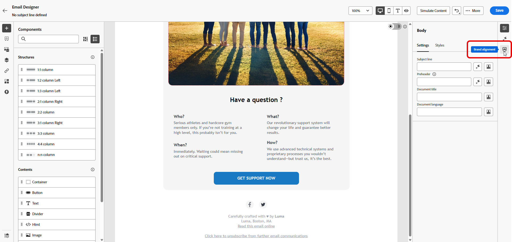
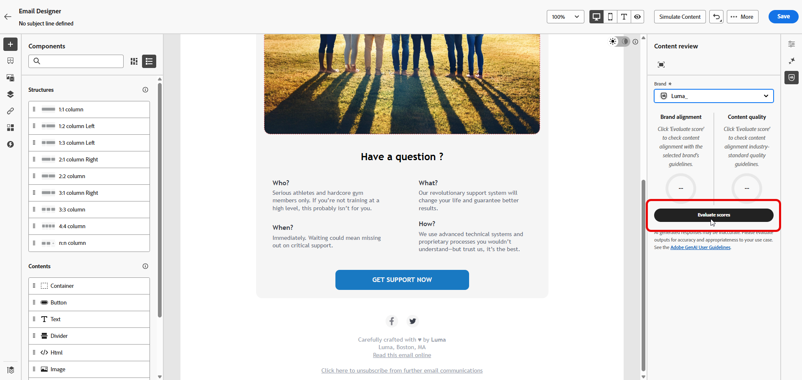
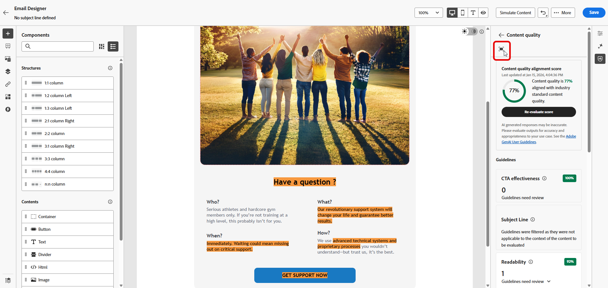
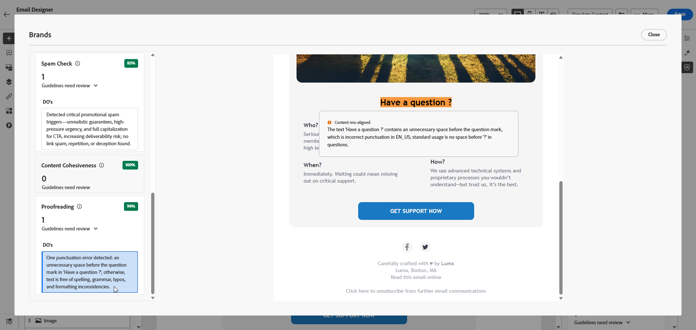

# Markenbewertung {#brand-score}

Die Überprüfung der Markenbewertung gewährleistet Konsistenz in Bezug auf Ton, Messaging und visuelle Identität in Ihren E-Mail-Kampagnen und dient als Qualitätsprüfung vor der Live-Schaltung Ihres Inhalts.

>[!AVAILABILITY]
>
>Sie müssen der [Benutzervereinbarung“ zustimmen](https://www.adobe.com/legal/licenses-terms/adobe-dx-gen-ai-user-guidelines.html){target="_blank"}{target="_blank"} bevor Sie den KI-Assistenten in Adobe Marketo Engage verwenden können. Weitere Informationen erhalten Sie beim Adobe-Support.

## Validieren von Inhalten mit Markenausrichtung {#validate-content}

Nachdem Sie Ihre Marke [eingerichtet und veröffentlicht) haben](/help/marketo/product-docs/email-marketing/email-designer/brands/manage-brands.md#create-brand-kit){target="_blank"} bewerten Sie die Markenausrichtung direkt in Ihrer E-Mail-Kampagne, um sicherzustellen, dass Ihr Inhalt mit Ihren Markenrichtlinien übereinstimmt.

1. Klicken Sie in Ihrer E-Mail auf das Symbol **[!UICONTROL Markenausrichtung]** .

   Ihr Inhalt bewertet automatisch Ihre [Standardmarke](/help/marketo/product-docs/email-marketing/email-designer/brands/manage-brands.md#default-brand){target="_blank"}.

   {width="800" zoomable="yes"}

1. Zum Abgleich mit einer anderen Marke wählen Sie diese aus dem Dropdown-Menü **[!UICONTROL Marke]** aus und klicken Sie auf **[!UICONTROL Wert auswerten]**.

   {width="800" zoomable="yes"}

1. Durchsuchen Sie den Bereich **[!UICONTROL Schreibstil]** oder **[!UICONTROL Visuelle Inhalte]**, um weitere Erkenntnisse zu Ihrer Bewertung zu erhalten.

   {width="800" zoomable="yes"}

1. Klicken Sie auf das , um eine detaillierte Ansicht Ihrer Qualitätsbewertung zu erhalten.

   {width="800" zoomable="yes"}

1. Wählen Sie eine gekennzeichnete Richtlinie aus, um spezifisches Feedback und Vorschläge anzuzeigen. Die Markenausrichtung bewertet die folgenden Kategorien:

   * **[!UICONTROL Schreibstil]**:
     * **[!UICONTROL Stil für Markenkommunikation]**: Definiert die Persönlichkeit und den emotionalen Ton, um eine einheitliche Markensprache über alle Kanäle hinweg sicherzustellen.
     * **[!UICONTROL Markenbotschaftsstandards]**: Strukturelle und formatierungsbezogene Regeln für effektive Marketing- und Werbetexte.
     * **[!UICONTROL Standards zur Einhaltung gesetzlicher Vorschriften]**: Stellt sicher, dass alle Kommunikationen den rechtlichen Anforderungen entsprechen, einschließlich Textplatzierung und Compliance-Checklisten.

   * **[!UICONTROL Visuelle Inhalte]**:
     * **[!UICONTROL Fotografiestandards]**: Anforderungen an fotografische Inhalte, einschließlich Auflösung, Komposition, Beleuchtung und Dateiformaten.
     * **[!UICONTROL Illustrationsstandards]**: Stilparameter, Linienstärken, Farbverwendung und Dateiformatanforderungen für Illustrationen.
     * **[!UICONTROL Symbolstandards]**: Spezifikationen für die Symbolgestaltung, einschließlich Rastersystemen, Strichstärken und der Größe, um Einheitlichkeit sicherzustellen.
     * **[!UICONTROL Nutzungsrichtlinien]**: Best Practices für Bildauswahl, Platzierung und Kontext, um die Markenidentität zu wahren.

   {width="800" zoomable="yes"}

1. Bearbeiten Sie Ihre Inhalte auf der Grundlage der Empfehlungen, um die Markenausrichtung zu verbessern.

1. Werten Sie den Inhalt manuell neu aus, nachdem Sie Änderungen vorgenommen haben, um Ihren Ausrichtungswert zu aktualisieren.

## Validieren der Inhaltsqualität {#validate-quality}

>[!NOTE]
>
>Die Bewertung der Inhaltsqualität ist unabhängig von den Markenrichtlinien. Auch wenn eine Marke im Dropdown-Menü ausgewählt wird, werden ihre Richtlinien nicht auf die Qualitätsprüfung angewendet. Die Markenauswahl ist nur für die Bewertung der Markenausrichtung relevant.

Zusätzlich zur Markenausrichtung können Sie die allgemeine Inhaltsqualität bewerten, um potenzielle Probleme mit Lesbarkeit, Inhaltskohärenz und Effektivität zu identifizieren, unabhängig von Ihren Markenrichtlinien.

So bewerten Sie die Qualität Ihrer Inhalte:

1. Klicken Sie in Ihrer E-Mail auf das Symbol **[!UICONTROL Markenausrichtung]** .

   {width="800" zoomable="yes"}

1. Klicken Sie **[!UICONTROL Bewertung auswerten]**, um sowohl die Markenausrichtung als auch die Inhaltsqualitätswerte zu generieren.

   {width="800" zoomable="yes"}

1. Navigieren Sie zur Registerkarte **[!UICONTROL Gesamtqualität]**, um Einblicke und Empfehlungen zur Inhaltsqualität zu erhalten.

   {width="800" zoomable="yes"}

1. Klicken Sie auf das , um eine detaillierte Ansicht Ihrer Qualitätsbewertung zu erhalten.

   {width="800" zoomable="yes"}

1. Wählen Sie ein markiertes Element aus, um spezifisches Feedback und umsetzbare Verbesserungsvorschläge anzuzeigen. Die Bewertungen basieren auf den folgenden Kategorien:

   * **[!UICONTROL Effektivität von CTA]**: Wertet aus, wie gut Ihr call-to-action Ihre Leser dazu motiviert, die gewünschte Aktion durchzuführen.
   * **[!UICONTROL Betreffzeile]**: Bewertet Klarheit, Relevanz und Aufmerksamkeit erregende Qualität, um E-Mail-Öffnungen zu fördern.
   * **[!UICONTROL Lesbarkeit]**: Misst, wie einfach und ansprechend Ihre Inhalte für Leser sind.
   * **[!UICONTROL Spam-Prüfung]**: Identifiziert gängige Spam-Trigger, die die Zustellbarkeit beeinträchtigen können.
   * **[!UICONTROL Inhaltskohärenz]**: Stellt sicher, dass Ihre Inhalte reibungslos fließen und auf dem Thema bleiben.
   * **[!UICONTROL Korrekturlesen]**: Überprüft Rechtschreibung, Grammatik und Klarheit.

   {width="800" zoomable="yes"}

1. Bearbeiten Sie Ihre Inhalte anhand der Empfehlungen, um die Lesbarkeit, Inhaltskohärenz und Gesamtqualität zu verbessern.

1. Klicken Sie **[!UICONTROL Bewertung erneut bewerten]**, nachdem Sie Änderungen vorgenommen haben, um Ihren Qualitätswert zu aktualisieren.
