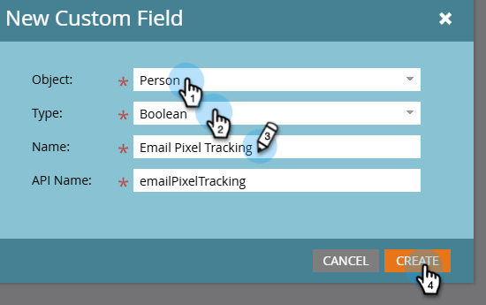
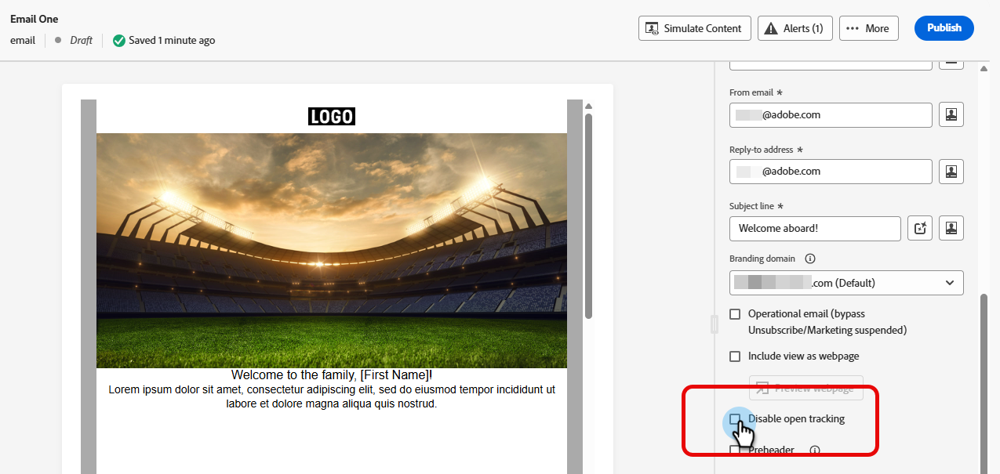
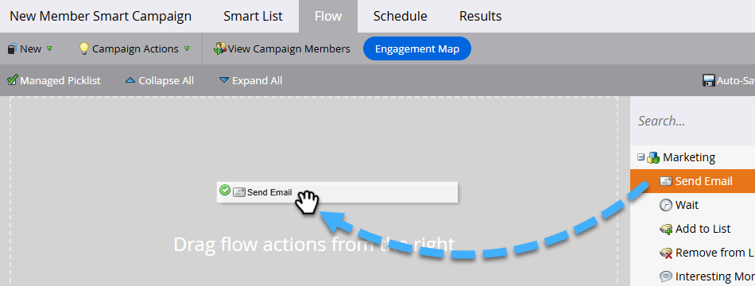

# CNIL-Anleitung: Bedingtes E-Mail-Öffnungs-Tracking {#cnil}

Erfahren Sie, wie Sie Marketo Engage in Übereinstimmung mit den CNIL-Richtlinien (COMMUNITY LINK) so konfigurieren, dass das Endbenutzer-Einverständnis für das Tracking der E-Mail-Öffnungen (Pixel) berücksichtigt wird. Der Ansatz verwendet ein benutzerdefiniertes boolesches Feld, um zu bestimmen, welche E-Mail-Variante eine Person erhält, entweder mit aktiviertem oder mit deaktiviertem Öffnungs-Tracking.

## Schritt 1: Erstellen eines benutzerdefinierten booleschen Felds {#custom-field}

1. Klicken Sie im Bereich **Admin** auf **Feldverwaltung** und wählen Sie **Neues benutzerdefiniertes Feld**.

   

1. Wählen Sie _Objekt_ die Option **Person**. Wählen Sie _Typ_ die Option **Boolesch**. Geben Sie _Name_ „E-Mail-Pixel-Tracking“ ein (der API-Name wird automatisch ausgefüllt). Klicken Sie auf **Erstellen**.

   

## Schritt 2: Füllen Sie das Feld Zustimmung aus {#populate}

1. Legen Sie den Feldwert für die E-Mail-Pixel-Verfolgung für jede Person über den Datenimport (API-Synchronisierung oder [CSV-Upload](https://experienceleague.adobe.com/en/docs/marketo/using/getting-started/quick-wins/import-a-list-of-people){target="_blank"}) fest.

   

1. Stellen Sie sicher, dass das benutzerdefinierte Feld korrekt zugeordnet ist.

   

>[!NOTE]
>
>Künftig können Sie die Daten direkt beim Ausfüllen eines Formulars erfassen, sodass die Person sich für das E-Mail-Öffnungs-Tracking anmelden oder abmelden kann.

## Schritt 3: E-Mail-Varianten erstellen {#variants}

Zwei E-Mails erstellen. Beachten Sie, dass das Öffnungs-Tracking für E-Mails standardmäßig sowohl für den E-Mail-Designer als auch für den alten E-Mail-Editor aktiviert ist.

* **E-Mail 1 (Tracking der Öffnungen aktiviert)**: Nach dem Erstellen der E-Mail sind keine weiteren Maßnahmen erforderlich. Öffnungs-Tracking aktiviert lassen.

* **E-Mail 2 (Tracking der Öffnungen deaktiviert)**: E-Mail 1 klonen und Tracking der Öffnungen deaktivieren.

  

In der E-Mail **Designer befindet sich das Kontrollkästchen**&#x200B;Öffnungs-Tracking deaktivieren _auf der Registerkarte_ Details im Bereich _Zusammenfassung_ rechts von Ihrer E-Mail. Im alten E-Mail-Editor befindet sich **Kontrollkästchen**&#x200B;Öffnungs-Tracking deaktivieren“ im Menü _E-Mail-Einstellungen_.

**E-Mail-Designer**

{width="800" zoomable="yes"}

**Legacy-E-Mail-Editor**

{width="800" zoomable="yes"}

## Schritt 4: Konfigurieren der intelligenten Kampagne {#smart-campaign}

[Erstellen einer Smart-Kampagne](https://experienceleague.adobe.com/en/docs/marketo/using/product-docs/core-marketo-concepts/smart-campaigns/creating-a-smart-campaign/create-a-new-smart-campaign){target="_blank"} um zu bestimmen, welche E-Mail jede Person erhält.

1. Fügen Sie auf der _Fluss_ der Smart-Kampagne den Schritt **E-Mail senden** ein.

   {width="800" zoomable="yes"}

1. Klicken Sie im Flussschritt auf **Auswahl hinzufügen**. Legen Sie in Auswahl 1 **Wenn** auf _E-Mail-Pixelverfolgung_, den Operator auf _Is_ und den Wert auf _false_ fest. Wählen Sie für **E** Mail _die Option „E-Mail 2_ aus.

1. Legen Sie in der Standardauswahl für „E **Mail** „E _Mail One“_.

   

Dadurch wird sichergestellt, dass Personen, die dem Öffnungs-Tracking nicht zugestimmt haben, die nicht verfolgte E-Mail erhalten, während Personen, die dem Öffnungs-Tracking zugestimmt haben, die standardmäßig verfolgte E-Mail erhalten.
