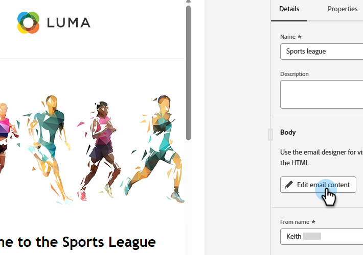
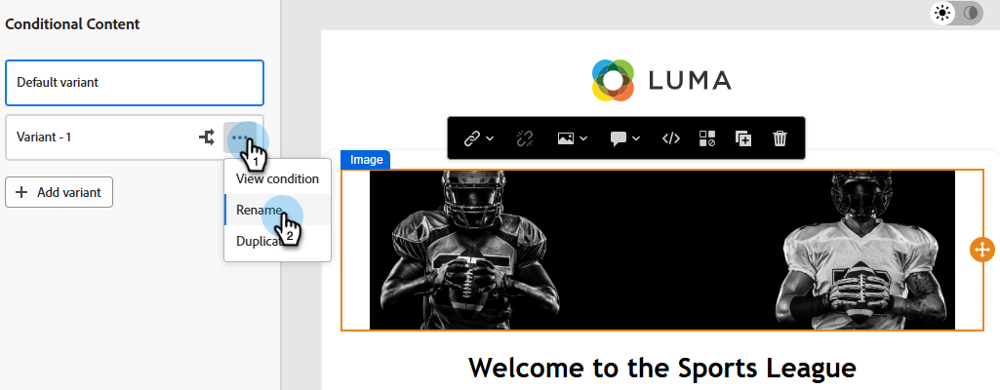

# Bedingte Inhalte {#conditional-content}

Mit bedingten Inhalten können Sie dynamisch steuern, welche Inhalte von welcher Zielgruppe angezeigt werden. Verwenden Sie vorhandene Segmentierungen, um anhand vordefinierter Kriterien zu bestimmen, was ein Empfänger sieht.

>[!PREREQUISITES]
>
>Mindestens eine Segmentierung [erstellt](/help/marketo/product-docs/personalization/segmentation-and-snippets/segmentation/create-a-segmentation.md) und [genehmigt](/help/marketo/product-docs/personalization/segmentation-and-snippets/segmentation/approve-a-segmentation.md).

## Hinzufügen bedingter Inhalte {#add-conditional-content}

1. Öffnen Sie die gewünschte E-Mail und klicken Sie auf **E-Mail-Inhalt bearbeiten**.

   

1. Wählen Sie den Inhalt aus, der bedingt sein soll (in diesem Beispiel wählen wir das Kopfzeilenbild aus). Klicken Sie auf _Symbol „Bedingten Inhalt_&quot;.

   

1. Das Markierungsfeld wird orange. Klicken Sie links auf das Symbol _Bedingung auswählen_ (), um Ihre Variante zu definieren.

   {width="700" zoomable="yes"}

1. Wählen Sie das gewünschte Segment aus und klicken Sie auf **Auswählen**.

   

1. Klicken Sie auf _Bild bearbeiten_, um das vorhandene Bild für die Variante zu ersetzen. Quelle des neuen Bildes auswählen. In diesem Beispiel wählen wir die Bibliothek _Bilder und Dateien_ in unserem Marketo Engage-Abonnement aus.

   

1. Wählen Sie das entsprechende Bild aus und klicken Sie auf **Auswählen**.

   {width="600" zoomable="yes"}

1. Das neue Bild wird angezeigt. Es empfiehlt sich, die Variante umzubenennen, damit sie leichter zu erkennen ist. Klicken Sie auf die Auslassungszeichen und wählen Sie **Umbenennen**.

   >[!NOTE]
   >
   >Durch Klicken auf die Auslassungszeichen können Sie auch die definierte Bedingung der Variante anzeigen und sie duplizieren. Wenn Sie über mehr als eine Variante verfügen, wird eine Löschoption verfügbar. Wenn Sie nur eine Variante haben, können Sie sie löschen, indem Sie einfach erneut auf das Symbol _Bedingten Inhalt aktivieren_ klicken (es lautet jetzt _Bedingten Inhalt deaktivieren_ wenn Sie den Mauszeiger darüber bewegen).

   {width="600" zoomable="yes"}

1. Um weitere Varianten hinzuzufügen (optional), klicken Sie auf **Variante hinzufügen** und führen Sie dieselben Schritte aus.

   

1. Wenn Sie fertig sind, zeigt jede Variante den ausgewählten Inhalt an.

   

1. Empfänger sehen Inhalte basierend auf den in den einzelnen Segmenten definierten Regeln. Im obigen Beispiel sieht jeder, der „Football“ auf seinem Marketo Engage-Feld _Lieblingssport_ aufgeführt hat, das Football-Image.

>[!MORELIKETHIS]
>
>* [Definieren von Segmentregeln](/help/marketo/product-docs/personalization/segmentation-and-snippets/segmentation/define-segment-rules.md)
>* [Erstellen eines benutzerdefinierten Felds in Marketo](/help/marketo/product-docs/administration/field-management/create-a-custom-field-in-marketo.md)
