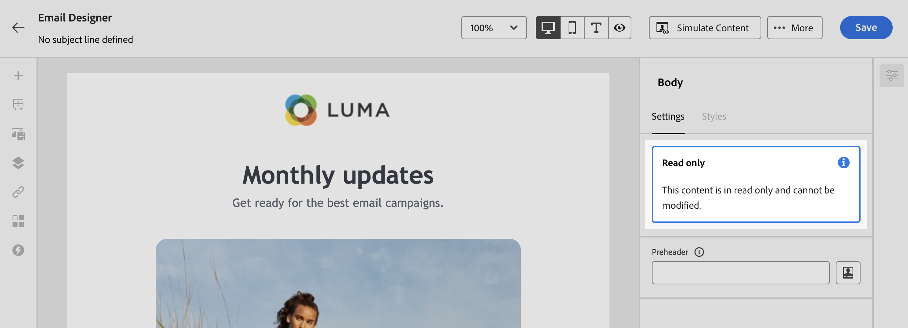

# Sperren von Inhalt in E-Mail-Vorlagen {#lock-content-email-templates}

Mit Marketo Engage können Sie Inhalte in E-Mail-Vorlagen sperren, indem Sie entweder die gesamte Vorlage oder bestimmte Strukturen/Komponenten sperren. Auf diese Weise können Sie unbeabsichtigte Bearbeitungen oder Löschungen verhindern, sodass Sie das Anpassen von Vorlagen besser steuern und die Effizienz sowie Zuverlässigkeit Ihrer E-Mail-Kampagnen optimieren können.

>[!AVAILABILITY]
>
>Benutzende mit der Berechtigung zum Erstellen von Inhaltsvorlagen können die Inhaltssperre aktivieren.

Inhaltssperren können entweder auf der Ebene **Struktur** oder auf der Ebene **Komponente** angewendet werden.

* Wenn eine Struktur gesperrt ist:

   * Alle Inhalte in dieser Struktur sind ebenfalls gesperrt.
   * Der Struktur kann kein Inhalt hinzugefügt werden.
   * Standardmäßig können Sie die Struktur nicht löschen. Sie können diese Einschränkung überschreiben, indem Sie die Option „Löschen zulassen“ aktivieren.
   * Einzelne Inhaltskomponenten innerhalb der gesperrten Struktur können als bearbeitbar festgelegt werden.

* Wenn eine Struktur bearbeitbar ist (Struktur nicht gesperrt):

   * Einzelne Inhaltskomponenten können innerhalb dieser Struktur gesperrt werden.
   * Eine Komponente kann standardmäßig nicht gelöscht werden, wenn sie gesperrt ist oder die Option „Nur Sperre für bearbeitbare Inhalte“ ausgewählt ist. Sie können diese Einschränkung überschreiben, indem Sie die Option „Löschen zulassen“ aktivieren.

## Sperren einer E-Mail-Vorlage {#lock-an-email-template}

### Aktivieren der Inhaltssperre {#enable-content-locking}

Sie können die Inhaltssperre für eine E-Mail-Vorlage direkt in der E-Mail-Designer aktivieren, unabhängig davon, ob Sie eine neue Vorlage erstellen oder eine vorhandene bearbeiten.

1. Öffnen oder erstellen Sie eine E-Mail-Vorlage und rufen Sie im E-Mail-Designer den Bildschirm zur Inhaltsbearbeitung auf.

1. Aktivieren Sie **[!UICONTROL Bereich]** Hauptteil“ auf der rechten Seite die Option **[!UICONTROL Governance]**.

1. Wählen Sie in der Dropdown-Liste **[!UICONTROL Modus]** den gewünschten Sperrmodus für die Vorlage aus:

   * **[!UICONTROL Inhaltssperre]**: Sperrt bestimmte Abschnitte des Inhalts in der Vorlage. Standardmäßig können alle Strukturen und Komponenten bearbeitbar werden. Sie können dann einzelne Elemente selektiv sperren.
   * **[!UICONTROL Schreibgeschützt]**: Sperrt den gesamten Inhalt der Vorlage, um Änderungen zu vermeiden.

   {width="800" zoomable="yes"}

1. Wenn Sie den Modus **[!UICONTROL Inhaltssperre]** ausgewählt haben, können Sie weiter definieren, wie Benutzende mit der Vorlage interagieren können. Aktivieren Sie **[!UICONTROL Option „Inhaltsbearbeitung aktivieren]** und wählen Sie eine der folgenden Optionen:

   * **[!UICONTROL Hinzufügen von Struktur und Inhalten zulassen]**: Benutzende können Strukturen zwischen vorhandenen Strukturen hinzufügen und Inhaltskomponenten oder Fragmente in bearbeitbaren Strukturen hinzufügen.

   * **[!UICONTROL Nur Hinzufügen von Inhalten zulassen]**: Benutzende können Inhaltskomponenten oder Fragmente innerhalb bearbeitbarer Strukturen hinzufügen, aber keine Strukturen hinzufügen oder duplizieren.

1. Nach Auswahl des Sperrmodus können Sie festlegen, welche Strukturen und/oder Komponenten gesperrt werden sollen, wenn Sie den Modus **[!UICONTROL Inhaltssperrung]** ausgewählt haben:

   * [Erfahren Sie, wie Sie Strukturen sperren.](#lock-structures)
   * [Erfahren Sie, wie Sie Komponenten sperren.](#lock-components)

   Wenn Sie den Modus **[!UICONTROL Schreibgeschützt]** ausgewählt haben, können Sie mit dem Fertigstellen und Speichern Ihrer Vorlage fortfahren.

Sie können die Einstellungen für **[!UICONTROL Governance]** jederzeit beim Entwerfen Ihrer Vorlage anpassen, indem Sie den Hauptteil der Vorlage auswählen. Klicken Sie dazu auf den **[!UICONTROL Textkörper]** in der Navigationsleiste oben im rechten Bereich.

{width="800" zoomable="yes"}

### Sperren von Strukturen {#lock-structures}

So sperren Sie eine Struktur in Ihrer Vorlage:

1. Wählen Sie die Struktur aus, die gesperrt werden soll.

1. Wählen Sie in der Dropdown-Liste **[!UICONTROL Art der Sperre]** die Option **[!UICONTROL Gesperrt]** aus.

   {width="800" zoomable="yes"}

   >[!NOTE]
   >
   >Standardmäßig können Benutzende gesperrte Strukturen nicht löschen. Sie können diese Einschränkung überschreiben, indem Sie die Option **[!UICONTROL Löschen zulassen]** aktivieren.

Nach dem Sperren einer Struktur können keine weiteren Inhaltskomponenten oder -fragmente dupliziert oder darin hinzugefügt werden. Alle Komponenten innerhalb einer gesperrten Struktur sind ebenfalls standardmäßig gesperrt. So legen Sie eine Komponente in einer gesperrten Struktur als bearbeitbar fest:

1. Wählen Sie die Komponente aus, die entsperrt werden soll.

1. Aktivieren Sie **[!UICONTROL Option „Spezifische Sperre verwenden]**.

1. Wählen Sie in der Dropdownliste **[!UICONTROL Art der Sperre]** die Option **[!UICONTROL Bearbeitbar]** aus. Um das Bearbeiten von Inhalten beim Sperren von Stilen zu ermöglichen, wählen Sie **[!UICONTROL Nur bearbeitbare Inhalte]** aus. [Informationen zum Sperren von Komponenten](#lock-components)

   {width="800" zoomable="yes"}

### Sperren von Komponenten {#lock-components}

So sperren Sie eine bestimmte Komponente in einer Struktur:

1. Wählen Sie die Komponente aus und aktivieren Sie im rechten Bereich die Option **[!UICONTROL Spezifische Sperre verwenden]**.

1. Wählen Sie in der Dropdown-Liste **[!UICONTROL Art der Sperre]** Ihre bevorzugte Sperroption aus:

   {width="800" zoomable="yes"}

   * **[!UICONTROL Nur Sperre für bearbeitbare Inhalte]**: Sperrt die Stile der Komponente, ermöglicht jedoch die Inhaltsbearbeitung.
   * **[!UICONTROL Gesperrt]**: Sperrt den Inhalt und die Stile der Komponente vollständig.

   >[!NOTE]
   >
   >Mit derSperre **[!UICONTROL Bearbeitbar]** können Benutzende eine Komponente selbst dann bearbeiten, wenn sich diese innerhalb einer gesperrten Struktur befindet. [Informationen zum Sperren von Strukturen](#lock-structures)

1. Standardmäßig können Benutzende gesperrte Komponenten nicht löschen. Sie können das Löschen aktivieren, indem Sie die Option **[!UICONTROL Löschen zulassen]** aktivieren.

### Identifizieren gesperrter Inhalte {#identify-locked-content}

Verwenden Sie den **[!UICONTROL Navigationsbaum]** im Menü auf der linken Seite, um gesperrte Strukturen und Komponenten in Ihrer Vorlage einfach zu identifizieren. Dieses Menü bietet einen visuellen Überblick über alle Vorlagenelemente, indem gesperrte Elemente mit einem Sperrsymbol und bearbeitbare Elemente mit einem Bleistiftsymbol markiert sind.

Im folgenden Beispiel ist „Governance“ für den Vorlagentext aktiviert. *Struktur 2* ist gesperrt, wobei *Komponente 1* bearbeitbar ist, während *Struktur 3* vollständig gesperrt ist.

{width="800" zoomable="yes"}

## Verwenden von Vorlagen mit gesperrten Inhalten {#use-templates-with-locked-content}

Bei Verwendung einer Vorlage mit gesperrtem Inhalt wird im rechten Bereich die Meldung **[!UICONTROL Governance aktiviert]** angezeigt.

Je nach Typ der auf die Vorlage angewendeten Sperre können Sie verschiedene Aktionen für die Strukturen und Komponenten der Vorlage ausführen. Um alle bearbeitbaren Bereiche in der Vorlage schnell zu identifizieren, aktivieren Sie die Option **[!UICONTROL Bearbeitbare Bereiche hervorheben]**.

In der folgenden Vorlage können beispielsweise alle Bereiche bearbeitet werden. Eine Ausnahme stellt das obere Bild dar, das gesperrt wurde, sodass Sie es nicht bearbeiten oder entfernen können.

{width="800" zoomable="yes"}

Im Folgenden finden Sie einige Beispiele für die E-Mail-Bearbeitung und die zugehörige Konfiguration zum Sperren von Inhalten, die eingerichtet wurde:

<table>
<thead>
  <tr>
    <th>Art der Inhaltssperre</th>
    <th>Vorlagenkonfiguration</th>
    <th>Bearbeitung von E-Mails</th>
  </tr></thead>
<tbody>
  <tr>
    <td>Schreibgeschützte Inhaltsvorlage</td>
    <td></td>
    <td></td>
  </tr>
  <tr>
    <td>Der gesamte Inhalt kann bearbeitet werden, aber Benutzende können keine Struktur oder Komponente hinzufügen.</td>
    <td></td>
    <td></td>
  </tr>
  <tr>
    <td>Gesperrte Struktur, die nicht gelöscht werden kann</td>
    <td></td>
    <td></td>
  </tr>
  <tr>
    <td>Komponente mit gesperrten Stilen, die nicht gelöscht werden können. Benutzende können nur den Inhalt ändern.</td>
    <td></td>
    <td></td>
  </tr>
  <tr>
    <td>Bearbeitbare Komponente innerhalb einer gesperrten Struktur.</td>
    <td></td>
    <td></td>
  </tr>
</tbody>
</table>
