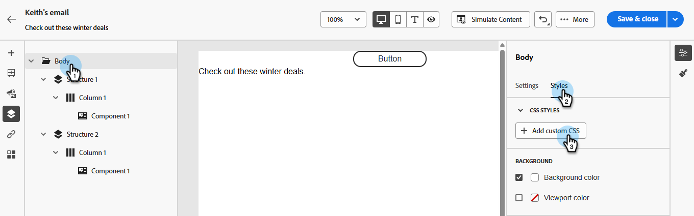
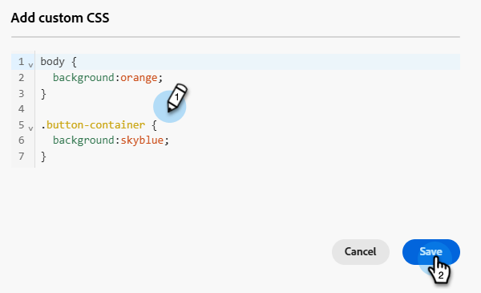

# Hinzufügen von benutzerdefinierten CSS zu E-Mail-Inhalten {#custom-css}

Fügen Sie Ihr eigenes benutzerdefiniertes CSS direkt in der Marketo Engage E-Mail-Designer hinzu, um erweiterte, spezifische Stile zu erhalten.

## Definieren von benutzerdefiniertem CSS {#define-custom-css}

1. Stellen Sie sicher, dass in der E-Mail-Designer ein Inhalt definiert ist, indem Sie mindestens eine Komponente hinzufügen.

1. Wählen Sie **[!UICONTROL Textkörper]** entweder über den **[!UICONTROL Navigationsbaum]** auf der linken oder im rechten Bereich aus. **[!UICONTROL CSS-]**&quot; wird auf der rechten Seite angezeigt.

   {width="800" zoomable="yes"}

   >[!NOTE]
   >
   >Der Abschnitt **[!UICONTROL CSS]** Stile“ ist nur verfügbar, wenn im Editor Inhalte vorhanden sind.

1. Klicken Sie auf die Schaltfläche **[!UICONTROL + Benutzerdefiniertes CSS hinzufügen]**.

   >[!NOTE]
   >
   >Die Schaltfläche **[!UICONTROL Benutzerdefiniertes CSS hinzufügen]** ist nur verfügbar, wenn **[!UICONTROL Hauptteil]** ausgewählt ist. Sie können jedoch benutzerdefinierte CSS-Stile auf alle Komponenten in Ihrem Inhalt anwenden.

1. Geben Sie Ihren CSS-Code in den entsprechenden Textbereich ein, der angezeigt wird. Stellen Sie sicher, dass das benutzerdefinierte CSS [gültig ist und der richtigen Syntax folgt](#use-valid-css). Klicken Sie auf **Speichern**, wenn Sie fertig sind.

   

   >[!NOTE]
   >
   >Sie können kein benutzerdefiniertes CSS zu Ihrem Inhalt hinzufügen, wenn Sie eine [Vorlage mit gesperrtem Inhalt](/help/marketo/product-docs/email-marketing/email-designer/content-locking.md) verwenden. Die Schaltflächenbeschriftung ändert sich in **[!UICONTROL Benutzerdefiniertes CSS anzeigen]** und jedes angezeigte benutzerdefinierte CSS ist schreibgeschützt.

1. Stellen Sie sicher, dass das CSS für Ihren Inhalt gilt. Ist dies nicht der Fall, lesen Sie den Abschnitt [Fehlerbehebung](#troubleshooting).

   

   >[!NOTE]
   >
   >Wenn Sie den gesamten Inhalt entfernen, wird der Abschnitt ausgeblendet und das zuvor definierte benutzerdefinierte CSS wird nicht mehr angewendet. Fügen Sie Inhalte wieder hinzu, damit der Abschnitt **[!UICONTROL CSS-Stile]** wieder angezeigt wird. Das benutzerdefinierte CSS wird erneut angewendet.

## Verwenden von gültigem CSS {#using-valid-css}

Sie können eine beliebige gültige CSS-Zeichenfolge im Textbereich **[!UICONTROL Benutzerdefiniertes CSS hinzufügen]** eingeben. Richtig formatiertes CSS wird sofort auf den Inhalt angewendet.

>[!CAUTION]
>
>Sie sind für die Sicherheit Ihres benutzerdefinierten CSS verantwortlich. Stellen Sie sicher, dass Ihr CSS keine Sicherheitslücken enthält oder mit den vorhandenen Inhalten in Konflikt steht.
>
>Vermeiden Sie die Verwendung von CSS, das unbeabsichtigt das Layout oder die Funktionalität des Inhalts beeinträchtigen könnte.

+++ Beispiele für gültiges CSS

Im Folgenden finden Sie Beispiele für gültiges CSS.

```css
.acr-component[data-component-id="form"] {
  display: flex;
  justify-content: center;
  background: none;
}

.acr-Form {
  width: 100%;
  padding: 20px 100px;
  border-spacing: 0px 8px;
  box-sizing: border-box;
  margin: 0;
}

.acr-Form .spectrum-FieldLabel {
  width: 20%;
}

.acr-Form.spectrum-Form--labelsAbove .spectrum-FieldLabel,
.acr-Form [data-form-item="checkbox"] .spectrum-FieldLabel {
  width: auto;
}

.acr-Form .spectrum-Textfield {
  width: 100%;
}

#acr-form-error,
#acr-form-confirmation {
  width: 100%;
  padding: var(--spectrum-global-dimension-static-size-500);
  display: flex;
  align-items: center;
  flex-direction: column;
  justify-content: center;
  gap: var(--spectrum-global-dimension-static-size-200);
}

.spectrum-Form-item.is-required .spectrum-FieldLabel:after{
  content: '*';
  font-size: 1.25rem;
  margin-left: 5px;
  position: absolute;
}

/* Error field placeholder */
.spectrum-HelpText {
  display: none !important;
}

.spectrum-HelpText.is-invalid,
.is-invalid ~ .spectrum-HelpText {
  display: flex !important;
}
```

```css
@media only screen and (min-width: 600px) {
  .acr-paragraph-1 {
    width: 100% !important;
  }
}
```

+++


+++ Beispiele für ungültiges CSS

Wenn ungültiges CSS eingegeben wird, wird eine Fehlermeldung angezeigt, die darauf hinweist, dass das CSS nicht gespeichert werden kann. Im Folgenden finden Sie Beispiele für ungültiges CSS.

Die Verwendung von `<style>`-Tags wird nicht akzeptiert:

```html
<style type="text/css">
  .acr-Form {
    width: 100%;
    padding: 20px 100px;
    border-spacing: 0px 8px;
    box-sizing: border-box;
    margin: 0;
  }
</style>
```

Ungültige Syntax wie fehlende Klammern wird nicht akzeptiert:

```css
body {
  background: red;
```

+++

## Technische Implementierung {#implementation}

Ihr benutzerdefiniertes CSS wird am Ende des Abschnitts `<head>` als Teil eines `<style>`-Tags mit dem Attribut `data-name="global-custom"` hinzugefügt, wie im folgenden Beispiel dargestellt. Dadurch wird sichergestellt, dass die benutzerdefinierten Stile global auf den Inhalt angewendet werden.

+++ Beispiel anzeigen

```html
<!DOCTYPE html>
<html>
  <head>
    <meta charset="utf-8">
    <meta name="content-version" content="3.3.31">
    <meta name="x-apple-disable-message-reformatting">
    <meta name="viewport" content="width=device-width,initial-scale=1.0">
    <style data-name="default" type="text/css">
      td { padding: 0; }
      th { font-weight: normal; }
    </style>
    <style data-name="grid" type="text/css">
      .acr-grid-table { width: 100%; }
    </style>
    <style data-name="acr-theme" type="text/css" data-theme="default" data-variant="0">
      body { margin: 0; font-family: Arial; }
    </style>
    <style data-name="media-default-max-width-500px" type="text/css">
      @media screen and (max-width: 500px) {
        body { width: 100% !important; }
      }
    </style>
    <style data-name="global-custom" type="text/css">
      /* Add you custom CSS here */
    </style>
  </head>
  <body>
    <!-- Minimal content -->
  </body>
</html>
```

+++


Das benutzerdefinierte CSS wird nicht vom Bereich **[!UICONTROL Einstellungen]** des E-Mail-Designers interpretiert oder überprüft. Es ist vollkommen unabhängig und kann nur über die Option **[!UICONTROL Benutzerdefiniertes CSS hinzufügen]** geändert werden.

### Schutzmechanismen - Importierte Inhalte {#guardrails}

Wenn Sie benutzerdefiniertes CSS mit Inhalten verwenden möchten, die in den E-Mail-Designer importiert wurden, sollten Sie Folgendes beachten:

* Wenn [externe HTML-](/help/marketo/product-docs/email-marketing/email-designer/email-authoring.md#import-html) einschließlich CSS importieren, befindet sich dieser Inhalt, sofern Sie ihn nicht konvertieren, im **[!UICONTROL Kompatibilitätsmodus]**, wobei der Abschnitt **[!UICONTROL CSS-]**&quot; nicht verfügbar ist.

* Wenn der Import von mit der E-Mail-Designer erstellten Inhalten CSS enthält, das über die Option **[!UICONTROL Benutzerdefiniertes CSS hinzufügen]** angewendet wurde, ist das zuvor angewendete CSS in derselben Option sichtbar und kann bearbeitet werden.

## Fehlerbehebung {#troubleshooting}

Wenn Ihr benutzerdefiniertes CSS nicht angewendet wird, versuchen Sie es mit den folgenden Vorschlägen.

* Stellen Sie sicher, dass Ihr CSS gültig und frei von Syntaxfehlern (z. B. fehlende Klammern, falsche Eigenschaftsnamen) ist. [Weitere Informationen](#use-valid-css)

* Stellen Sie sicher, dass Ihr CSS zum `<style>`-Tag mit dem `data-name="global-custom"` hinzugefügt wird.

* Überprüfen Sie, ob für das `global-custom`-Stil-Tag das Attribut `data-disabled` auf `true` festgelegt ist. In diesem Fall wird das benutzerdefinierte CSS nicht angewendet.

+++ Beispiel:

  ```html
  <style data-name="global-custom" type="text/css" data-disabled="true"> body: { color: red; } </style>
  ```

+++

* Stellen Sie sicher, dass Ihr CSS nicht durch andere CSS-Regeln überschrieben wird.

   * Verwenden Sie Ihre Browser-Entwickler-Tools, um den Inhalt zu überprüfen und zu überprüfen, ob Ihr CSS auf die richtigen Selektoren abzielt.

   * Erwägen Sie, Ihren Deklarationen `!important` hinzuzufügen, um sicherzustellen, dass sie Vorrang haben.

+++ Beispiel:

     ```css
     .acr-Form {
       background: red !important;
     }
     ```

+++

>[!NOTE]
>
>Der Marketo Engage-Support ist nicht für die Fehlerbehebung bei benutzerdefiniertem CSS eingerichtet. Unterstützung bei CSS erhalten Sie von einem Web-Entwickler.
