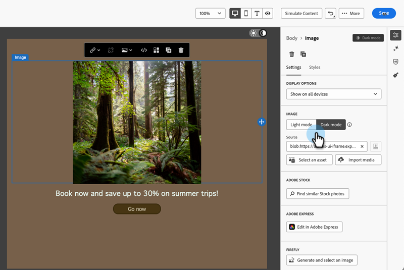

# Dunkler Modus {#dark-mode}

Beim Entwerfen Ihrer E-Mails können Sie mit der E-Mail-Designer zur Ansicht **[!UICONTROL Dunkelmodus]** wechseln.

Im **[!UICONTROL Dunkelmodus]** können Sie bestimmte benutzerdefinierte Einstellungen definieren, die angezeigt werden sollen, indem Sie E-Mail-Clients unterstützen, wenn ihr Dunkelmodus aktiviert ist.

## Was ist der dunkle Modus? {#what-is-dark-mode}

Der Dunkelmodus ermöglicht es unterstützenden E-Mail-Clients und -Programmen, E-Mails mit dunkleren Hintergründen und helleren Farben für Text, Schaltflächen und andere Benutzeroberflächenelemente anzuzeigen. Dadurch werden die Augen weniger beansprucht, die Akkulaufzeit verkürzt und die Lesbarkeit in schwach beleuchteten Umgebungen verbessert, sodass das Betrachten angenehmer wird.

## Schutzmechanismen {#guardrails}

Das Dark-Mode-Rendering kann in verschiedenen E-Mail-Clients erheblich variieren.

Bevor Sie den Dunkelmodus verwenden, müssen Sie wissen, wie die wichtigsten E-Mail-Clients damit umgehen. Es sind drei Fälle zu unterscheiden:

### Clients, die keinen dunklen Modus unterstützen {#not-supporting}

Einige E-Mail-Clients unterstützen diese Funktion überhaupt nicht, z. B.:

* Yahoo!Mail
* AOL

Unabhängig davon, ob Sie benutzerdefinierte Einstellungen für den Dunkelmodus definieren oder nicht, zeigen diese E-Mail-Clients keinen Rendering-Modus für den Dunkelmodus an.

### Clients, die ihren eigenen dunklen Modus anwenden {#default-support}

Einige E-Mail-Clients wenden systematisch ihren eigenen standardmäßigen dunklen Modus auf alle empfangenen E-Mails an. Farben, Hintergründe, Bilder usw. werden automatisch mit den für diesen E-Mail-Client spezifischen Einstellungen für den Dunkelmodus angepasst. Externe Änderungen sind nicht möglich.

Beispiele:

* Gmail (Desktop-Webmail, iOS, Android, Mobile-Webmail)
* Outlook Windows
* Outlook Windows Mail

Wenn Sie in diesem Fall benutzerdefinierte Einstellungen für den Dunkelmodus in der E-Mail-Designer definieren, werden diese Einstellungen durch die Einstellungen des E-Mail-Clients überschrieben.

Während diese E-Mail-Clients also den Dunkelmodus verarbeiten, wird Ihr spezifisches Dunkelmodus-Design nicht gerendert.

### Clients, die den benutzerdefinierten dunklen Modus unterstützen {#custom-dark-mode}

Einige E-Mail-Clients bieten die Möglichkeit, den benutzerdefinierten Dunkelmodus mit der `@media (prefers-color-scheme: dark)`-Abfrage zu rendern, was die von der [!DNL Marketo Engage] E-Mail-Designer verwendete Methode ist.

Die wichtigsten Clients, die diese Option handhaben, sind:

* Apple Mail für macOS
* Apple Mail für iOS
* Outlook macOS
* Outlook.com
* Outlook iOS
* Outlook Android

Die Einstellungen, die Sie in der E-Mail-Designer definieren, sollten angezeigt werden.

>[!NOTE]
>
>Erfahren Sie, wie Sie [benutzerdefinierte Einstellungen für den Dunkelmodus](#define-custom-dark-mode) in der E-Mail-Designer definieren.

Je nach E-Mail-Client können einige Einschränkungen gelten. Beispielsweise erzeugen einige Clients (z. B. Apple Mail 16) keinen Dunkelmodus, wenn Bilder vorhanden sind.

Um optimale Ergebnisse zu erzielen, testen Sie Ihren Inhalt in den E-Mail-Clients, auf die Sie abzielen. Um eine Simulation in jedem Client anzuzeigen, verwenden Sie die Funktion [E-Mail-Rendering](/help/marketo/product-docs/email-marketing/email-designer/test-email-rendering.md) in der E-Mail-Designer.

## Dunkler Modus im E-Mail-Designer {#dark-mode-email-designer}

Beim dunklen Modus im E-Mail-Designer sind zwei Aspekte zu berücksichtigen:

* Sie können eine Vorschau anzeigen, wie der standardmäßige dunkle Modus in den meisten unterstützenden E-Mail-Clients gerendert wird. [Weitere Informationen](#preview-dark-mode)

* Wenn Sie die Standardeinstellungen unterstützender E-Mail-Clients überschreiben möchten, können Sie benutzerdefinierte Einstellungen für den Dunkelmodus in der E-Mail definieren, die Sie bearbeiten. [Weitere Informationen](#define-custom-dark-mode)

### Vorschau des standardmäßigen dunklen Modus {#preview-dark-mode}

Erfahren Sie, wie Sie in der E-Mail-Designer auf den Dunkelmodus zugreifen und eine Vorschau der Standardeinstellungen für den Dunkelmodus erhalten.

1. Wählen Sie auf der Startseite des E-Mail-Designers die Option **[!UICONTROL Erstellen von neuen Inhalten]** aus.

1. Fügen Sie [Strukturen und Inhalte](/help/marketo/product-docs/email-marketing/email-designer/email-authoring.md#add-structure-and-content) zu Ihrer E-Mail hinzu.

1. Aktivieren Sie oben rechts den Umschalter **[!UICONTROL Dunkelmodus]**.

   

1. Die Vorschau des standardmäßigen dunklen Modus wird angezeigt.

   

Standardmäßig wendet die Vorschau des dunklen Modus im E-Mail-Designer das Farbschema „Vollfarbinvertierung“ auf alle Elemente außer auf Bilder und Symbole an. 

Das bedeutet, dass Bereiche mit hellen und dunklen Elementen erkannt und invertiert werden, sodass helle Hintergründe dunkel und dunkler Text hell werden, während dunkle Hintergründe hell und heller Text dunkel werden.

>[!CAUTION]
>
>Das endgültige Rendering kann je nach E-Mail-Client der Empfängerinnen und Empfänger variieren. Um eine Simulation für jeden E-Mail-Client anzuzeigen, verwenden Sie die Funktion [E-Mail-Rendering](/help/marketo/product-docs/email-marketing/email-designer/test-email-rendering.md).

### Definieren des benutzerdefinierten dunklen Modus {#define-custom-dark-mode}

Nach dem Wechsel **[!UICONTROL Dunkler Modus]** können Sie bestimmte Stilelemente Ihres Inhalts bearbeiten, die nur angezeigt werden, wenn der Dunkle Modus im E-Mail-Client des Empfängers aktiviert ist (sofern er diese Funktion unterstützt).

>[!IMPORTANT]
>
>Das endgültige Rendering im Dunkelmodus hängt von jedem E-Mail-Client ab, sodass die Ergebnisse von einem Client zum anderen variieren können. [Weitere Informationen](#guardrails)

Um die benutzerdefinierten Dunkelmodus-Stile von E-Mail-Designer zu nutzen, verwendet Marketo Engage die `@media (prefers-color-scheme: dark)` CSS-Abfrage , die erkennt, ob der E-Mail-Client der Benutzenden auf den Dunkelmodus eingestellt ist, und das in Ihrer E-Mail definierte Design mit dunklem Design anwendet.

Gehen Sie wie folgt vor, um die Einstellungen für den benutzerdefinierten dunklen Modus zu definieren.

1. Wechseln Sie in der E[Mail-Designer zur &#x200B;](#preview-dark-mode)Vorschau im Dunkelmodus“.

1. Bearbeiten Sie alle Stilattribute wie Text, Hintergründe, Schaltflächen usw.

1. Sie können die Farben von Bildern und Symbolen nicht ändern, aber Sie können bestimmte Assets nur für den Dunkelmodus definieren. Wählen Sie dazu ein Bild aus. Wechseln Sie über den entsprechenden Umschalter im Bereich **[!UICONTROL Einstellungen]** zu **[!UICONTROL Dunkler Modus]** und wählen Sie ein anderes Asset aus.

   

1. Sie können jederzeit **[!UICONTROL Zur Live-Ansicht wechseln]** um zu sehen, wie Ihre Inhalte auf verschiedenen Gerätegrößen gerendert werden können. Wählen Sie in dieser Ansicht den Umschalter für den Dunkelmodus aus, um eine Vorschau der Dunkelmodusversion Ihres Inhalts auf verschiedenen Geräten anzuzeigen.

   

   >[!NOTE]
   >
   >Die Live-Ansicht ist eine allgemeine Vorschau, die vergleicht, wie das Rendering über verschiedene Gerätegrößen hinweg aussehen könnte. Das endgültige Rendering kann je nach E-Mail-Client der Empfängerinnen und Empfänger variieren.

1. Wenn Sie mit den Änderungen für den dunklen Modus zufrieden sind, klicken Sie auf **[!UICONTROL Inhalt simulieren]**.

   

1. Wählen Sie **[!UICONTROL E-Mail rendern]** und verbinden Sie sich mit Ihrem Litmus-Konto. Sie können das endgültige Rendering des dunklen Modus für verschiedene E-Mail-Clients sehen. Weitere Informationen zu [E-Mail-Rendering](/help/marketo/product-docs/email-marketing/email-designer/test-email-rendering.md).

   >[!IMPORTANT]
   >
   >Während die Simulation dem Aussehen von E-Mails im Dunkelmodus sehr nahe kommt, kann das tatsächliche Rendering aufgrund von Variationen bei E-Mail-Service-Anbietern oder Geräteeinstellungen unterschiedlich sein.

## Best Practices {#best-practices}

Da die Akzeptanz des Dunkelmodus in den wichtigsten E-Mail-Clients zunimmt, ist es wichtig zu berücksichtigen, wie Ihre E-Mails in hellen und dunklen Umgebungen gerendert werden, unabhängig davon, ob Sie [benutzerdefinierten Dunkelmodus](#define-custom-dark-mode) verwenden oder nicht.

Der Dunkelmodus kann Farben, Hintergründe und Bilder verändern und manchmal die Design-Auswahl überschreiben. Befolgen Sie die unten aufgeführten Best Practices, um visuelle Konsistenz, Barrierefreiheit und Markenintegrität sicherzustellen.

**Optimieren Ihrer Bilder und Logos**

* Speichern Sie Logos und Symbole als PNGs mit transparentem Hintergrund, um sichtbare weiße Felder im dunklen Modus zu vermeiden.

* Vermeiden Sie Bilder mit hartcodierten weißen oder hellen Hintergründen.

* Wenn Transparenz nicht möglich ist, platzieren Sie Bilder in Ihrem Design auf einem einfarbigen Hintergrund, um unangenehme Farbinversionen zu verhindern.

**Beachten Ihrer Hintergründe**

* Stellen Sie einen ausreichenden Kontrast zwischen Text- und Hintergrundfarben sicher, damit die Lesbarkeit sowohl im hellen als auch im dunklen Modus gewahrt bleibt.

* Vermeiden Sie es, sich bei kritischen Inhalten allein auf Hintergrundfarben zu verlassen. Einige Clients überschreiben Hintergrundfarben im dunklen Modus, sodass Sie sicherstellen müssen, dass wichtige Informationen weiterhin sichtbar sind.

**Entwerfen barrierefreier Inhalte im dunklen Modus**

* Verwenden Sie Farbkombinationen, die für Menschen mit Farbenblindheit leicht zu unterscheiden sind.

* Verwenden Sie eine Mitteltonpalette, um sowohl vor hellen als auch vor dunklen Hintergründen einen Kontrast sicherzustellen.

* Verwenden Sie barrierefreie Farbkombinationen mit hohem Kontrast, um die Lesbarkeit zu verbessern und die WCAG-Standards (Web Content Accessibility Guidelines) zu erfüllen. Verwenden Sie Tools wie die Kontrastprüfung von WebAIM, um den Farbkontrast zu überprüfen.

* Vermeiden Sie dünne Schriftarten, da sie die Lesbarkeit beeinträchtigen können. Wenn für Ihre Marke eine dünne Schriftart erforderlich ist, verwenden Sie sie für den dunklen Modus eine Fettformatierung.

* Vermeiden Sie reines Weiß auf reinem Schwarz, da dies die Augen belasten kann und von einigen E-Mail-Clients möglicherweise automatisch invertiert wird.

* Wenn der dunkle Modus nicht unterstützt wird, können Sie barrierefreie Fallback-Stile bereitstellen.

**Testen Ihrer E-Mails in einer Umgebung im dunklen Modus**

* Nutzen Sie die [Vorschau des dunklen Modus](#preview-dark-mode) im E-Mail-Designer. Diese verwendet invertierte Farbschemata, sodass Sie Probleme frühzeitig erkennen.

* Verwenden Sie die Funktion [E-Mail](/help/marketo/product-docs/email-marketing/email-designer/test-email-rendering.md)Rendering, die Litmus nutzt, um Ihre Designs in wichtigen E-Mail-Clients zu simulieren und zu sehen, wie sich Farben und Bilder im Dunkelmodus verhalten.
