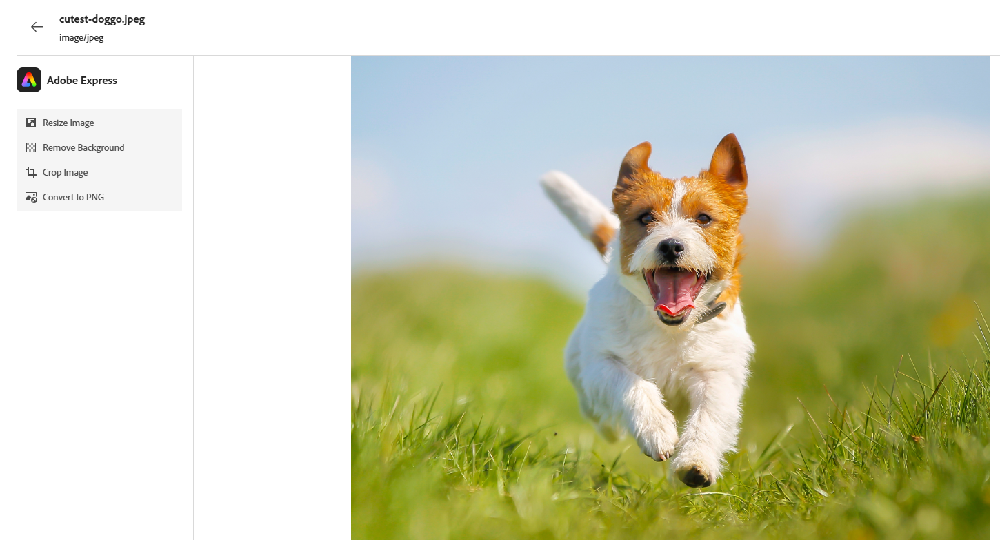
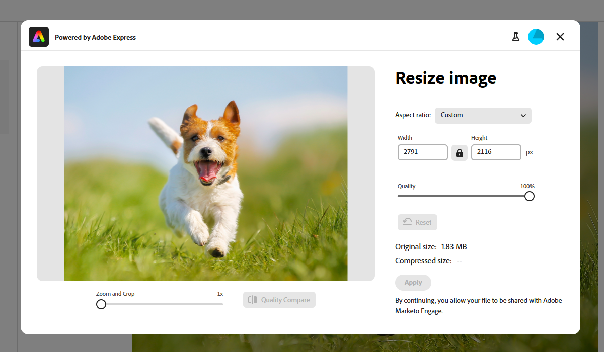

# Bearbeiten von Bildern mit Adobe Express {#edit-images-with-adobe-express}

Adobe Marketo Engage ist nativ mit Adobe Express integriert, sodass Sie Zugriff auf eine Vielzahl von Bildbearbeitungs-Tools haben. Sie können diese Tools verwenden, um Ihre Bilder im Marketo Engage Design Studio zu ändern. Die Integration bietet die folgenden zentralen Vorteile:

* Erhöhte Wiederverwendung von Inhalten durch Bearbeiten und Speichern neuer Bilder in Marketo Engage.

* Weniger Zeit und Aufwand beim Aktualisieren von Bildern oder Erstellen neuer Versionen vorhandener Bilder.

>[!NOTE]
>
>Adobe Express unterstützt derzeit nur PNG- und JPEG-Bilddateiformate.

## Zugriff auf den Adobe Express-Editor {#access-the-adobe-express-editor}

Es gibt zwei Möglichkeiten, auf den Adobe Express-Editor zuzugreifen:

* Klicken Sie auf den Bildnamen
* _Dropdown-Menü &quot;_ und Bilddateien“

>[!BEGINTABS]

>[!TAB Klicken Sie auf den Bildnamen]

1. Navigieren Sie in Marketo Engage zu **[!UICONTROL Design Studio]** und wählen Sie **[!UICONTROL Bilder und Dateien]** aus.

   {width="600" zoomable="yes"}

1. Wählen Sie das Bild aus, das Sie bearbeiten möchten.

   {width="600" zoomable="yes"}

   >[!NOTE]
   >
   >* Um die Assets nach Arbeitsbereich und Ordner anzuzeigen, öffnen Sie die Struktur, indem Sie oben links auf **[!UICONTROL Ordner anzeigen]** klicken.
   >
   >* Um die Tabelle nach einer der Spalten zu sortieren, klicken Sie auf den Spaltentitel. Der Pfeil in der Titelzeile zeigt die aktuelle Sortierspalte und -reihenfolge an.

1. Klicken Sie auf der Registerkarte _Details_ auf **[!UICONTROL Bearbeiten in Adobe Express]**.

   {width="600" zoomable="yes"}

   >[!CAUTION]
   >
   >Wenn das Bild bereits in einer E-Mail- oder E-Mail-Vorlage referenziert wird, werden alle vorgenommenen Änderungen dieses Bild an allen Stellen aktualisieren, an denen es derzeit verwendet wird.

>[!TAB Bild- und Dateiaktionen]

1. Navigieren Sie in Marketo Engage zu **[!UICONTROL Design Studio]** und wählen Sie **[!UICONTROL Bilder und Dateien]** aus.

   {width="600" zoomable="yes"}

   >[!NOTE]
   >
   >* Um die Assets nach Arbeitsbereich und Ordner anzuzeigen, öffnen Sie die Struktur, indem Sie oben links auf **[!UICONTROL Ordner anzeigen]** klicken.
   >
   >* Um die Tabelle nach einer der Spalten zu sortieren, klicken Sie auf den Spaltentitel. Der Pfeil in der Titelzeile zeigt die aktuelle Sortierspalte und -reihenfolge an.

1. Aktivieren Sie das Kontrollkästchen neben dem Bild, das Sie bearbeiten möchten. Wählen Sie in **[!UICONTROL Dropdown-Liste „Bild]** und Dateiaktionen“ die Option **[!UICONTROL In Adobe Express bearbeiten]**.

   {width="600" zoomable="yes"}

   >[!CAUTION]
   >
   >Wenn das Bild bereits in einer E-Mail- oder E-Mail-Vorlage referenziert wird, werden alle vorgenommenen Änderungen dieses Bild an allen Stellen aktualisieren, an denen es derzeit verwendet wird.

>[!ENDTABS]

## Adobe Express Enterprise-Lizenz {#adobe-express-enterprise-license}

### Benutzer mit einer Enterprise-Lizenz {#users-with-an-enterprise-license}

Wenn Sie über eine Enterprise-Lizenz für Adobe Express verfügen, haben Sie Zugriff auf den vollständigen Express-Editor. Sie können Bildeinstellungen wie Farbe, Helligkeit, Schärfe, Kontrast, Größe und mehr anpassen. Mit der Option KI-Magie können Sie Hintergründe entfernen, Objekte einfügen und entfernen und Teile eines Bildes löschen. Besuchen Sie das [Adobe Express-Benutzerhandbuch](https://helpx.adobe.com/de/express/user-guide.html){target="_blank"} um mehr über die einzelnen Einstellungen zu erfahren.

>[!IMPORTANT]
>
>Die erworbene Lizenz muss unter derselben IMS-Org wie Ihr Marketo Engage-Abonnement erfolgen, um auf alle Adobe Express-Bearbeitungsfunktionen zugreifen zu können. Außerdem muss jeder einzelne Benutzer über eine Lizenz in Adobe Express verfügen. Benutzende [ohne Lizenz](#users-without-an-enterprise-license) können nur auf die Schnellaktionen in Adobe Express zugreifen.

### Benutzer ohne Enterprise-Lizenz {#users-without-an-enterprise-license}

Für Benutzer ohne Enterprise-Lizenz haben Sie weiterhin Zugriff auf mehrere Schnellbearbeitungs-Funktionen. Diese Funktionen sind:

* [Bildgröße ändern](#resize-image)
* [Hintergrund entfernen](#remove-background)
* [Bild zuschneiden](#crop-image)
* [In PNG/JPEG konvertieren](#convert-to-png-jpeg)

Die Funktionen sind auf der linken Seite der Bildseite verfügbar.

{width="800" zoomable="yes"}

#### Bildgröße ändern {#resize-image}

1. Klicken Sie **Bildgröße ändern**.

1. Nehmen Sie die gewünschten Änderungen vor und klicken Sie **auf &quot;**&quot;.

{width="800" zoomable="yes"}

<table><tbody>
  <tr>
    <td style="width:25%"><b>Seitenverhältnis</b></td>
    <td>Wählen Sie in <b> Dropdown</b>Seitenverhältnis“ <b>Standard</b>, um vorberechnete gemeinsame Bildgrößen auszuwählen, oder <b>Benutzerdefiniert</b>, um Ihre eigene Breite/Höhe festzulegen. Sie können auch die Standardgröße einer bestimmten Social-Media-Plattform auswählen (Pinterest, Snapchat usw.).</td>
  </tr>
  <tr>
    <td style="width:25%"><b>Breite und Höhe</b></td>
    <td>Standardmäßig ist das Seitenverhältnis gesperrt, sodass die Bildproportionen beim Anpassen der Größe gleich bleiben. Bei Bedarf können Sie die Schaltfläche Sperren auswählen, um das Seitenverhältnis zu entsperren.</td>
  </tr>
  <tr>
    <td style="width:25%"><b>Zurücksetzen</b></td>
    <td>Klicken Sie <b>Zurücksetzen</b>, um alle Änderungen am Bild zu entfernen und es in den Originalzustand zurückzuversetzen.</td>
  </tr>
  <tr>
    <td style="width:25%"><b>Zoomen und zuschneiden</b></td>
    <td>Klicken Sie <b>Zoom und Zuschneiden</b>, um bestimmte Bereiche des Bildes einzuzoomen. Durch Klicken <b>Anwenden</b> nach dem Vergrößern wird das Bild auf das aktuell angezeigte Bild zugeschnitten.</td>
  </tr>
</tbody>
</table>

#### Hintergrund entfernen {#remove-background}

1. Klicken Sie **Hintergrund entfernen**.

1. Adobe Express zeigt das Bild ohne Hintergrund an. Wenn es Ihren Anforderungen entspricht, klicken Sie auf **Anwenden**.

{width="800" zoomable="yes"}

>[!TIP]
>
>Wenn Sie mit dem Ergebnis nicht zufrieden sind, klicken Sie einfach auf das **X**, um das Fenster zu schließen.

#### Bild zuschneiden {#crop-image}

1. Klicken Sie **[!UICONTROL Bild zuschneiden]**.

1. Ziehen Sie die Ecken des Bildes, um den gewünschten Zuschnitt zu erstellen.

{width="800" zoomable="yes"}

1. Klicken Sie **[!UICONTROL Anwenden]** wenn Sie fertig sind.

#### In PNG/JPEG konvertieren {#convert-to-png-jpeg}

Konvertieren Sie eine PNG-Datei in eine JPEG-Datei oder eine JPEG-Datei in eine PNG-Datei.

1. Klicken Sie **[!UICONTROL Nach PNG/JPEG konvertieren]**.

{width="800" zoomable="yes"}

1. Klicken Sie auf **[!UICONTROL Übernehmen]**.

## Speichern Sie Ihre Arbeit {#save-your-work}

Wenn Sie mit allen Änderungen fertig sind, klicken Sie auf **Speichern**, um Ihre Arbeit zu speichern.

{width="800" zoomable="yes"}

Das bearbeitete Bild wird im selben Ordner wie das Originalbild gespeichert.
