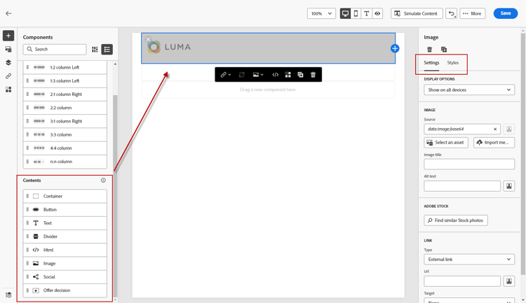

# E-Mail-Erstellung {#email-authoring}

Erfahren Sie, wie Sie E-Mails in der neuen Marketo Engage E-Mail-Designer erstellen, personalisieren und in der Vorschau anzeigen.

>[!PREREQUISITES]
>
>Um auf den neuen E-Mail-Designer zugreifen zu können, muss Ihr Marketo Engage-Abonnement auf das [Adobe Identity Management System (IMS) migriert ](https://experienceleague.adobe.com/en/docs/marketo/using/product-docs/administration/marketo-with-adobe-identity/adobe-identity-management-overview). Wenn Ihre Anfrage noch nicht bearbeitet wurde und Sie eine Beschleunigung anfordern möchten, wenden Sie sich bitte an das Adobe Account Team (Ihren Account Manager) oder an den [Marketo Support](https://nation.marketo.com/t5/support/ct-p/Support).

## Erstellen einer E-Mail {#create-an-email}

E-Mails aus Email Designer können derzeit nur im Design Studio erstellt und in Smart Campaign/Listen referenziert oder direkt in E-Mail-Programmen erstellt/verwendet werden.

>[!BEGINTABS]

>[!TAB Design Studio]

1. Melden Sie sich über die [Adobe Experience Cloud](https://experiencecloud.adobe.com/){target="_blank"} bei Marketo Engage an.

1. Wählen Sie in My Marketo **Design Studio** aus.

   

1. Wählen Sie in der Struktur **E-Mails (Neuer Editor)**.

   

1. Klicken Sie auf die **E-Mail erstellen**.

   

1. Geben Sie einen E-Mail-Namen und eine Betreffzeile ein. Klicken Sie auf **Erstellen**.

   

>[!TAB E-Mail-Programm]

1. Melden Sie sich über die [Adobe Experience Cloud](https://experiencecloud.adobe.com/){target="_blank"} bei Marketo Engage an.

1. Suchen und wählen Sie Ihr E-Mail-Programm aus (oder erstellen Sie es).

   

1. Sie haben zwei Möglichkeiten, eine neue E-Mail zu erstellen. Klicken Sie mit der rechten Maustaste auf den Namen Ihres E-Mail-Programms und wählen Sie **Neues lokales Asset**, oder klicken Sie auf die Schaltfläche **+Neue E-Mail** im Feld E-Mail im Dashboard. In diesem Beispiel werden wir ersteres tun.

   

1. Wählen Sie **E-Mail (neuer Editor)**.

   

1. Geben Sie einen E-Mail-Namen und eine Betreffzeile ein. Klicken Sie auf **Erstellen**.

   

>[!ENDTABS]

Das war&#39;s. Jetzt ist es an der Zeit, Ihre E-Mail zu entwerfen.

## Wählen des Inhaltstyps {#choose-your-content-type}

1. Klicken Sie in der soeben erstellten E-Mail auf **E-Mail-Inhalt hinzufügen**.

   

1. Die _E-Mail erstellen_ wird geladen. Sie können aus mehreren Optionen wählen:

* [Erstellen von neuen Inhalten](#design-from-scratch) mithilfe des visuellen E-Mail-Editors

* [Importieren Sie Ihre eigene HTML ](#import-html) eine HTML- oder ZIP-Datei

* [Vorhandene Vorlage auswählen](#choose-a-template) (eines unserer Beispiele oder eines, das Sie bereits gespeichert haben)

### Von Grund auf gestalten {#design-from-scratch}

Verwenden Sie die folgenden Optionen, um Ihren Inhalt zu definieren, wenn Sie im E-Mail-Editor von Grund auf neu beginnen.

1. Wählen Sie auf _Seite „E_ Mail erstellen“ die Option **Erstellen von neuen Inhalten** aus.

1. Fügen Sie [Struktur und Inhalt](#add-structure-and-content) zu Ihrer E-Mail hinzu.

1. Fügen Sie [images](#add-assets) hinzu.

1. [Personalisieren](#personalize-content) Ihres Inhalts.

1. Links überprüfen und [Tracking bearbeiten](#edit-url-tracking).

### Importieren von HTML {#import-html}

Sie können vorhandenen HTML-Inhalt importieren, um Ihre E-Mail zu gestalten. Der Inhalt kann wie folgt lauten:

* Eine HTML-Datei mit integriertem Stylesheet

* Eine ZIP-Datei, die eine HTML-Datei, das Stylesheet (.css) und Bilder enthält

>[!NOTE]
>
>Die Dateistruktur des komprimierten Ordners ist freigestellt. Verweise müssen jedoch relativ sein und mit der Baumstruktur des ZIP-Ordners übereinstimmen.

1. Wählen Sie auf der Seite Vorlage entwerfen die Option **HTML importieren** aus.

1. Ziehen Sie die gewünschte HTML- oder ZIP-Datei per Drag-and-Drop (oder wählen Sie eine Datei auf Ihrem Computer aus) und klicken Sie auf **Importieren**.

   

>[!NOTE]
>
>Wenn der HTML-Inhalt hochgeladen wird, befindet sich der Inhalt im Kompatibilitätsmodus . In diesem Modus können Sie nur Ihren Text personalisieren, Links hinzufügen oder Assets zu Ihren Inhalten hinzufügen.

Sie können die gewünschten Änderungen am importierten Inhalt mit den [visuellen E-Mail-Editor-Tools](#add-structure-and-content) vornehmen.

### Vorlage wählen {#choose-a-template}

Es gibt zwei Arten von Vorlagen zur Auswahl.

* **Beispielvorlagen**: Marketo Engage bietet vier vordefinierte E-Mail-Vorlagen.

* **Gespeicherte Vorlagen**: Hierbei handelt es sich um Vorlagen, die Sie mithilfe des Menüs Vorlagen von Grund auf neu erstellt haben, oder um eine E-Mail, die Sie erstellt und als Vorlage gespeichert haben.

>[!BEGINTABS]

>[!TAB Beispielvorlagen]

Wählen Sie eine der vordefinierten Vorlagen für einen Vorsprung beim Design Ihrer E-Mail-Vorlage.

1. Die Registerkarte Beispielvorlagen ist standardmäßig geöffnet.

1. Wählen Sie die Vorlage aus, die Sie verwenden möchten.

   

1. Klicken Sie auf **Diese Vorlage verwenden**.

   

1. Bearbeiten Sie den Inhalt nach Bedarf mit dem visuellen Content Designer.

>[!TAB Gespeicherte Vorlagen]

1. Klicken Sie auf **Gespeicherte Vorlagen** und wählen Sie die gewünschte Vorlage aus.

   

1. Klicken Sie auf **Diese Vorlage verwenden**.

   

1. Bearbeiten Sie den Inhalt nach Bedarf mit dem visuellen Content Designer.

>[!ENDTABS]

## Hinzufügen von Struktur und Inhalten {#add-structure-and-content}

1. Um mit dem Erstellen oder Ändern von Inhalten zu beginnen, ziehen Sie ein Element per Drag-and-Drop aus „Strukturen“ auf die Arbeitsfläche. Bearbeiten Sie die Einstellungen im Bereich auf der rechten Seite.

   >[!TIP]
   >
   >Wählen Sie die Komponente n:n Spalte aus, um die Anzahl der Spalten zu definieren (3 bis 10). Sie können auch die Breite jeder Spalte definieren, indem Sie die Pfeile unter die Spalte verschieben.

   

   >[!NOTE]
   >
   >Die Größe einer Spalte darf nicht kleiner als 10 % der Gesamtbreite der Strukturkomponente sein. Nur leere Spalten können entfernt werden.

1. Ziehen Sie aus dem Abschnitt Inhalte die gewünschten Elemente per Drag-and-Drop in eine oder mehrere Strukturkomponenten.

   

1. Jede Komponente kann über die Registerkarten Einstellungen oder Stil angepasst werden. Ändern Sie Schriftart, Textstil, Rand und mehr.

### Hinzufügen von Fragmenten {#add-fragments}

1. Um auf Ihre Fragmente zuzugreifen, wählen Sie das Symbol _Fragmente_ (  ) in der linken Navigationsleiste aus.

   {width="700" zoomable="yes"}

1. Ziehen Sie eines der Fragmente per Drag-and-Drop in den Platzhalter der Strukturkomponente .

Der Editor rendert das Fragment innerhalb des Abschnitts/Elements der E-Mail-Struktur. Der Inhalt des Fragments wird innerhalb der Struktur dynamisch aktualisiert, um anzuzeigen, wie der Inhalt in der E-Mail angezeigt wird.

>[!TIP]
>
>Wenn das Fragment das gesamte horizontale Layout in der E-Mail einnehmen soll, fügen Sie eine 1:1-Spaltenstruktur hinzu und ziehen Sie das Fragment dann per Drag-and-Drop hinein.

Nachdem die E-Mail gespeichert wurde, wird sie auf der Registerkarte _[!UICONTROL Verwendet von]_ der Seite mit den Fragmentdetails angezeigt. Fragmente, die einer E-Mail-Vorlage hinzugefügt wurden, können innerhalb der Vorlage nicht bearbeitet werden. Das Quellfragment definiert den Inhalt.

### Assets hinzufügen {#add-assets}

Fügen Sie Bilder hinzu, die im Abschnitt [Bilder und Dateien](/help/marketo/product-docs/demand-generation/images-and-files/add-images-and-files-to-marketo.md){target="_blank"} Ihrer Marketo Engage-Instanz gespeichert sind.

>[!NOTE]
>
>Bilder können nur im neuen Designer hinzugefügt werden, andere Dateitypen sind derzeit nicht möglich.

1. Um auf Ihre Bilder zuzugreifen, klicken Sie auf das Symbol Asset-Wähler .

   

1. Ziehen Sie das gewünschte Bild per Drag-and-Drop in eine Strukturkomponente .

   

   >[!NOTE]
   >
   >Um ein vorhandenes Bild zu ersetzen, wählen Sie es aus und klicken Sie dann auf **Asset auswählen** auf der Registerkarte Einstellungen auf der rechten Seite.

### Ebenen, Einstellungen und Stile {#layers-settings-styles}

Öffnen Sie den Navigationsbaum, um auf bestimmte Strukturen und deren Spalten/Komponenten zuzugreifen und so eine präzisere Bearbeitung zu ermöglichen. Um darauf zuzugreifen, klicken Sie auf das Symbol Navigationsbaum .

Im folgenden Beispiel werden Schritte zum Anpassen des Abstands und der vertikalen Ausrichtung innerhalb einer aus Spalten zusammengesetzten Strukturkomponente beschrieben.

1. Wählen Sie die Spalte in der Strukturkomponente direkt auf der Arbeitsfläche aus oder verwenden Sie den _Navigationsbaum_ der links angezeigt wird.

1. Klicken Sie in der Spalten-Symbolleiste auf _[!UICONTROL Spalte auswählen]_ und wählen Sie das Tool aus, das Sie bearbeiten möchten.

   Sie können sie auch aus dem Strukturbaum auswählen. Die bearbeitbaren Parameter für diese Spalte werden auf den Registerkarten _[!UICONTROL Einstellungen]_ und _[!UICONTROL Stile]_ auf der rechten Seite angezeigt.

   

1. Um die Spalteneigenschaften zu bearbeiten, klicken Sie auf die _[!UICONTROL Stile]_ Registerkarte auf der rechten Seite und ändern Sie sie entsprechend Ihren Anforderungen:

   * Für **[!UICONTROL Hintergrund]** ändern Sie die Hintergrundfarbe nach Bedarf.

     Deaktivieren Sie das Kontrollkästchen für einen transparenten Hintergrund. Aktivieren Sie die **[!UICONTROL Hintergrundbild]**, um ein Bild anstelle einer Volltonfarbe als Hintergrund zu verwenden.

   * Wählen **[!UICONTROL für]** das Symbol _Oben_, _Mitte_ oder _Unten_ aus.
   * Definieren **[!UICONTROL für]** Abstand“ den Abstand für alle Seiten.

     Wählen Sie **[!UICONTROL Unterschiedlicher Abstand für jede Seite]** aus, wenn Sie den Abstand anpassen möchten. Klicken Sie auf _Sperrsymbol_, um die Synchronisierung aufzuheben.

   * Erweitern Sie den Abschnitt **[!UICONTROL Erweitert]**, um Inline-Stile für die Spalte zu definieren.

   

1. Wiederholen Sie diese Schritte nach Bedarf, um die Ausrichtung und den Abstand für die anderen Spalten in der Komponente anzupassen.

1. Speichern Sie Ihre Änderungen.

### Personalisieren von Inhalten {#personalize-content}

Token funktionieren im neuen Editor genauso wie im alten, aber das Symbol sieht anders aus. Im folgenden Beispiel wird das Hinzufügen eines Vornamen-Tokens mit Fallback-Text beschrieben.

1. Wählen Sie die Textkomponente aus. Platzieren Sie den Cursor an der gewünschten Stelle, und klicken Sie auf das Symbol **Personalisierung hinzufügen**.

   

1. Klicken Sie auf den gewünschten [Tokentyp](/help/marketo/product-docs/demand-generation/landing-pages/personalizing-landing-pages/tokens-overview.md){target="_blank"}.

   

1. Suchen Sie das gewünschte Token und klicken Sie auf das Symbol **…** (durch Klicken auf das Symbol + wird stattdessen ein Token ohne Fallback-Text hinzugefügt).

   

   >[!NOTE]
   >
   >„Fallback-Text“ ist der neue Editor-Begriff für den Standardwert. Beispiel: ``{{lead.First Name:default=Friend}}``. Dies wird empfohlen, wenn in dem von Ihnen ausgewählten Feld kein Wert für die Person vorhanden ist.

1. Legen Sie Ihren Fallback-Text fest und klicken Sie auf **Hinzufügen**.

   

1. Klicken Sie auf **Speichern**.

### URL-Tracking bearbeiten {#edit-url-tracking}

Manchmal soll die Marketo-Tracking-URL nicht für einen Link in einer E-Mail aktiviert werden. Dies ist nützlich, wenn die Zielseite URL-Parameter nicht unterstützt und zu einem fehlerhaften Link führen kann.

1. Klicken Sie auf das Symbol Links , um alle URLs in Ihrer E-Mail anzuzeigen.

   

1. Klicken Sie auf das Stiftsymbol, um das Tracking für beliebige Links zu bearbeiten.

1. Klicken Sie auf **Tracking-Typ** und treffen Sie Ihre Auswahl.

   

   <table><tbody>
     <tr>
       <td><b>Tracking ohne mkt_tok</b></td>
       <td>Aktiviert das Tracking der URL ohne Verwendung des Abfragezeichenfolgenparameters mkt_tok in der Ziel-URL</td>
     </tr>
     <tr>
       <td><b>Nachverfolgen mit mkt_tok</b></td>
       <td>Aktiviert das Tracking der URL mithilfe des Abfragezeichenfolgenparameters „mkt_tok“ in der Ziel-URL</td>
     </tr>
     <tr>
       <td><b>Nicht verfolgen</b></td>
       <td>Deaktiviert das Tracking der URL</td>
     </tr>
   </tbody>
   </table>

1. Optional können Sie der URL einen Titel geben oder Tags hinzufügen.

1. Klicken Sie auf **Speichern**, wenn Sie fertig sind.

## Prüfen von Warnhinweisen {#check-alerts}

Während Sie Ihre Inhalte entwerfen, werden Warnhinweise oben rechts im Bildschirm angezeigt, wenn wichtige Einstellungen fehlen.

Es gibt zwei Arten von Warnhinweisen:

**Warnungen**

Warnhinweise geben Hinweise auf Empfehlungen und zeigen Best Practices, wie etwa:

* **Der Ausschluss-Link ist nicht im E-Mail-Textkörper vorhanden**: Obwohl Abmelde-Links eine Voraussetzung sind, empfiehlt es sich, sie dem Textkörper Ihrer E-Mail hinzuzufügen.

>[!NOTE]
>
>Das Hinzufügen einer Abmelde-Option ist für [operative E-Mails](/help/marketo/product-docs/email-marketing/general/functions-in-the-editor/make-an-email-operational.md) (Nicht-Marketing) nicht erforderlich.

* **Textversion von HTML ist leer**: Sie müssen eine Textversion Ihres E-Mail-Textkörpers für den Fall definieren, dass HTML-Inhalte nicht angezeigt werden können.

* **Leerer Link ist im E-Mail-Text vorhanden**: Überprüfen Sie, ob alle Links in Ihrer E-Mail korrekt sind.

* **Die E-Mail-Größe überschreitet den Grenzwert von 100 KB**: Stellen Sie sicher, dass die Größe Ihrer E-Mail 100 KB nicht überschreitet, um einen optimalen Versand zu erzielen.

**Fehler**

Fehler verhindern, dass Sie die E-Mail senden oder testen, bis sie behoben sind:

* **Betreffzeile fehlt**: Eine E-Mail-Betreffzeile ist erforderlich.

* **E-Mail-Version der Nachricht ist leer**: Dieser Fehler tritt auf, wenn der E-Mail-Inhalt nicht konfiguriert wurde.

## E-Mail testen {#test-your-email}

Wenn der Nachrichteninhalt definiert ist, können Sie ihn mithilfe von Testprofilen in der Vorschau anzeigen, einen Testversand durchführen und steuern, wie er in gängigen Desktop-, Mobile- und Web-basierten Clients gerendert wird. Wenn Sie personalisierte Inhalte eingefügt haben, können Sie mithilfe von Testprofildaten überprüfen, wie diese in der Nachricht angezeigt werden.

Um eine Vorschau Ihres E-Mail-Inhalts anzuzeigen, klicken Sie **Inhalt simulieren** und fügen Sie dann ein Testprofil hinzu, um Ihre Nachricht mithilfe der Testprofildaten zu überprüfen.

## Referenzieren einer E-Mail {#reference-an-email}

E-Mail-Designer-E-Mails sind in allen E-Mail-, Interaktions-, Standard- und Veranstaltungsprogrammen verfügbar (mit Ausnahme von interaktiven Webinar-Programmen). Wenn Sie Ihre E-Mail im Design Studio erstellt haben, kann sie von Smart-Kampagnen und/oder Smart-Listen wie jede andere E-Mail referenziert werden.

* Verweisen Sie in einer Smart List darauf, indem [ die üblichen Schritte ](/help/marketo/product-docs/core-marketo-concepts/smart-lists-and-static-lists/creating-a-smart-list/create-a-smart-list.md).

* Verweisen Sie in einer Smart Campaign darauf, [ Sie die üblichen Schritte ](/help/marketo/product-docs/core-marketo-concepts/smart-campaigns/creating-a-smart-campaign/create-a-new-smart-campaign.md).

>[!NOTE]
>
>Es können nur gespeicherte E-Mails referenziert werden. Im neuen E-Mail-Designer gibt es keinen Status „Genehmigt“.

>[!MORELIKETHIS]
>
>[E-Mail-Vorlagen](/help/marketo/product-docs/email-marketing/email-designer/email-template-authoring.md){target="_blank"}: Erfahren Sie, wie Sie im neuen Designer eine E-Mail-Vorlage erstellen, gestalten und darauf zugreifen.
