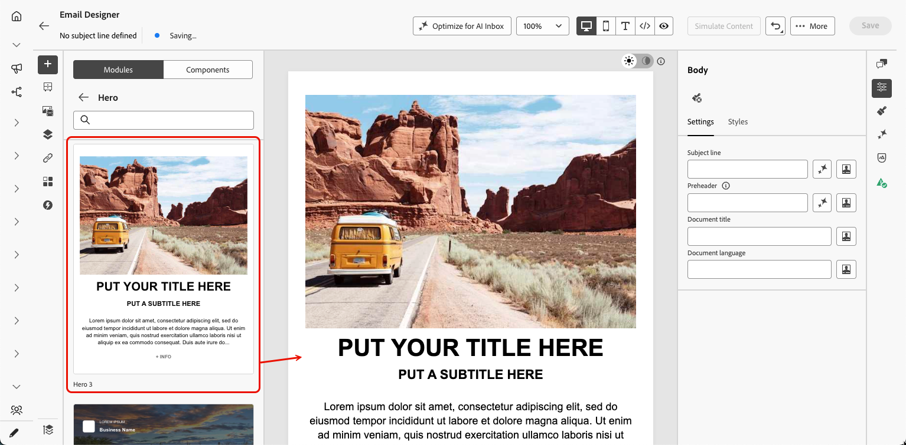
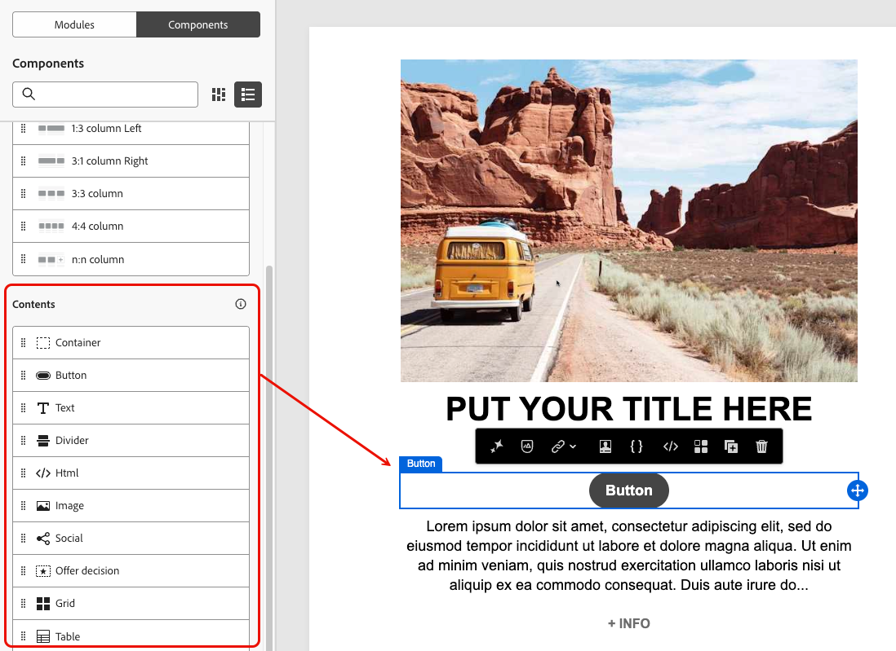

# Verwenden von Modulen im E-Mail-Designer {#email-modules}

E-Mail-Designer enthält eine Bibliothek mit Modulen: einsatzbereite, vollständig strukturierte Inhaltsbausteine, die die E-Mail-Erstellung beschleunigen und die Konsistenz des Designs in Ihrer gesamten Kommunikation fördern.

Im Gegensatz [Inhaltskomponenten](/help/marketo/product-docs/email-marketing/email-designer/email-authoring.md#add-structure-and-content), bei denen es sich um leere Platzhalter handelt, die Sie von Grund auf neu konfigurieren, sind Module vorgefertigte Abschnitte (z. B. Kopfzeilen- oder Produktkartenraster oder Fußzeilen mit Opt-out-Links), die Sie direkt auf Ihrer Arbeitsfläche ablegen und dort anpassen können.

>[!NOTE]
>
>Module sind keine Fragmente. Sie sind in der von Ihnen entworfenen E-Mail enthalten. Nachdem Sie ein Modul jedoch an Ihre Anforderungen angepasst haben, können Sie es als &quot;[ Fragment“ speichern](/help/marketo/product-docs/email-marketing/email-designer/fragments.md#visual-fragments) um es dann für andere E-Mails und Nachrichten wiederzuverwenden.

## Aufrufen und Einfügen von Modulen {#access-modules}

Gehen Sie wie folgt vor, um die verfügbaren Module im E-Mail-Designer anzuzeigen und zu nutzen.

1. Öffnen Sie die gewünschte E-Mail.

1. Klicken Sie im linken Bereich auf die Registerkarte **[!UICONTROL Module]**.

   

1. Durchsuchen Sie die verfügbaren Modulkategorien oder verwenden Sie die Suchleiste, um nach Namen zu filtern.

1. Klicken Sie auf den Pfeil **>** neben einer Kategorie, um sie zu erweitern und verfügbare Layout-Varianten anzuzeigen.

1. Suchen Sie die Modulvariante, die Sie verwenden möchten, und ziehen Sie sie dann per Drag-and-Drop direkt auf Ihre E-Mail-Arbeitsfläche.

   

1. Das Modul wird mit seinem Standardinhalt eingefügt. Klicken Sie auf ein beliebiges Element auf der Arbeitsfläche, um mit der Inline-Bearbeitung von Inhalten zu beginnen. Klicken Sie auf einen Textbereich, um direkt Text einzugeben, oder klicken Sie auf ein Bild, um es durch ein Bild aus Ihrer Asset-Bibliothek zu ersetzen.

   >[!NOTE]
   >
   >Wenn E-Mail-Designs auf Ihre Inhalte angewendet werden, erben Module automatisch die angewendeten Design-Stile, um die Markenkonsistenz in Ihrem Design sicherzustellen.

1. Verwenden Sie die Registerkarten **[!UICONTROL Einstellungen]** und **[!UICONTROL Stile]** im rechten Bereich, um Eigenschaften und Stil wie für jedes andere E-Mail-Element anzupassen.

   {width="70%"}

1. Sie können dem Modul auch [Inhaltskomponenten](/help/marketo/product-docs/email-marketing/email-designer/email-authoring.md#add-structure-and-content) direkt hinzufügen. Wechseln Sie zur Registerkarte **[!UICONTROL Komponenten]** im linken Bereich und ziehen Sie eine Komponente per Drag-and-Drop in das Modul. Die Komponente übernimmt standardmäßig die Formatierung des Moduls. Diese können Sie jedoch bei Bedarf überschreiben.

   {width="60%"}

## Verfügbare Module {#available-modules}

Die folgenden Modulkategorien sind vorkonfiguriert verfügbar. Für jedes Modul gibt es mehrere Layout-Varianten, z. B. einspaltige, zweispaltige und dreispaltige Raster. Erweitern Sie die Modulkategorien, um die Variante auszuwählen, die zu Ihrem Layout passt.

| Modul | Beschreibung |
|---|---|
| **[!UICONTROL Kopfzeilen]** | Markenkonforme E-Mail-Kopfzeile mit Ihrem Logo, Navigations-Links und Einführungstext. |
| **[!UICONTROL Hero]** | Bannerabschnitt in voller Breite: ideal für Werbeaktionen, Ankündigungen oder Kampagnenöffner. |
| **[!UICONTROL Kundenreferenzen]** | Kundenzitate oder Social Proof in einem konsistenten, einheitlich formatierten Format. |
| **[!UICONTROL Karten]** | Produkte, Artikel oder Inhaltselemente in ein- oder mehrspaltigen Raster-Layouts. |
| **[!UICONTROL Teams]** | Team-Mitglieder, Autorinnen und Autoren, Rednerinnen und Redner mit Foto, Namen und Rolle. |
| **[!UICONTROL Fußzeilen]** | Vollständige E-Mail-Fußzeile mit Navigations-Links, Social-Media-Symbolen, rechtlichen Informationen und obligatorischen Abmelde- und Mirrorseiten-Links. |
