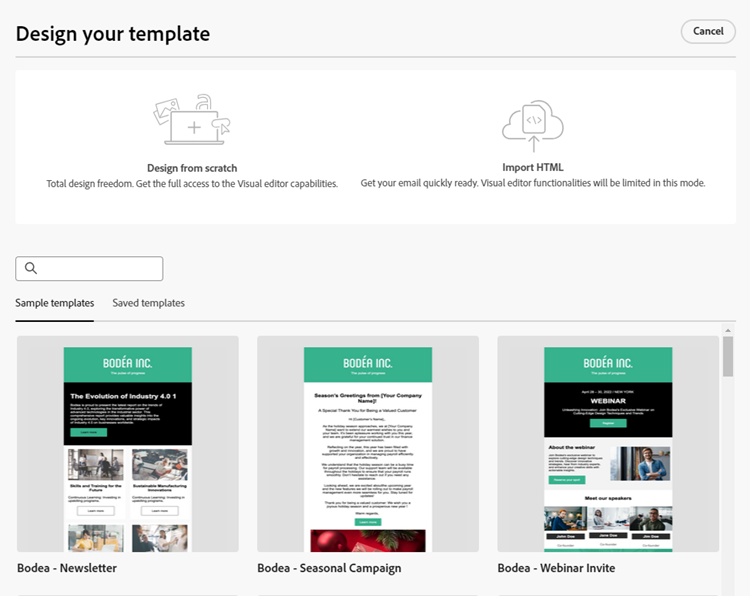
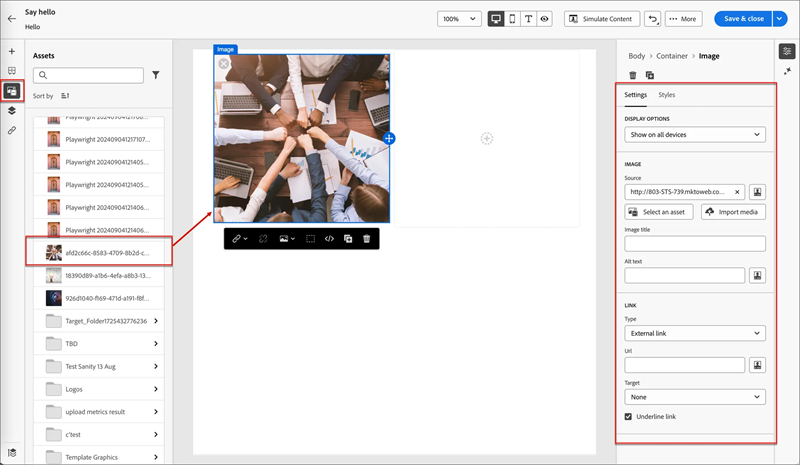
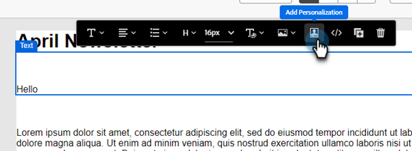

# Erstellung von E-Mail-Vorlagen {#email-template-authoring}

Für einen beschleunigten und verbesserten Design-Prozess können Sie eigenständige E-Mail-Vorlagen erstellen, um benutzerdefinierte Inhalte einfach wiederzuverwenden.

>[!PREREQUISITES]
>
>Um auf den neuen E-Mail-Designer zugreifen zu können, muss Ihr Marketo Engage-Abonnement auf das [Adobe Identity Management System (IMS) migriert ](https://experienceleague.adobe.com/en/docs/marketo/using/product-docs/administration/marketo-with-adobe-identity/adobe-identity-management-overview). Wenn Ihre Anfrage noch nicht bearbeitet wurde und Sie eine Beschleunigung anfordern möchten, wenden Sie sich bitte an das Adobe Account Team (Ihren Account Manager) oder an den [Marketo Support](https://nation.marketo.com/t5/support/ct-p/Support).

>[!NOTE]
>
>E-Mail-Vorlagen im neuen E-Mail-Designer können nur zum Erstellen von E-Mails im neuen E-Mail-Designer verwendet werden. Sie können im alten E-Mail-Editor nicht referenziert werden.

## E-Mail-Vorlage erstellen {#create-an-email-template}

1. Melden Sie sich über die [Adobe Experience Cloud](https://experiencecloud.adobe.com/){target="_blank"} bei Marketo Engage an.

1. Wählen Sie in My Marketo **Design Studio** aus.

   

1. Wählen Sie in der Struktur **E-Mail-Vorlagen (Neuer Editor)**.

   

1. Klicken Sie auf **Schaltfläche „Vorlage erstellen**.

   

1. Geben Sie einen Vorlagennamen und eine optionale Beschreibung ein. Klicken Sie auf **Erstellen**.

   

## Entwerfen einer Vorlage {#design-your-template}

Auf der _Vorlage entwerfen_ können Sie aus einigen Optionen auswählen. [Erstellen Sie von Grund ](#design-from-scratch), [importieren Sie Ihre eigene HTML](#import-html) oder [wählen Sie eine vorhandene Vorlage aus](#choose-a-template) (eines unserer Beispiele oder eines, das Sie bereits gespeichert haben).

### Von Grund auf gestalten {#design-from-scratch}

Definieren Sie Ihre Inhalte, indem Sie strukturelle Elemente mit einfachen Drag-and-Drop-Aktionen hinzufügen und verschieben.

1. Wählen Sie auf _Seite_ Vorlage entwerfen“ **Erstellen von neuen Inhalten** aus.

1. Fügen Sie [Struktur und Inhalt](#add-structure-and-content) hinzu.

### HTML importieren {#import-your-html}

Sie können vorhandene HTML-Inhalte importieren, um Ihre E-Mail-Vorlagen zu entwerfen. Der Inhalt kann wie folgt lauten:

* Eine HTML-Datei mit integriertem Stylesheet

* Eine ZIP-Datei, die eine HTML-Datei, das Stylesheet (.css) und Bilder enthält

>[!NOTE]
>
>Die Dateistruktur des komprimierten Ordners ist freigestellt. Verweise müssen jedoch relativ sein und mit der Baumstruktur des ZIP-Ordners übereinstimmen.

1. Wählen Sie auf _Seite „Vorlage_&quot; **HTML importieren** aus.

1. Ziehen Sie die gewünschte HTML- oder ZIP-Datei per Drag-and-Drop (oder wählen Sie eine Datei auf Ihrem Computer aus) und klicken Sie auf **Importieren**.

   

   >[!NOTE]
   >
   >Wenn der HTML-Inhalt hochgeladen wird, befindet sich der Inhalt im Kompatibilitätsmodus . In diesem Modus können Sie nur Ihren Text personalisieren, Links hinzufügen oder Assets zu Ihren Inhalten hinzufügen.

1. Um die Inhaltskomponenten von Email Designer nutzen zu können, klicken Sie auf die Registerkarte **HTML Converter** und dann auf **Convert**.

   >[!CAUTION]
   >
   >Einen `<table>`-Tag als erste Ebene in einer HTML-Datei zu verwenden kann zum Verlust des Stils führen, einschließlich der Einstellungen für Hintergrund und Breite im Tag der obersten Ebene.

Sie können jetzt Ihre importierte Datei nach Bedarf mit dem visuellen E-Mail-Editor personalisieren.

### Vorlage wählen {#choose-a-template}

Es gibt zwei Arten von Vorlagen zur Auswahl.

* **Beispielvorlagen**: Marketo Engage bietet vier vordefinierte E-Mail-Vorlagen.

* **Gespeicherte Vorlagen**: Hierbei handelt es sich um Vorlagen, die Sie mithilfe des Menüs Vorlagen von Grund auf neu erstellt haben, oder um eine E-Mail, die Sie erstellt und als Vorlage gespeichert haben.

>[!BEGINTABS]

>[!TAB Beispielvorlagen]

Wählen Sie eine der vordefinierten Vorlagen für einen Vorsprung beim Design Ihrer E-Mail-Vorlage.

1. Die Registerkarte Beispielvorlagen ist standardmäßig geöffnet.

1. Wählen Sie die Vorlage aus, die Sie verwenden möchten.

   

1. Klicken Sie auf **Diese Vorlage verwenden**.

   

1. Bearbeiten Sie den Inhalt nach Bedarf mit dem visuellen Content Designer.

>[!TAB Gespeicherte Vorlagen]

1. Klicken Sie auf **Gespeicherte Vorlagen** und wählen Sie die gewünschte Vorlage aus.

   

1. Klicken Sie auf **Diese Vorlage verwenden**.

   

1. Bearbeiten Sie den Inhalt nach Bedarf mit dem visuellen Content Designer.

>[!ENDTABS]

## Hinzufügen von Struktur und Inhalten {#add-structure-and-content}

1. Um mit dem Erstellen oder Ändern von Inhalten zu beginnen, ziehen Sie ein Element per Drag-and-Drop aus „Strukturen“ auf die Arbeitsfläche. Bearbeiten Sie die Einstellungen im Bereich auf der rechten Seite.

   >[!TIP]
   >
   >Wählen Sie die Komponente n:n Spalte aus, um die Anzahl der Spalten zu definieren (3 bis 10). Sie können auch die Breite jeder Spalte definieren, indem Sie die Pfeile unter die Spalte verschieben.

   

   >[!NOTE]
   >
   >Die Größe einer Spalte darf nicht kleiner als 10 % der Gesamtbreite der Strukturkomponente sein. Nur leere Spalten können entfernt werden.

1. Ziehen Sie aus dem Abschnitt Inhalte die gewünschten Elemente per Drag-and-Drop in eine oder mehrere Strukturkomponenten.

   

1. Jede Komponente kann über die Registerkarten Einstellungen oder Stil angepasst werden. Ändern Sie Schriftart, Textstil, Rand und mehr.

### Hinzufügen von Fragmenten {#add-fragments}

1. Um auf Ihre Fragmente zuzugreifen, wählen Sie das Symbol _Fragmente_ (  ) in der linken Navigationsleiste aus.

   {width="700" zoomable="yes"}

1. Ziehen Sie eines der Fragmente per Drag-and-Drop in den Platzhalter der Strukturkomponente .

Der Editor rendert das Fragment innerhalb des Abschnitts/Elements der E-Mail-Struktur. Der Inhalt des Fragments wird innerhalb der Struktur dynamisch aktualisiert, um anzuzeigen, wie der Inhalt in der E-Mail angezeigt wird.

>[!TIP]
>
>Wenn das Fragment das gesamte horizontale Layout in der E-Mail einnehmen soll, fügen Sie eine 1::1-Spaltenstruktur hinzu und ziehen Sie das Fragment dann per Drag-and-Drop hinein.

Nachdem die E-Mail gespeichert wurde, wird sie auf der Registerkarte _[!UICONTROL Verwendet von]_ der Seite mit den Fragmentdetails angezeigt. Fragmente, die einer E-Mail-Vorlage hinzugefügt wurden, können innerhalb der Vorlage nicht bearbeitet werden. Das Quellfragment definiert den Inhalt.

### Hinzufügen von Assets {#add-assets}

Fügen Sie Bilder hinzu, die im Abschnitt [Bilder und Dateien](/help/marketo/product-docs/demand-generation/images-and-files/add-images-and-files-to-marketo.md){target="_blank"} Ihrer Marketo Engage-Instanz gespeichert sind.

>[!NOTE]
>
>Bilder können nur im neuen Designer hinzugefügt werden, andere Dateitypen sind derzeit nicht möglich.

1. Um auf Ihre Bilder zuzugreifen, klicken Sie auf das Symbol Asset-Wähler .

   

1. Ziehen Sie das gewünschte Bild per Drag-and-Drop in eine Strukturkomponente .

   

   >[!NOTE]
   >
   >Um ein vorhandenes Bild zu ersetzen, wählen Sie es aus und klicken Sie dann auf **Asset auswählen** auf der Registerkarte Einstellungen auf der rechten Seite.

### Ebenen, Einstellungen und Stile {#layers-settings-styles}

Öffnen Sie den Navigationsbaum, um auf bestimmte Strukturen und deren Spalten/Komponenten zuzugreifen und so eine präzisere Bearbeitung zu ermöglichen. Um darauf zuzugreifen, klicken Sie auf das Symbol Navigationsbaum .

Im folgenden Beispiel werden Schritte zum Anpassen des Abstands und der vertikalen Ausrichtung innerhalb einer aus Spalten zusammengesetzten Strukturkomponente beschrieben.

1. Wählen Sie die Spalte in der Strukturkomponente direkt auf der Arbeitsfläche aus oder verwenden Sie den _Navigationsbaum_ der links angezeigt wird.

1. Klicken Sie in der Spalten-Symbolleiste auf _[!UICONTROL Spalte auswählen]_ und wählen Sie das Tool aus, das Sie bearbeiten möchten.

   Sie können sie auch aus dem Strukturbaum auswählen. Die bearbeitbaren Parameter für diese Spalte werden auf den Registerkarten _[!UICONTROL Einstellungen]_ und _[!UICONTROL Stile]_ auf der rechten Seite angezeigt.

   

1. Um die Spalteneigenschaften zu bearbeiten, klicken Sie auf die _[!UICONTROL Stile]_ Registerkarte auf der rechten Seite und ändern Sie sie entsprechend Ihren Anforderungen:

   * Für **[!UICONTROL Hintergrund]** ändern Sie die Hintergrundfarbe nach Bedarf.

     Deaktivieren Sie das Kontrollkästchen für einen transparenten Hintergrund. Aktivieren Sie die **[!UICONTROL Hintergrundbild]**, um ein Bild anstelle einer Volltonfarbe als Hintergrund zu verwenden.

   * Wählen **[!UICONTROL für]** das Symbol _Oben_, _Mitte_ oder _Unten_ aus.
   * Definieren **[!UICONTROL für]** Abstand“ den Abstand für alle Seiten.

     Wählen Sie **[!UICONTROL Unterschiedlicher Abstand für jede Seite]** aus, wenn Sie den Abstand anpassen möchten. Klicken Sie auf _Sperrsymbol_, um die Synchronisierung aufzuheben.

   * Erweitern Sie den Abschnitt **[!UICONTROL Erweitert]**, um Inline-Stile für die Spalte zu definieren.

   

1. Wiederholen Sie diese Schritte nach Bedarf, um die Ausrichtung und den Abstand für die anderen Spalten in der Komponente anzupassen.

1. Speichern Sie Ihre Änderungen.

### Personalisieren von Inhalten {#personalize-content}

Token funktionieren im neuen Editor genauso wie im alten, aber das Symbol sieht anders aus. Im folgenden Beispiel wird das Hinzufügen eines Vornamen-Tokens mit Fallback-Text beschrieben.

1. Wählen Sie die Textkomponente aus. Platzieren Sie den Cursor an der gewünschten Stelle, und klicken Sie auf das Symbol **Personalisierung hinzufügen**.

   

1. Klicken Sie auf den gewünschten [Tokentyp](/help/marketo/product-docs/demand-generation/landing-pages/personalizing-landing-pages/tokens-overview.md){target="_blank"}.

   

1. Suchen Sie das gewünschte Token und klicken Sie auf das Symbol **…** (durch Klicken auf das Symbol + wird stattdessen ein Token ohne Fallback-Text hinzugefügt).

   

   >[!NOTE]
   >
   >„Fallback-Text“ ist der neue Editor-Begriff für den Standardwert. Beispiel: ``{{lead.First Name:default=Friend}}``. Dies wird empfohlen, wenn in dem von Ihnen ausgewählten Feld kein Wert für die Person vorhanden ist.

1. Legen Sie Ihren Fallback-Text fest und klicken Sie auf **Hinzufügen**.

   

1. Klicken Sie auf **Speichern**.

### URL-Tracking bearbeiten {#edit-url-tracking}

Manchmal soll die Marketo-Tracking-URL nicht für einen Link in einer E-Mail aktiviert werden. Dies ist nützlich, wenn die Zielseite URL-Parameter nicht unterstützt und zu einem fehlerhaften Link führen kann.

1. Klicken Sie auf das Symbol Links , um alle URLs in Ihrer E-Mail anzuzeigen.

   

1. Klicken Sie auf das Stiftsymbol, um das Tracking für beliebige Links zu bearbeiten.

1. Klicken Sie auf **Tracking-Typ** und treffen Sie Ihre Auswahl.

   

   <table><tbody>
     <tr>
       <td><b>Tracking ohne mkt_tok</b></td>
       <td>Aktiviert das Tracking der URL ohne Verwendung des Abfragezeichenfolgenparameters mkt_tok in der Ziel-URL</td>
     </tr>
     <tr>
       <td><b>Nachverfolgen mit mkt_tok</b></td>
       <td>Aktiviert das Tracking der URL mithilfe des Abfragezeichenfolgenparameters „mkt_tok“ in der Ziel-URL</td>
     </tr>
     <tr>
       <td><b>Nicht verfolgen</b></td>
       <td>Deaktiviert das Tracking der URL</td>
     </tr>
   </tbody>
   </table>

1. Optional können Sie der URL einen Titel geben oder Tags hinzufügen.

1. Klicken Sie auf **Speichern**, wenn Sie fertig sind.

### Optionen anzeigen {#view-options}

Nutzen Sie die Ansicht- und Inhaltsvalidierungsoptionen, die im visuellen E-Mail-Editor verfügbar sind.

* Zoomen Sie den Inhalt mit den voreingestellten Zoom-Optionen ein/aus.

* Inhalte auf Desktop-, Mobile- oder Nur-Text-/Nur-Text-Kanälen anzeigen.

   * Klicken Sie auf das Symbol Live-Ansicht (Auge) für die geräteübergreifende Inhaltsvorschau.

   * Wählen Sie eines der standardmäßigen Geräte aus oder geben Sie benutzerdefinierte Dimensionen ein, um eine Vorschau Ihres Inhalts anzuzeigen.

### Mehr Optionen {#more-options}

Über die **Mehr**-Optionen im Inhaltseditor können Sie die folgenden Aktionen ausführen:

* **Vorlage zurücksetzen**: Wählen Sie diese Option, um die visuelle E-Mail-Designer-Arbeitsfläche zu leeren und die Inhaltserstellung neu zu starten.

* **Design ändern**: Kehren Sie zur Seite _Design Ihrer Vorlage_ zurück. Von hier aus können Sie jede Aktion ausführen, die im Abschnitt [Gestalten Ihrer Vorlage](#design-your-template) beschrieben wird.

* **HTML exportieren**: Laden Sie den Inhalt auf der visuellen Arbeitsfläche im HTML-Format in Form einer ZIP-Datei auf Ihr lokales System herunter.

## Vorlagendetails anzeigen {#view-template-details}

Klicken Sie auf _Listenseite „E_ Mail-Vorlagen“ auf den Namen einer E-Mail-Vorlage, um deren Details anzuzeigen.

Grundlegende Details wie Name und Beschreibung können bearbeitet werden. Klicken Sie auf eine Stelle außerhalb des bearbeiteten Felds, um die Änderungen zu speichern.

Klicken Sie auf **Mehr**, um Ihre Vorlage schnell zu löschen oder zu duplizieren.

Wenn aktive Warnhinweise vorhanden sind (Fehler/Warnungen für die E-Mail-Vorlage), klicken Sie auf Warnhinweise , um die Informationen anzuzeigen.

>[!NOTE]
>
>Diese Warnhinweise verbieten zwar nicht die Verwendung der E-Mail-Vorlage für die E-Mail-Erstellung, die Informationen bieten jedoch Einblick in die Funktionen, die möglicherweise nicht funktionieren, und in die erforderlichen Aktualisierungen, bevor die E-Mail für den Versand verwendet werden kann.

## Anzeigen der von Verweisen verwendeten E-Mail-Vorlage {#email-template-used-by-references}

Klicken Sie in der E-Mail-Vorlagenübersicht auf die Registerkarte **Verwendet von**, um Details dazu anzuzeigen, wo diese E-Mail-Vorlage in Marketo Engage verwendet wurde.

## E-Mail-Vorlagen bearbeiten {#edit-email-templates}

Diese Aktion kann übernommen werden aus:

* Klicken Sie auf der Registerkarte Details **E-Mail-Vorlage bearbeiten**.

Diese Aktion führt Sie je _zuletzt gespeicherten Status der E_ Mail-Vorlage zur Seite „Vorlage gestalten“ oder zur Seite „Visual Content Editor“. Von hier aus können Sie den Inhalt Ihrer E-Mail-Vorlage nach Bedarf bearbeiten. Informationen zu den Bearbeitungsoptionen finden Sie unter Erstellen von E-Mail-Vorlagen .

## E-Mail-Vorlagen duplizieren {#duplicate-email-templates}

Es gibt zwei Möglichkeiten, eine E-Mail-Vorlage zu duplizieren:

* Klicken Sie in den E-Mail-Vorlagendetails auf der rechten Seite auf **Mehr** und wählen Sie **Duplizieren**.

  

* Klicken Sie auf _Listenseite E_ Mail-Vorlagen auf das Symbol Mehr Aktionen (drei Punkte) der gewünschten E-Mail-Vorlage und wählen Sie **Duplizieren**.

Geben Sie im Dialogfeld einen eindeutigen Namen und optional eine Beschreibung ein. Klicken Sie abschließend **Duplizieren**.

Die duplizierte E-Mail-Vorlage wird dann auf der _E-Mail-Vorlagen_ Auflistungsseite angezeigt.

## E-Mail-Vorlagen löschen {#delete-email-templates}

Es gibt zwei Möglichkeiten, eine E-Mail-Vorlage zu löschen.

>[!CAUTION]
>
>Das Löschen einer E-Mail-Vorlage kann nicht rückgängig gemacht werden.

* Klicken Sie in den E-Mail-Vorlagendetails auf der rechten Seite auf **Mehr** und wählen Sie **Löschen**.

  

* Klicken Sie auf _Listenseite E_ Mail-Vorlagen auf das Symbol Mehr Aktionen (drei Punkte) der gewünschten E-Mail-Vorlage und wählen Sie **Löschen**.

## Massenaktionen {#bulk-actions}

Wählen Sie auf der _E_ Mail-Vorlagen“-Listenseite mehrere Vorlagen aus, indem Sie die Kontrollkästchen links auswählen. Unten wird ein Banner angezeigt.

**Löschen**: Sie können maximal 20 Vorlagen gleichzeitig löschen. In einem Bestätigungsdialogfeld können Sie die Aktion abbrechen oder den Löschvorgang bestätigen.

>[!MORELIKETHIS]
>
>[E-Mail-Authoring](/help/marketo/product-docs/email-marketing/email-designer/email-authoring.md){target="_blank"}: Erfahren Sie, wie Sie eine E-Mail im neuen Designer erstellen, gestalten und referenzieren.
