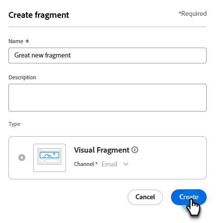

# Fragmente

Ein Fragment ist eine wiederverwendbare Komponente, die in einer oder mehreren E-Mails und E-Mail-Vorlagen referenziert werden kann. Normalerweise handelt es sich dabei um einen Inhaltsblock (Text, Bild oder beides), der schnell in Ihr Projekt eingefügt werden kann. Mit dieser Funktion können Sie mehrere benutzerdefinierte Inhaltsbausteine vorab erstellen, um E-Mail-Inhalte für einen verbesserten Design-Prozess zusammenzustellen. Häufige Anwendungsfälle sind u. a. Kopf-/Fußzeilen-Inhaltsbausteine für E-Mails, Einladungsbanner für Veranstaltungen, saisonale Nachrichten und mehr.

>[!NOTE]
>
>Fragmente entsprechen den [Snippets](/help/marketo/product-docs/personalization/segmentation-and-snippets/snippets/create-a-snippet.md){target="_blank"} im alten E-Mail-Editor.

So verwenden Sie Fragmente in Ihren Workflows optimal:

* _Erstellen von Fragmenten_ - Erstellen Sie visuelle Fragmente, entweder von Grund auf neu oder indem Sie Inhalte als Fragment aus dem Visual Content Editor speichern.
* _Fragmente wiederverwenden_ - Verwenden Sie sie so oft wie nötig in Ihren Inhalten.

## Visuelle Fragmente {#visual-fragments}

Visuelle Fragmente sind vordefinierte visuelle Blöcke, die (mit dem Visual Content Editor) erstellt wurden und die in mehreren E-Mail- oder E-Mail-Vorlagen wiederverwendet werden können.

## Zugreifen auf und Verwalten von Fragmenten {#access-and-manage-fragments}

Um auf visuelle Fragmente zuzugreifen, navigieren Sie zu **Design Studio** in Marketo Engage. Klicken Sie in der Baumstruktur links auf **[!UICONTROL Fragmente (Neu)]**.

{width="600" zoomable="yes"}

Standardmäßig wird die Tabelle nach der Spalte _[!UICONTROL Geändert]_ sortiert. Klicken Sie auf Andere Spaltentitel, um zu ändern, nach welchem Element die Tabelle sortiert wird. Klicken Sie erneut auf denselben Titel, um zwischen aufsteigender und absteigender Reihenfolge zu wechseln.

### Suchen und Filtern

Verwenden Sie die Suchleiste, um ein Fragment anhand des Namens zu finden. Klicken Sie auf _Filter_-Symbol (  ), um die verfügbaren Filteroptionen anzuzeigen und die gewünschten Einstellungen auszuwählen.

{width="700" zoomable="yes"}

### Anpassen der Spalten {#customize-the-column-display}

Passen Sie die Spalten an, die Sie in der Tabelle anzeigen möchten, indem Sie auf das Symbol _Tabelle anpassen_ (  ) oben rechts klicken.

Wählen Sie die gewünschten Spalten aus und klicken Sie auf **[!UICONTROL Anwenden]**.

{width="400" zoomable="yes"}

### Fragmentstatus {#fragment-status}

Der Fragmentstatus bestimmt seine Verfügbarkeit zur Verwendung in einer E-Mail oder E-Mail-Vorlage und die Änderungen, die Sie daran vornehmen können.

<table>
<tbody>
  <tr>
    <td width="25%"><b>Entwurf</b></td>
    <td width="75%">Wenn Sie ein Fragment erstellen, befindet es sich im Entwurfsstatus . Er bleibt ein Entwurf, bis Sie ihn zur Verwendung in einer E-Mail oder E-Mail-Vorlage veröffentlichen.
    
Verfügbare Aktionen:
    <li>Alle Details bearbeiten</li>
    <li>In Visual Designer bearbeiten</li>
    <li>Veröffentlichen</li>
    <li>Duplizieren</li>
    <li>Löschen</li>
  </td>
  <tr>
    <td><b>Veröffentlicht</b></td>
    <td>Wenn Sie ein Fragment veröffentlichen, wird es zur Verwendung in einer E-Mail oder E-Mail-Vorlage verfügbar. Veröffentlichte Fragmentinhalte können im visuellen Designer nicht geändert werden.
    
Verfügbare Aktionen:
    <li>Beschreibung bearbeiten.</li>
    <li>Hinzufügen zu einer E-Mail oder Vorlage</li>
    <li>Versionsentwurf erstellen</li>
    <li>Duplizieren</li>
    <li>Löschen (wenn nicht in Gebrauch)</li>
    </td>
  </tr>
  <tr>
    <td style="width:25%"><b>Mit Entwurf veröffentlicht</b></td>
    <td style="width:75%">Wenn Sie einen Entwurf aus einem veröffentlichten Fragment erstellen, bleibt die veröffentlichte Version zur Verwendung in einer E-Mail- oder E-Mail-Vorlage verfügbar und der Entwurfsinhalt kann im visuellen Designer geändert werden. Wenn Sie die Entwurfsversion veröffentlichen, ersetzt sie die aktuelle veröffentlichte Version, und der Inhalt wird in <i>allen) E</i>Mails und E-Mail-Vorlagen, in denen sie verwendet wird, aktualisiert.
    
Verfügbare Aktionen:
    <li>Beschreibung bearbeiten.</li>
    <li>Hinzufügen zu einer E-Mail oder Vorlage</li>
    <li>Bearbeiten der Entwurfsversion in Visual Designer</li>
    <li>Entwurfsversion veröffentlichen</li>
    <li>Duplizieren</li>
    <li>Löschen (wenn nicht in Gebrauch)</li>
    </td>
  </tr>
</tbody>
</table>

## Erstellen eines Fragments {#create-a-fragment}

1. Um ein neues visuelles Fragment zu erstellen, klicken **[!UICONTROL oben rechts]** der Seite mit der Fragmentliste auf „Fragment erstellen“.

   {width="700" zoomable="yes"}

1. Geben Sie Ihrem Fragment **[!UICONTROL Name]** und eine optionale **[!UICONTROL Beschreibung]**.

   _Fragmentanforderungen_

   * Name: max. 100 Zeichen, muss eindeutig sein, darf nicht zwischen Groß- und Kleinschreibung unterschieden werden
   * Beschreibung: max. 300 Zeichen
   * Zeichen: Alpha-, numerische und Sonderzeichen sind in Ordnung
   * Reservierte Zeichen sind **_nicht zulässig_**: `\ / : * ? " < > |`

   {width="400" zoomable="yes"}

1. Klicken Sie auf **[!UICONTROL Erstellen]**.

   {width="400" zoomable="yes"}

   >[!NOTE]
   >
   >Der &quot;**&quot; eines Fragments** derzeit nicht geändert werden.

1. Ein _E-Mail erstellen_-Modal wird angezeigt. Wählen Sie _Verwenden von Designs_ oder _Manuelles Styling_. In dieser Option wählen wir &quot;**verwenden**. Klicken Sie **Bestätigen** wenn Sie fertig sind.

   

   >[!NOTE]
   >
   >Wenn Sie manuelle Formatierung wählen, verwenden Sie die [Inhaltserstellungs-Tools](/help/marketo/product-docs/email-marketing/email-designer/email-authoring.md#add-structure-and-content){target="_blank"}, um den Inhalt des visuellen Fragments zu erstellen.

1. Klicken Sie auf _Symbol_ Designs“.

   

   >[!INFO]
   >
   >Weitere Informationen zu [Design-Einstellungen](/help/marketo/product-docs/email-marketing/email-designer/brand-themes.md#settings){target="_blank"}.

1. Klicken Sie **[!UICONTROL auf &quot;]**&quot;, um das Entwurfsfragment zu speichern.

1. Wenn Sie bereit sind, das Fragment für die Verwendung in einer E-Mail- oder E-Mail-Vorlage verfügbar zu machen, klicken Sie auf **[!UICONTROL Veröffentlichen]**.

## Anzeigen von Fragmentdetails {#view-fragment-details}

Klicken Sie auf den Namen eines beliebigen Fragments auf der Listenseite, um die Fragmentdetailseite zu öffnen. Sie können wählen, ob Sie das Fragment bearbeiten, umbenennen oder seine Beschreibung aktualisieren möchten. Nehmen Sie Aktualisierungen vor und klicken Sie außerhalb des Namens- oder Beschreibungsfelds, um Ihre Änderungen zu speichern.

>[!NOTE]
>
>Wenn ein veröffentlichtes Fragment von einer E-Mail- oder E-Mail-Vorlage verwendet wird, können Sie seinen Namen nicht ändern oder den Inhalt bearbeiten. Sie können eine Entwurfsversion erstellen, wenn Sie Änderungen am Fragment vornehmen möchten.

{width="600" zoomable="yes"}

Klicken Sie **[!UICONTROL Fragment bearbeiten]**, um das Fragment im visuellen Inhaltseditor zu öffnen.

Sie können die Ansicht jederzeit verlassen, indem Sie oben links auf _Zurück_-Pfeil klicken, der Sie zur Listenseite _Fragmente_ zurückbringt.

## Anzeigen von durch Verweise verwendeten Fragmenten {#view-fragment-used-by-references}

Klicken Sie auf der Seite mit den Fragmentdetails auf **[!UICONTROL Registerkarte]** Verwendet von“, um Details zum Verwendungsort des Fragments in Marketo Engage anzuzeigen.

>[!IMPORTANT]
>
>Ein Fragment, das derzeit von einer E-Mail oder E-Mail-Vorlage verwendet wird, kann nicht gelöscht werden.

{width="600" zoomable="yes"}

Klicken Sie auf den Link, um die entsprechende E-Mail oder E-Mail-Vorlage zu öffnen, in der das Fragment verwendet wird.

## Löschen von Fragmenten {#delete-fragments}

Da ein Fragment, das derzeit von einer E-Mail- oder E-Mail-Vorlage verwendet wird, nicht gelöscht werden kann, sollten Sie die Verweise _Verwendet von_ überprüfen, bevor Sie mit dem Entfernen eines Fragments beginnen. Außerdem kann eine Entfernung nicht rückgängig gemacht werden. Überprüfen Sie dies, bevor Sie eine Löschaktion starten.

Sie können ein Fragment mit einer der folgenden Methoden löschen:

* Klicken Sie in den Fragmentdetails auf der rechten Seite auf **[!UICONTROL Löschen]**.
* Klicken Sie auf _[!UICONTROL Listenseite]_ Fragmente“ auf das Auslassungszeichen neben dem Fragment und wählen Sie **[!UICONTROL Löschen]**.

Diese Aktion öffnet ein Bestätigungsdialogfeld. Sie können den Vorgang abbrechen, indem Sie auf **[!UICONTROL Abbrechen]** klicken oder auf **[!UICONTROL Löschen]** klicken, um den Löschvorgang zu bestätigen.

{width="400"}

## Bearbeiten von Fragmenten {#edit-fragments}

Änderungen an einem Fragment hängen vom aktuellen Status ab:

* Wenn sich ein Fragment im _Entwurf_-Status befindet, können Sie alle zugehörigen Details und den visuellen Inhalt bearbeiten.
* Wenn sich ein Fragment im Status _Veröffentlicht_ befindet, können Sie die Fragmentbeschreibung bearbeiten, jedoch nicht den Namen. Visuelle Inhalte können nicht bearbeitet werden.
* Wenn sich ein Fragment im Status _Veröffentlicht mit Entwurf_ befindet, ist die Bearbeitung der Details auf die Beschreibung beschränkt. Sie können auch den visuellen Inhalt für die Entwurfsversion bearbeiten.

>[!BEGINTABS]

>[!TAB Entwurf]

1. Klicken Sie auf _[!UICONTROL Listenseite]_ Fragmente“ auf den Fragmentnamen, um das Fragment zu öffnen.

   Eine Vorschau des visuellen Inhalts wird mit den Fragmentdetails auf der rechten Seite angezeigt.

1. Nehmen Sie die gewünschten Änderungen vor.

   {width="600" zoomable="yes"}

1. Um Änderungen am Inhalt im visuellen Designer vorzunehmen, klicken Sie auf **[!UICONTROL Fragment bearbeiten]**. Klicken Sie auf **Speichern**, wenn Sie fertig sind.

1. Klicken Sie **[!UICONTROL Speichern]** oder **[!UICONTROL Speichern und schließen]** um zu den Fragmentdetails zurückzukehren.

1. Wenn Sie das Fragment für die Verwendung in einer E-Mail oder E-Mail-Vorlage verfügbar machen möchten, klicken Sie auf **[!UICONTROL Veröffentlichen]**.

>[!TAB Veröffentlicht]

1. Klicken Sie auf _[!UICONTROL Listenseite]_ Fragmente“ auf den Fragmentnamen, um das Fragment zu öffnen.

   Eine Vorschau des visuellen Inhalts wird mit den Fragmentdetails auf der rechten Seite angezeigt.

1. Ändern Sie bei Bedarf die Beschreibung.

   Für ein veröffentlichtes Fragment können alle anderen Details nicht geändert werden.

1. Wenn Sie den Inhalt aktualisieren möchten, klicken Sie oben **[!UICONTROL auf „Entwurfsversion]**&quot;.

   Klicken Sie **[!UICONTROL Dialogfeld]** OK“, um die Entwurfsversion im visuellen Designer zu öffnen. Sie können bei Bedarf die `image source` KG - LINK HERE ändern.

   {width="300"}

1. Klicken Sie **[!UICONTROL Speichern]** oder **[!UICONTROL Speichern und schließen]** um zu den Fragmentdetails zurückzukehren.

1. Wenn Sie das Fragment für die Verwendung in einer E-Mail oder E-Mail-Vorlage verfügbar machen möchten, klicken Sie auf **[!UICONTROL Veröffentlichen]**.

>[!NOTE]
>
>Wenn Sie die Entwurfsversion veröffentlichen, ersetzt sie die aktuelle veröffentlichte Version, und der Inhalt wird in den E-Mails und E-Mail-Vorlagen aktualisiert, in denen sie bereits verwendet wird.

>[!TAB Veröffentlicht mit Entwurf]

Es gibt zwei Möglichkeiten, die Entwurfsversion zur Bearbeitung über die Listenseite _[!UICONTROL Fragmente]_ zu öffnen:

* Klicken Sie auf das _Mehr_-Symbol (**…**) neben dem Fragmentnamen und wählen Sie **[!UICONTROL Entwurfsversion öffnen]**.

  {width="300"}

* Klicken Sie auf den Fragmentnamen, um das Fragment zu öffnen. Klicken Sie dann oben **[!UICONTROL auf]** Entwurfsversion öffnen“.

Eine Vorschau des visuellen Inhalts für die Entwurfsversion wird mit den Fragmentdetails auf der rechten Seite angezeigt.

So aktualisieren Sie den Inhalt:

1. Klicken **[!UICONTROL oben]** auf „Fragment bearbeiten“. Klicken Sie auf **Speichern**, wenn Sie fertig sind.

1. Klicken Sie **[!UICONTROL Speichern]** oder **[!UICONTROL Speichern und schließen]** um zu den Fragmentdetails zurückzukehren.

1. Wenn Sie das Fragment für die Verwendung in einer E-Mail oder E-Mail-Vorlage verfügbar machen möchten, klicken Sie auf **[!UICONTROL Veröffentlichen]**.

>[!NOTE]
>
>Wenn Sie die Entwurfsversion veröffentlichen, ersetzt sie die aktuelle veröffentlichte Version, und der Inhalt wird in den E-Mails und E-Mail-Vorlagen aktualisiert, in denen sie bereits verwendet wird.

>[!ENDTABS]

## Fragmente duplizieren {#duplicate-fragments}

Sie können ein Fragment mit einer der folgenden Methoden duplizieren:

* Klicken Sie auf _[!UICONTROL Listenseite]_ Fragmente“ auf das Symbol _Mehr_ (**…**) neben dem Fragmentnamen und wählen Sie **[!UICONTROL Duplizieren]**.
* Klicken Sie oben rechts auf der Seite mit den Fragmentdetails auf **[!UICONTROL … Mehr]** und wählen Sie **[!UICONTROL Duplizieren]**.

{width="600" zoomable="yes"}

Geben Sie im Dialogfeld einen eindeutigen Namen und optional eine Beschreibung ein. Klicken Sie auf **[!UICONTROL Duplizieren]**.

{width="400"}

Das duplizierte Fragment wird dann in der Liste _Fragmente_ angezeigt.

## Speichern eines neuen Fragments aus E-Mail- oder Vorlageninhalten {#save-a-new-fragment-from-email-or-template-content}

Wenn Sie eine E-Mail- oder E-Mail-Vorlage im visuellen Inhaltseditor erstellen/bearbeiten, können Sie den gesamten Inhalt oder einen Teil davon zur Wiederverwendung als Fragment speichern.

1. Um Inhalte als Fragment zu speichern, klicken Sie auf **[!UICONTROL Mehr]** und wählen Sie **[!UICONTROL Als Fragment speichern]**.

1. Wählen Sie die verschiedenen Elemente aus, die in das Fragment aufgenommen werden sollen.

   Wählen Sie mehrere Strukturen aus, indem Sie die Umschalt- oder die Strg-Taste gedrückt halten.

   Sie können nur nebeneinander liegende Strukturen auswählen.

1. Klicken Sie bei ausgewähltem Inhalt oben **[!UICONTROL auf]** Erstellen“.

1. Geben Sie im Dialogfeld einen Namen und eine optionale Beschreibung für das Fragment ein und klicken Sie auf **[!UICONTROL Erstellen]**.

Das Fragment wird dann auf der Seite _Fragmente_ angezeigt und ist für die Verwendung in E-Mails und E-Mail-Vorlagen verfügbar.

## Hinzufügen visueller Fragmente zu E-Mail- oder Vorlageninhalten {#add-visual-fragments-to-your-email-or-template-content}

Fragmente sind zur Wiederverwendung vorgesehen. Sie können einer E-Mail- oder E-Mail-Vorlage bis zu 30 hinzufügen. Diese können dann nur bis zu einer Ebene verschachtelt werden.

* [Fragment zu einer E-Mail hinzufügen](/help/marketo/product-docs/email-marketing/email-designer/email-authoring.md#add-fragments)

* [Hinzufügen eines Fragments zu einer E-Mail-Vorlage](/help/marketo/product-docs/email-marketing/email-designer/email-template-authoring.md#add-fragments)

Der Inhalt des Fragments wird innerhalb der Struktur dynamisch aktualisiert, um eine visuelle Darstellung des Inhalts in der E-Mail zu rendern.

>[!TIP]
>
>Wenn das Fragment das gesamte horizontale Layout in der E-Mail einnehmen soll, fügen Sie eine [!UICONTROL 1:1Spalten]-Struktur hinzu und ziehen Sie das Fragment dann per Drag-and-Drop hinein.

Nachdem die E-Mail-/E-Mail-Vorlage gespeichert wurde, wird sie auf der Seite mit den Fragmentdetails angezeigt, wenn die Registerkarte _[!UICONTROL Verwendet von]_ ausgewählt ist. Hinzugefügte Fragmente können innerhalb der E-Mail oder Vorlage nicht bearbeitet werden. Das veröffentlichte Quellfragment definiert den Inhalt.

## Fragmentaktionen beim Verfassen von E-Mails und Vorlagen {#fragment-actions-during-email-and-template-authoring}

Wenn ein Fragment zu einer E-Mail oder E-Mail-Vorlage hinzugefügt wird, kann sein Inhalt nicht innerhalb der E-Mail oder Vorlage bearbeitet werden. Sie können jedoch die folgenden Aktionen anwenden:

* **[!UICONTROL Löschen]** - Dadurch wird das Fragment aus dem aktuellen Inhalt der E-Mail oder E-Mail-Vorlage entfernt (die Fragmentquelle ist nicht betroffen).
* **[!UICONTROL Aktualisieren]** - aktualisiert den Inhalt des Fragments in der aktuellen E-Mail oder E-Mail-Vorlage. Eine Aktualisierung ist nützlich, wenn Sie die letzten Änderungen am Fragment nach dem Hinzufügen zur E-Mail- oder E-Mail-Vorlage berücksichtigen möchten.
* **[!UICONTROL Duplizieren]** - Dadurch wird das Fragment in derselben E-Mail oder E-Mail-Vorlage im Editor dupliziert. Das duplizierte Fragment wird direkt unter dem Original hinzugefügt.
* **[!UICONTROL Fragment öffnen]** - Dadurch wird eine neue Browser-Registerkarte mit der Fragment-Editor-Seite und Details geöffnet.
* **[!UICONTROL Vererbung unterbrechen]** - Hiermit wird die Vererbung des Fragments (und seiner Änderungen) von der Quelle unterbrochen. Verwenden Sie diese Aktion, um den Fragmentinhalt als unabhängigen und bearbeitbaren Inhalt in der E-Mail- oder E-Mail-Vorlage verfügbar zu machen. Diese Aktion entfernt auch die E-Mail- oder E-Mail-Vorlage aus der Referenz _Verwendet von_ für das ursprüngliche Fragment.

Wenn Sie das Fragment auf der Editor-Seite auswählen, sind diese Aktionen in der Kontextsymbolleiste und im Bedienfeld Eigenschaften auf der rechten Seite verfügbar.

{width="600" zoomable="yes"}

>[!MORELIKETHIS]
>
>[Anpassbare Fragmente](/help/marketo/product-docs/email-marketing/email-designer/customizable-fragments.md)
