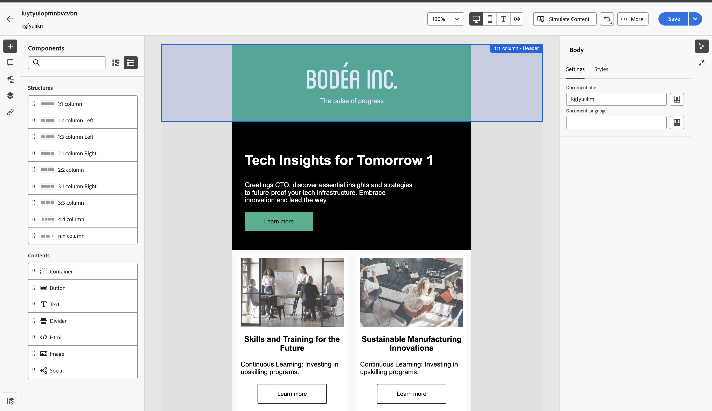

# GenStudio-Integration für Marketo Engage {#genstudio-integration-for-marketo-engage}

Adobe GenStudio for Performance Marketing ist eine generative KI-First-Anwendung, mit der Sie Ihre eigenen Anzeigen und E-Mails erstellen können, um wirkungsvolle, personalisierte Marketing-Kampagnen zu entwickeln, die Ihren Markenstandards entsprechen und Ihren Unternehmensrichtlinien entsprechen. Es bietet eine Vielzahl von Tools, die die Komplexität der Inhaltserstellung vereinfachen.

>[!AVAILABILITY]
>
>So nutzen Sie diese Funktion:
>
>* Ihre IMS-Organisation muss mit GenStudio for Performance Marketing in derselben IMS-Organisation wie Marketo Engage bereitgestellt werden (weitere Informationen erhalten Sie von Ihrem Account Manager).
>* Sie müssen über eine Benutzerberechtigung für GenStudio for Performance Marketing verfügen (System Manager, Editor oder Mitarbeiter-Produktprofil)

>[!INFO]
>
>Weitere Informationen zu [GenStudio for Performance Marketing](https://experienceleague.adobe.com/de/docs/genstudio-for-performance-marketing/user-guide/home){target="_blank"}.

## Nutzen der GenStudio-Funktionen in Marketo Engage {#leverage-genstudio-capabilities}

Mit dieser Integration kann ein technischer Marketing-Experte, der Marketo Engage zum Entwickeln und Automatisieren von E-Mail-Kampagnen verwendet, mit einem Performance-Marketing-Experten zusammenarbeiten, der Inhalte mithilfe von GenStudio erstellt. Auf diese Weise können markeninterne Inhalte von GenStudio einfach in Marketo Engage integriert werden.

## Exportieren einer HTML-Vorlage von Marketo Engage nach GenStudio {#export-an-html-template}

Exportieren Sie ganz einfach eine Vorlage mit den Richtlinien Ihrer Marke nach GenStudio for Performance Marketing.

1. Greifen Sie in Marketo Engage auf den Inhalt Ihrer E-Mail zu.

1. Klicken Sie in der E-Mail-Designer auf die Schaltfläche **Mehr** und wählen Sie **HTML exportieren**.

   

1. [Laden Sie die exportierte &#x200B;](https://experienceleague.adobe.com/de/docs/genstudio-for-performance-marketing/user-guide/content/templates/use-templates#templates-from-ajo-and-marketo){target="_blank"} HTML in GenStudio for Performance Marketing hoch.

1. Verwenden Sie in GenStudio diese Vorlage, um [mehrere E-Mail-Varianten zu erstellen](https://experienceleague.adobe.com/de/docs/genstudio-for-performance-marketing/user-guide/create/create-email-experience){target="_blank"} mit KI-Eingabeaufforderungen und speichern Sie sie.

## Nutzen von GenStudio-Erlebnissen in Marketo Engage {#leverage-genstudio-experiences}

Gehen Sie wie folgt vor, um die von Ihnen erstellten GenStudio-E-Mail-Varianten durch Importieren in Marketo Engage zu nutzen.

1. Erstellen Sie in Marketo Engage [eine E-Mail](/help/marketo/product-docs/email-marketing/email-designer/email-authoring.md#create-an-email).

1. Klicken Sie auf der E-Mail-Detailseite auf **E-Mail-Inhalt bearbeiten**.

   

1. Wählen Sie **HTML importieren**.

   

1. Klicken Sie auf die Schaltfläche **Adobe GenStudio for Performance Marketing**.

   Schaltfläche 

1. Durchsuchen Sie die GenStudio-Erlebnisse, um mit der Erstellung Ihrer Inhalte zu beginnen. Sie können die Erlebnisse nach Kriterien wie Produkten, Rollen, Marken oder sogar Farben filtern.

1. Wählen Sie ein Erlebnis aus und klicken Sie auf **Verwenden**.

   {width="800" zoomable="yes"}

1. Der ausgewählte Inhalt wird im E-Mail-Designer angezeigt.

   {width="800" zoomable="yes"}

>[!NOTE]
>
>Aus einer Marketo Engage-Vorlage erstellte GenStudio-Erlebnisse werden direkt in die E-Mail-Designer importiert. GenStudio-Erlebnisse, die ohne eine Marketo Engage-Vorlage erstellt wurden, werden im Kompatibilitätsmodus importiert.

Verwenden Sie die [Tools zur Bearbeitung von E](/help/marketo/product-docs/email-marketing/email-designer/email-authoring.md#add-structure-and-content){target="_blank"}Mail-Inhalten und [Personalisierungsfelder](/help/marketo/product-docs/email-marketing/email-designer/email-authoring.md#personalize-content){target="_blank"}, um Ihre E-Mail nach Bedarf zu bearbeiten.
