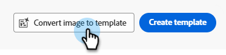
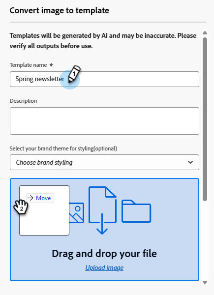

# Konvertieren von Bildern in HTML-Vorlagen {#image-to-html}

## Überblick {#overview}

Der Bild-zu-HTML-Konverter beschleunigt die E-Mail-Erstellung erheblich, indem er statische Bilder in vollständig anpassbare, modulare HTML-E-Mail-Inhaltsvorlagen konvertiert. Mit diesem Nicht-Code-Tool können Sie visuelle Designs von Grafikdesignern oder Design-Tools in responsive, bearbeitbare E-Mail-Vorlagen umwandeln, die immer wieder verwendet werden können.

Der Image-zu-HTML-Konverter nutzt generative KI-Technologie und analysiert Layout, Typografie, Farben und visuelle Elemente in Ihrem Bild und generiert einen übersichtlichen, modularen HTML-Code, der die Designtreue aufrechterhält und gleichzeitig eine vollständige Bearbeitbarkeit und Kompatibilität mit E-Mail-Designer sicherstellt.

>[!PREREQUISITES]
>
>* Sie müssen zunächst den [Core Gen-AI-Bedingungen und den Zusatzbedingungen](https://www.adobe.com/legal/terms/enterprise-licensing/genai-ww.html){target="_blank"} zustimmen, um die Gen-AI-Funktion in E-Mail-Designer nutzen zu können. Weitere Informationen erhalten Sie beim Adobe Account Team (Ihrem Account Manager).
>* Sie müssen _Zugriff auf E-Mail_ Vorlage) sowie _E-Mail-Vorlage bearbeiten/_) [in Ihrer Marketo-Rolle ](https://experienceleague.adobe.com/en/docs/marketo/using/product-docs/administration/users-and-roles/managing-user-roles-and-permissions#edit-a-role).

## Konvertieren eines Bildes {#convert-an-image}

Gehen Sie wie folgt vor, um ein Bild in eine vollständig anpassbare HTML-E-Mail-Vorlage zu konvertieren.

>[!NOTE]
>
>Für optimale Ergebnisse sollten Sie hochwertige Bilder mit klaren visuellen Elementen und lesbarem Text verwenden. Bilder sollten idealerweise zwischen 600 und 800 Pixel breit sein, um den standardmäßigen E-Mail-Größen zu entsprechen.

1. Klicken Sie _Design Studio_ auf **E-Mail-Vorlagen** und dann auf **E-Mail-Vorlagen (Neu)**.

   

1. Klicken Sie **[!UICONTROL Bild in Vorlage konvertieren]**.

   

1. Geben Sie einen _Vorlagennamen_ und optional eine Beschreibung ein. Optional können Sie auch Ihren Markenstil auswählen. Laden Sie das gewünschte Bild hoch oder ziehen Sie es per Drag-and-Drop hinüber.

   

1. Scrollen Sie nach unten und aktivieren Sie _Kontrollkästchen Die Upload-Datei enthält nicht…_. Klicken Sie **Konvertieren**.

   

   >[!NOTE]
   >
   >Der Generierungsprozess kann je nach Komplexität und Größe des Bilddesigns bis zu fünf Minuten dauern. Die KI-Verarbeitung erfolgt im Hintergrund, sodass Sie während der Konvertierung diesen Bildschirm verlassen und an anderen Aufgaben arbeiten können. Möglicherweise müssen Sie den Bibliotheksbildschirm _E-Mail_ aktualisieren, um die Statusänderung anzuzeigen.

1. Nach Abschluss der Konvertierung wird Ihre Vorlage automatisch als Entwurf gespeichert. Klicken Sie auf den Namen, um ihn anzuzeigen/zu bearbeiten.

   

1. Die konvertierte Vorlage wird im E-Mail-Designer mit allen Bearbeitungsfunktionen geöffnet. Sie können jetzt:

   * Textinhalt bearbeiten und Personalisierung anwenden
   * Bilder ändern und Links hinzufügen
   * Farben, Schriften und Stile anpassen
   * Inhaltskomponenten hinzufügen, entfernen oder neu anordnen
   * Alle E-Mail-Designer-Funktionen wie bei jeder anderen Vorlage nutzen

   {width="800" zoomable="yes"}

1. Sie können beliebige Anpassungen vornehmen, um die Vorlage zu verfeinern und Ihre Markenrichtlinien einzuhalten.

1. Wenn Sie mit der Vorlage zufrieden sind, klicken Sie auf **[!UICONTROL Speichern und schließen]** und dann auf **Veröffentlichen**.

Ihre Vorlage ist jetzt in der _E-Mail-Vorlagen_-Bibliothek verfügbar und kann beim Erstellen von E-Mails verwendet werden.

## Häufige Anwendungsfälle {#use-cases}

Der Bild-zu-HTML-Converter eignet sich ideal für:

* **Plattformmigration**: Sie migrieren von einer anderen E-Mail-Marketing-Plattform? Konvertieren Sie Ihre vorhandenen E-Mail-Designs in Marketo Engage-fähige HTML-Vorlagen, ohne sie von Grund auf neu zu erstellen
* **Konvertierung von Design-Mockups**: Wandeln Sie Design-Mockups aus Tools wie Photoshop, Figma oder anderer Design-Software in funktionale E-Mail-Vorlagen um
* **Schnelle Vorlagenerstellung**: Generieren Sie schnell E-Mail-Vorlagen für zeitkritische Kampagnen, ohne auf Entwicklerressourcen zu warten
* **Erstellen von Vorlagenbibliotheken**: Erstellen Sie eine umfassende Bibliothek markenkonsistenter Vorlagen, die Team-Mitglieder ohne technisches Fachwissen anpassen und bereitstellen können

## Best Practices {#best-practices}

**Vorbereitung**

* **Speichern Sie vorhandene Inhalte**: Wenn Sie ein Bild in HTML konvertieren, werden alle in Ihrer E-Mail vorhandenen Inhalte ersetzt. Speichern Sie Ihre aktuelle Arbeit immer, bevor Sie diese Funktion verwenden.
* **Workflow planen**: Verwenden Sie den Konverter „Bild in HTML&quot; zu Beginn Ihres E-Mail-Erstellungsprozesses oder stellen Sie sicher, dass Sie bereit sind, den gesamten aktuellen Inhalt zu ersetzen.

**Bildvorbereitung**

* **Resolution**: Verwenden Sie hochauflösende Bilder für eine bessere Texterkennung und Elementerkennung.
* **Klarheit**: Stellen Sie sicher, dass der Text klar lesbar ist und visuelle Elemente klar definiert sind.
* **Breite**: Entwerfen Sie Bilder mit standardmäßigen E-Mail-Breiten (600-800 px), um die typischen E-Mail-Client-Anforderungen zu erfüllen.
* **Dateiformat**: Verwenden Sie das JPEG- oder PNG-Format, um komprimierte Bilder oder Bilder von schlechter Qualität zu vermeiden.
* **Vollständiges Design**: Vollständiges E-Mail-Design in ein einziges Bild aufnehmen, von Kopf- bis Fußzeile.

**Überlegungen zum Design**

* **Einfache Layouts**: Einfache, gut strukturierte Layouts konvertieren präziser als hochkomplexe Designs.
* **Standardelemente**: Verwenden Sie gängige E-Mail-Design-Muster (Kopfzeilen-, Hauptteil-, CTAs- und Fußzeilen).
* **Textlesbarkeit**: Sicherstellen eines ausreichenden Kontrasts zwischen Text und Hintergrund.
* **Web-sichere Schriftarten**: Designs, die gängige Web-sichere Schriftarten verwenden, sind zuverlässiger.
* **Überlappende Elemente vermeiden**: Halten Sie Designelemente zur besseren Strukturerkennung klar getrennt.

**Nach der Konvertierung**

* **Prüfen Sie den Entwurf**: Nach Abschluss der Konvertierung wird Ihre Vorlage automatisch als Entwurf gespeichert. Nehmen Sie sich Zeit, um die generierte HTML sorgfältig auf Korrektheit zu überprüfen.
* **Gründlich testen**: Testen Sie die E-Mail über verschiedene E-Mail-Clients und Geräte hinweg. Nutzen Sie für schnellere Ergebnisse die Vorteile der [Litmus-Integration](/help/marketo/product-docs/email-marketing/email-designer/test-email-rendering.md).
* **Manuell verfeinern**: Nehmen Sie die erforderlichen Anpassungen unter Verwendung der vollständigen Bearbeitungsfunktionen des E-Mail-Designer vor.
* **Markenausrichtung**: Überprüfen Sie, ob Farben, Schriftarten und Stile Ihren Markenrichtlinien entsprechen.
* **Personalization**: Fügen Sie nach Bedarf dynamische Inhalte und Personalisierungs-Token hinzu.
* **Barrierefreiheit**: Überprüfen und erweitern Sie die Funktionen für die Barrierefreiheit bei Bedarf.

## Einschränkungen und Überlegungen {#limitations}

Beachten Sie die folgenden Einschränkungen bei der Verwendung des Konverters „Bild in HTML&quot;.

* **KI-Interpretation**: Die KI generiert HTML basierend auf einer visuellen Interpretation Ihres Bildes. Komplexe oder ungewöhnliche Designs erfordern nach der Konvertierung möglicherweise manuelle Anpassungen.

* **Textgenauigkeit**: Die KI versucht zwar, Text genau zu erkennen und zu reproduzieren, aber Sie sollten Textinhalte immer überprüfen und nach Bedarf korrigieren.

* **Dynamische Inhalte**: Der Konvertierungsprozess erstellt statisches HTML basierend auf Ihrem Bild. Nach der Konvertierung müssen Sie Personalisierung, dynamische Inhalte und Tracking manuell hinzufügen.

* **Komplexe Layouts**: Hochkomplexe Designs mit komplizierten Ebenen, ungewöhnlichen Formen oder nicht standardmäßigen Elementen werden möglicherweise nicht perfekt konvertiert. Einfachere Designs liefern in der Regel bessere Ergebnisse.

* **Verarbeitungszeit**: Der Konvertierungsprozess kann je nach Komplexität und Größe des Bildes bis zu fünf Minuten dauern. Die KI-Verarbeitung erfolgt im Hintergrund, sodass Sie andere Aufgaben bearbeiten können und der Bildschirm nicht geöffnet sein muss. Die Vorlage wird nach Abschluss der Konvertierung automatisch als Entwurf gespeichert.

>[!NOTE]
>
>Der Bild-zu-HTML-Converter ist als leistungsstarker Ausgangspunkt für die Erstellung von E-Mails konzipiert. Die generierte HTML sollte mit der E-Mail-Designer überprüft und verfeinert werden, um sicherzustellen, dass sie Ihren Anforderungen entspricht.

## Häufig gestellte Fragen {#faq}

+++Was geschieht mit meinen vorhandenen E-Mail-Inhalten, wenn ich den Bild-zu-HTML-Converter verwende?

Alle vorhandenen Inhalte in Ihrer E-Mail werden gelöscht und durch die neu generierte Vorlage ersetzt, wenn Sie ein Bild zur Konvertierung hochladen. Speichern Sie alle wichtigen Inhalte, bevor Sie diese Funktion verwenden. Am besten verwenden Sie den Konverter „Bild in HTML&quot; zu Beginn Ihres E-Mail-Erstellungsprozesses.

+++

+++Welche Dateiformate werden unterstützt?

Der Bild-zu-HTML-Converter unterstützt die Bildformate JPEG (.jpg, .jpeg) und PNG (.png).

+++

+++Wie lange dauert der Konvertierungsprozess?

Die Konvertierung kann je nach Komplexität und Größe des Bilddesigns bis zu fünf Minuten dauern. Die KI-Verarbeitung erfolgt im Hintergrund, sodass Sie weg navigieren und an anderen Aufgaben arbeiten können. Sie müssen den Bildschirm nicht offen lassen. Nach Abschluss der Konvertierung wird Ihre Datei automatisch als Entwurf gespeichert, den Sie überprüfen und bearbeiten können.

+++

+++Kann ich die generierte Vorlage bearbeiten?

Ja. Die generierte HTML-Vorlage wird im E-Mail-Designer mit allen Bearbeitungsfunktionen geöffnet. Sie können alle Aspekte der Vorlage ändern, einschließlich Text, Bilder, Stil, Layout und Struktur.

+++

+++Was geschieht, wenn die Konvertierung nicht genau meinem Design entspricht?

Die KI bemüht sich, Ihr Design möglichst genau zu interpretieren, doch einige manuelle Anpassungen können erforderlich sein. Verwenden Sie den E-Mail-Designer, um alle Elemente anzupassen, die einer Feinabstimmung bedürfen.

+++

+++Kann ich diese Funktion für Landingpages oder andere Inhaltstypen verwenden?

Der Bild-zu-HTML-Converter ist derzeit speziell für E-Mail-Vorlagen konzipiert. Verwenden Sie für andere Inhaltstypen die standardmäßigen Design- und Importoptionen, die im E-Mail-Designer verfügbar sind.

+++

+++Kann ich konvertierte Vorlagen für mehrere E-Mail-Kampagnen wiederverwenden?

Ja. Vorlagen, die mit dem Konvertierer „Bild in HTML&quot; erstellt wurden, werden automatisch in Ihrer _E-Mail-_&quot; gespeichert. Sie können in Zukunft in jeder E-Mail darauf zugreifen und sie wiederverwenden.

+++
