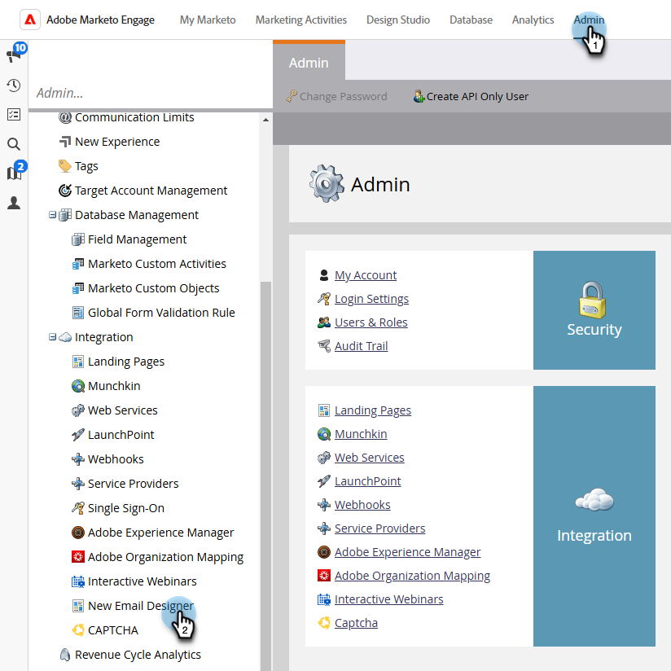

# Übersicht über E-Mail-Designer {#overview}

Willkommen bei der neuen Adobe Marketo Engage E-Mail-Designer.

Der E-Mail-Designer ist die neueste Innovation in Marketo Engage und bietet ein überarbeitetes Erlebnis bei der Erstellung von E-Mail- und E-Mail-Vorlagen. Er verbessert die Produktivität und Effizienz, indem er einen visuellen Drag-and-Drop-Editor zusammen mit standardmäßigen Vorlagen bereitstellt. Erstellen Sie ganz einfach benutzerdefinierte E-Mail-Vorlagen, ohne Geld für Anbieter ausgeben zu müssen.

>[!NOTE]
>
>Während der Zugriff auf die E-Mail-Designer in allen gängigen Browsern möglich ist, wird der vollständige Funktionsumfang von Firefox derzeit nicht unterstützt.

## Zugriff {#how-to-access}

+++Erfahren Sie, wie Sie auf Email Designer zugreifen können

Um auf den neuen E-Mail-Designer zugreifen zu können, muss Ihr Marketo Engage-Abonnement auf das [Adobe Identity Management System (IMS) migriert ](https://experienceleague.adobe.com/en/docs/marketo/using/product-docs/administration/marketo-with-adobe-identity/adobe-identity-management-overview). Wenn Ihre Anfrage noch nicht bearbeitet wurde und Sie eine Beschleunigung anfordern möchten, wenden Sie sich bitte an das Adobe Account Team (Ihren Account Manager) oder an den [Marketo Support](https://nation.marketo.com/t5/support/ct-p/Support).

### Benutzer hinzufügen {#add-users}

1. Wechseln Sie in Marketo Engage zum Bereich **[!UICONTROL Admin]** und wählen Sie **[!UICONTROL Neue E-Mail-Designer]** aus.

   {width="600" zoomable="yes"}

1. Klicken Sie **[!UICONTROL Benutzer hinzufügen]**.

   {width="600" zoomable="yes"}

1. Wählen **[!UICONTROL in der Dropdown]** Liste Neue Werte hinzufügen die gewünschten Benutzer aus. Klicken **[!UICONTROL abschließend]** OK“.

   {width="600" zoomable="yes"}

+++

## Verfügbare Artikel {#available-articles}

* [E-Mail-Authoring](/help/marketo/product-docs/email-marketing/email-designer/email-authoring.md){target="_blank"}: Erfahren Sie, wie Sie eine E-Mail im neuen Editor erstellen, gestalten und referenzieren.

* [Erstellen von E-Mail](/help/marketo/product-docs/email-marketing/email-designer/email-template-authoring.md){target="_blank"}Vorlagen: Erfahren Sie, wie Sie im neuen Editor eine E-Mail-Vorlage erstellen, gestalten und darauf zugreifen.

* [Fragments](/help/marketo/product-docs/email-marketing/email-designer/fragments.md){target="_blank"}: Erfahren Sie, wie Sie visuelle Inhaltsfragmente als wiederverwendbare Komponenten für E-Mails und E-Mail-Vorlagen erstellen und verwenden.

* [Anpassbare Fragmente](/help/marketo/product-docs/email-marketing/email-designer/customizable-fragments.md){target="_blank"}: Erfahren Sie, wie Sie Fragmente anpassen können, indem Sie einige ihrer Felder bearbeitbar machen.

* [Arbeiten mit AEM-Assets](/help/marketo/product-docs/email-marketing/email-designer/aem-assets.md){target="_blank"}: Erfahren Sie, wie Sie zur Verwendung in Marketo Engage einfach auf Ihre digitalen AEM-Assets zugreifen können.

* [Bearbeiten von Bildern mit Adobe Express](/help/marketo/product-docs/email-marketing/email-designer/edit-images-adobe-express.md){target="_blank"}: Erfahren Sie, wie Sie Bilder im Adobe Marketo Engage-E-Mail-Editor mithilfe von Adobe Express bearbeiten.

* [KI-Assistenten verwenden](/help/marketo/product-docs/email-marketing/email-designer/ai-assistant.md){target="_blank"}: Nutzen Sie die generative KI-Technologie von Adobe, um Ihren E-Mails hilfreichen Text und/oder Bilder hinzuzufügen.

* [Inhalt in E-Mail-Vorlagen sperren](/help/marketo/product-docs/email-marketing/email-designer/content-locking.md){target="_blank"}: Erfahren Sie, wie Sie Inhalte in E-Mail-Vorlagen sperren, um zu verhindern, dass Inhalte versehentlich bearbeitet oder gelöscht werden.

* [E-Mail-Rendering mit Litmus testen](/help/marketo/product-docs/email-marketing/email-designer/test-email-rendering.md){target="_blank"}: Nutzen Sie Ihr Litmus-Konto in Marketo Engage, um sofort zu sehen, wie Ihre E-Mail in gängigen E-Mail-Clients gerendert wird.

* [Funktionsvergleich](/help/marketo/product-docs/email-marketing/email-designer/feature-comparison.md){target="_blank"}: Vergleichen der Verfügbarkeit der Funktionen im vorherigen E-Mail-Editor (E-Mail-Editor 2.0) und im neuen E-Mail-Designer.

## FAQs {#faq}

**Wird der alte E-Mail-Editor weiterhin funktionieren? Wenn ja, für wie lange?**

Ja, der alte (klassische) E-Mail-Editor wird mit dem neuen E-Mail-Designer koexistieren. Im klassischen Editor erstellte E-Mails bleiben erhalten. Es gibt derzeit kein Datum, ab dem der klassische Editor eingestellt wird, er wird jedoch 2025 weiterhin funktionieren.

**In welchen Programmen kann ich die neuen E-Mail-Designer-E-Mails verwenden?**

Auf neue E-Mail-Designer-E-Mails kann in allen Programmen zugegriffen werden (mit Ausnahme von interaktiven Webinar-Programmen). Klonen ist ebenfalls verfügbar.

**Funktionieren unsere vorhandenen E-Mail-Vorlagen im neuen Designer? Falls nicht, müssen wir Vorlagen mit dem neuen Designer erstellen, damit alle Abschnitte/Module entsprechen, wie unser Inhalt aussehen soll?**

E-Mail-Vorlagen aus dem klassischen Editor können im neuen Designer nicht referenziert werden. Sie müssen neue Vorlagen im neuen Designer erstellen. Sie _jedoch_ Vorlage &quot;HTML&quot; in den neuen Designer importieren und dann die erforderlichen Anpassungen vornehmen. **Hinweis**: Die Kompatibilität der klassischen Editor-Vorlage mit dem neuen Designer wird in Kürze verfügbar sein.

**Kann ich neue Designer-Assets einfach in ein anderes Programm verschieben?**

Zurzeit nicht. Aber diese Funktionalität wird bald verfügbar sein.

**Können Assets im neuen E-Mail-Designer über die API bearbeitet werden?**

Assets, das über eine API bearbeitet wird, wird derzeit im neuen E-Mail-Designer nicht unterstützt.

**Gibt es eine Möglichkeit, das Branding (Schriftarten, Logos und Farben) durchzusetzen?**

Sperren von Inhaltsabschnitten ist Teil des neuen Designers, und Sperren von Stilen, Farben usw. wird bald verfügbar sein.

**Können Module für Vorlagen besser angepasst und skaliert werden?**

Ja, absolut anpassbar mit unserem WYSIWYG-Editor (What-you-see-is-what-you-get).

**Wie funktioniert der Erstellungsprozess von E-Mail-Vorlagen im neuen Designer? Ist es WYSIWYG oder sind dafür Kenntnisse über HTML erforderlich?**

Es ist WYSIWYG; HTML-Kenntnisse sind nicht erforderlich. Sie können auf einfache Weise Vorlagen im Designer erstellen, wodurch der Bedarf an externen Web-Entwicklern reduziert wird. Sie haben jedoch weiterhin die Möglichkeit, CSS zu aktualisieren und einzelne Abschnitte über HTML zu bearbeiten. Wir arbeiten auch an einer Möglichkeit, Vorlagen einfach vom klassischen Editor zum neuen Designer zu migrieren.

**Unterstützt der neue E-Mail-Designer die AMP-Sprache?**

AMP wird derzeit nicht unterstützt.

**Der dynamische Inhalt nach Attribut ist großartig, aber funktioniert der dynamische Inhalt nach Segment weiterhin?**

Derzeit unterstützt der neue Designer nur Attribute, wir arbeiten jedoch daran, Segmente in einer zukünftigen Version hinzuzufügen.

**Wie kann ich feststellen, ob unser Marketo Engage-Abonnement auf IMS (die Adobe Admin Console) migriert wurde?**

Wenn Sie sich über die [Adobe Experience Cloud](https://experiencecloud.adobe.com/){target="_blank"} bei Marketo Engage anmelden, wurde Ihr Abonnement migriert.

**Welche Browser kann ich mit der neuen E-Mail-Designer verwenden?**

Es wird empfohlen, derzeit Google Chrome, Apple Safari, Microsoft Edge oder Mozilla Firefox zu verwenden.
