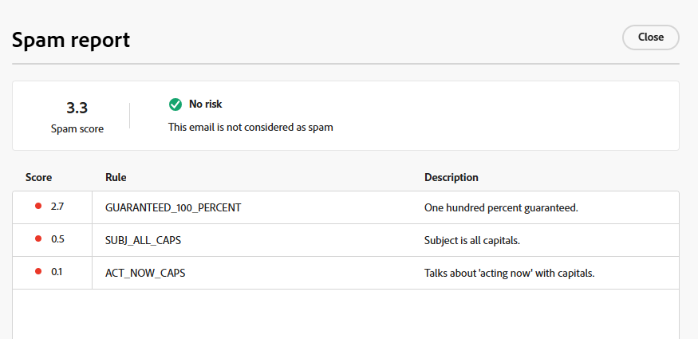

# E-Mail-Spam-Bericht {#email-spam-report}

Mit SpamAssassin in Marketo Engage können Sie Ihren E-Mail-Inhalt testen und die Wahrscheinlichkeit sehen, dass ISPs/Postfachanbieter ihn als Spam markieren.

SpamAssassin analysiert Ihre Inhalte und weist eine Bewertung anhand verschiedener Kriterien zu. Dabei gilt: Je niedriger der Wert, desto besser. Es ist wichtig, einen niedrigen Wert beizubehalten, da sich der Versand von E-Mails mit einem hohen Wert negativ auf die Zustellbarkeit insgesamt auswirken kann.

## Zugriff auf den Spam-Bericht {#access-the-spam-report}

1. Klicken Sie in Ihrer E-Mail auf **Inhalt simulieren**.

   {width="600" zoomable="yes"}

   >[!NOTE]
   >
   >Wenn Sie noch kein Testprofil hinzugefügt haben, müssen Sie dies direkt nach Schritt 1 tun.

1. Klicken Sie auf die **Spam-Bericht**.

   

1. Ein Spam-Bericht wird generiert.

   {width="600" zoomable="yes"}

1. Überprüfen Sie die Bewertungen und Beschreibungen für jedes Element.

   >[!IMPORTANT]
   >
   >Wenn die Gesamtpunktzahl höher als 5 ist, wird Ihre E-Mail möglicherweise vom Empfänger blockiert oder beim Versand als Spam gekennzeichnet.

1. Wenn Sie die Punktzahl für zu hoch halten, bearbeiten Sie den Inhalt in der E-Mail-Designer auf der Grundlage der Berichtsergebnisse und führen Sie dann den **Spam-Bericht** erneut aus.

   {width="800" zoomable="yes"}

Wenn die Punktzahl Ihren Vorstellungen entspricht, kann sie gesendet werden.

{width="800" zoomable="yes"}

>[!NOTE]
>
>Der Spam-Wert wird über SpamAssassin ermittelt und **Regeln gehören nicht Adobe**. Weitere Informationen zu diesen Regeln finden Sie in der [SpamAssassin-Dokumentation](https://spamassassin.apache.org/#_blank){target="_blank"}. Eine vollständige Liste der Fehler [finden Sie hier](https://spamassassin.apache.org/old/tests_3_0_x.html){target="_blank"}.
