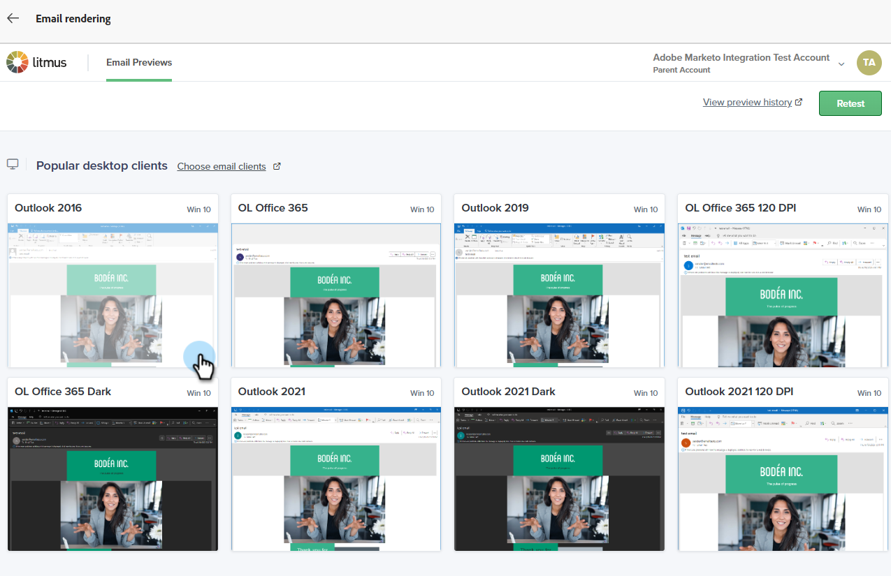
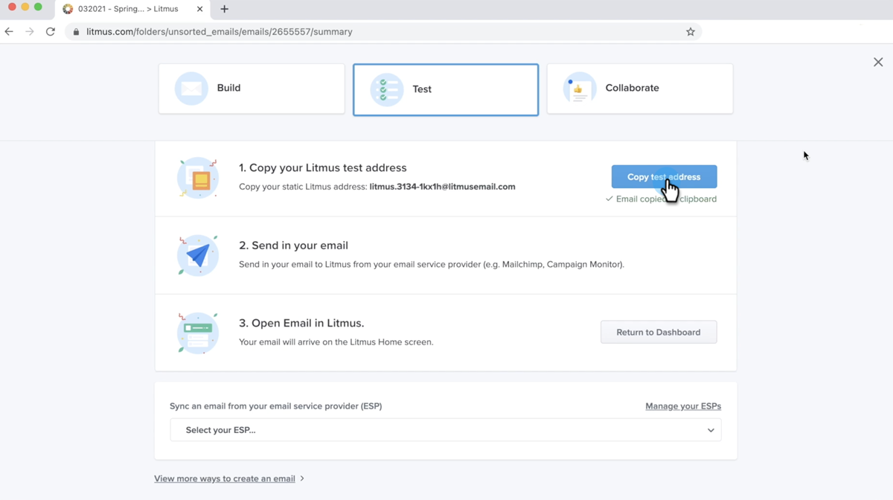

# E-Mail-Rendering mit Litmus testen {#test-email-rendering-with-litmus}

Nutzen Sie Ihr [Litmus](https://www.litmus.com/email-testing)-Konto in Marketo Engage, um sofort zu sehen, wie Ihre E-Mail in gängigen E-Mail-Clients gerendert wird.

>[!AVAILABILITY]
>
>Diese Funktion steht allen Marketo Engage-Benutzern mit einem aktiven Litmus-Konto zur Verfügung.

## Litmus Enterprise-Benutzer {#litmus-enterprise}

Die folgenden Schritte gelten für Benutzer des [Litmus Enterprise Plan](https://www.litmus.com/pricing/enterprise){target="_blank"}.

1. Klicken Sie auf dem _E-Mail_ Inhalt bearbeiten) auf die Schaltfläche **Inhalt simulieren**.

   

1. Wählen Sie Ihre Testempfängerin aus und klicken Sie auf die Schaltfläche **E-Mail rendern**.

   {width="800" zoomable="yes"}

1. Falls noch nicht geschehen, (**Sie Ihr Litmus-Konto**. Wenn Sie dies bereits getan haben, fahren Sie mit Schritt 6 fort.

   {width="800" zoomable="yes"}

1. Geben Sie Ihre Litmus-Anmeldeinformationen ein und klicken Sie auf **Anmelden**.

   >[!IMPORTANT]
   >
   >Durch die Verknüpfung Ihres Litmus-Accounts mit Marketo Engage erklären Sie sich damit einverstanden, dass Test-E-Mails an Litmus gesendet werden. Nach dem Versand werden diese Test-E-Mails nicht mehr von Adobe verwaltet. Daher gilt die Litmus-E-Mail-Richtlinie zur Datenaufbewahrung für diese E-Mails, einschließlich der darin enthaltenen Personalisierungsdaten.

1. Klicken Sie **Verbinden**, um die Integration abzuschließen.

   

1. Klicken Sie auf die Schaltfläche **Test ausführen**, um E-Mail-Vorschauen zu generieren.

1. Sehen Sie, wie Ihre Inhalte in beliebten Desktop-, Mobile- und Web-basierten E-Mail-Clients aussehen. Klicken Sie auf beliebig viele Miniaturen, um eine Vorschau anzuzeigen.

   {width="800" zoomable="yes"}

   >[!NOTE]
   >
   >Erfahren Sie, wie [Ihre Standard-E-Mail-Client-Liste anpassen](https://help.litmus.com/article/227-change-your-default-email-clients-list).

1. Wenn Sie den Test abgeschlossen haben, klicken Sie auf den Rückwärtspfeil oben links, um zum Bildschirm _Inhalt simulieren_ zurückzukehren.

   

**OPTIONALER SCHRITT**: Wenn Sie Änderungen an Ihrer E-Mail vornehmen möchten, klicken Sie nach dem Klicken auf **E-Mail rendern**, um sie anzuzeigen, stellen Sie sicher, dass Sie auch auf die Schaltfläche **Erneut testen** oben rechts im Bildschirm Litmus _E-Mail-Vorschau_ klicken.

## Litmus Core-Benutzer {#litmus-core}

Die folgenden Schritte gelten für Benutzer des [Litmus-](https://www.litmus.com/pricing/){target="_blank"}&quot;

1. Rufen Sie in Ihrem Litmus-Konto die Test-E-Mail-Adresse ab, indem Sie auf die **Testadresse kopieren** im Bildschirm _Test_ klicken.

   {width="800" zoomable="yes"}

1. Navigieren Sie in Marketo Engage zum Bildschirm _E-Mail-Inhalt bearbeiten_ der gewünschten E-Mail und klicken Sie auf die Schaltfläche **Inhalt simulieren**.

   {width="600" zoomable="yes"}

1. Wählen Sie Ihre Testempfängerinnen und Testempfänger aus und klicken Sie auf die Schaltfläche **Testversand durchführen**.

   {width="800" zoomable="yes"}

1. Geben Sie die Litmus-E-Mail-Adresse ein, die Sie in Schritt 1 kopiert haben, und klicken **erneut auf „Testversand**&quot;.

   

1. Überprüfen Sie die E-Mail in Ihrem Litmus-Konto (im Ordner, der der E-Mail-Adresse entspricht, die Sie aus Litmus kopiert haben).

   {width="800" zoomable="yes"}
