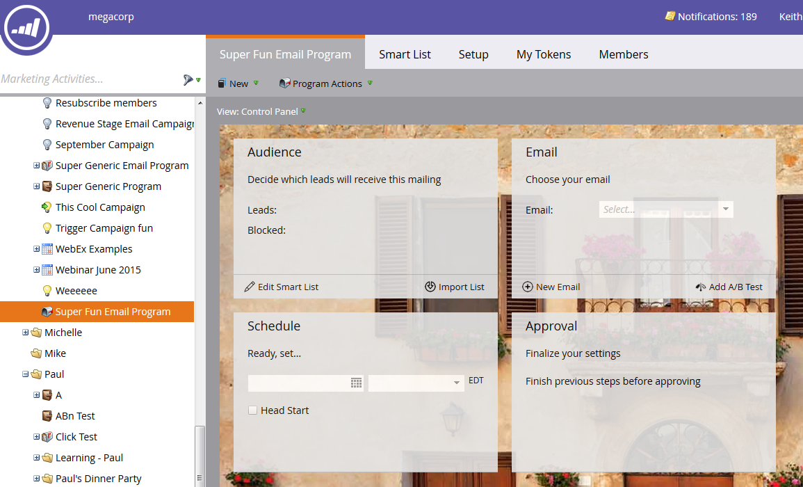

# Erstellen eines E-Mail-Programms {#create-an-email-program}

Verwenden Sie E-Mail-Programme, um schnell und einfach eine E-Mail an eine Gruppe von Personen zu senden.

1. Navigieren Sie zu **[!UICONTROL Marketing-Aktivitäten]**.

   

1. Wählen Sie den Ordner aus, in dem Sie das Programm erstellen möchten, klicken Sie auf die **[!UICONTROL Neu]** und wählen Sie **[!UICONTROL Neues Programm]**.

   

1. Geben Sie einen Namen ein, wählen Sie **[!UICONTROL E]** als [!UICONTROL Programmtyp] aus und klicken Sie auf **[!UICONTROL Erstellen]**.

   

   >[!NOTE]
   >
   >Bei Auswahl von **[!UICONTROL E]** als Programmtyp wird der Kanal automatisch auf „E **[!UICONTROL Mail senden“]**. Du kannst es ändern, wenn du willst.

   

Schön! Beachten Sie, dass sich das Programm jetzt in der Baumstruktur befindet und verwendet werden kann. Der nächste Schritt besteht darin, Ihre Audience zu definieren. Siehe die Marketo-bezogenen Artikel unten.

>[!MORELIKETHIS]
>
>* [Definieren einer Zielgruppe mit einer Smart-Liste](/help/marketo/product-docs/email-marketing/email-programs/managing-people-in-email-programs/define-an-audience-with-a-smart-list.md)
>* [Definieren einer Zielgruppe durch Importieren einer Liste](/help/marketo/product-docs/email-marketing/email-programs/managing-people-in-email-programs/define-an-audience-by-importing-a-list.md)
