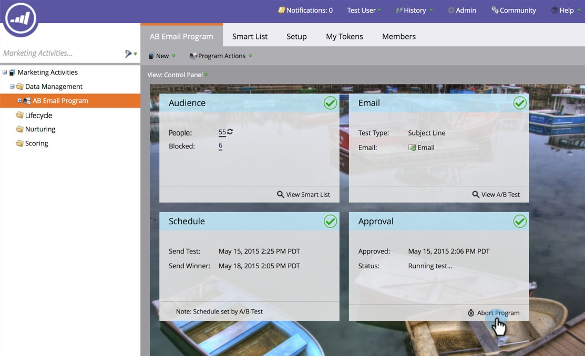

# Schließen von E-Mail-Programm {#abort-email-program}

Entschuldigung! Tretet auf die Bremse! Dieses E-Mail-Programm sollte nicht ausgehen.

>[!NOTE]
>
>Dieser Artikel soll verhindern, dass E-Mails vor dem Versand gesendet werden. Gesendete E-Mails können nicht zurückgerufen werden.

1. Klicken Sie in einem E-Mail-Programm auf **[!UICONTROL Programm abbrechen]**.

   

1. Klicken Sie **[!UICONTROL Abbrechen]**, um die vollständige Bestätigung zu erhalten.

   

1. Es wird ein Warnhinweis-Header angezeigt, der besagt, dass dieses E-Mail-Programm abgebrochen wurde.

   

   >[!CAUTION]
   >
   >Nachdem das E-Mail-Programm abgebrochen wurde, kann es nicht mehr neu geplant werden.

Wau! Bist du nicht froh, dass du diese kostspieligen Fehler vermeiden kannst?
