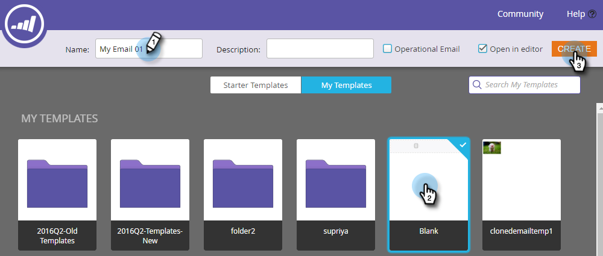
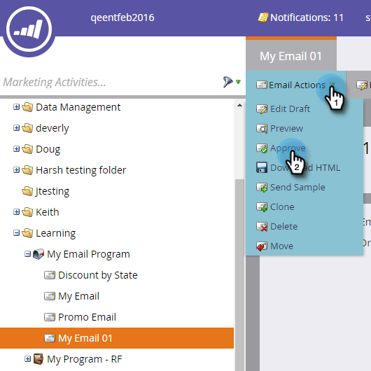

# Erstellen einer E-Mail für ein E-Mail-Programm {#create-an-email-for-an-email-program}

>[!PREREQUISITES]
>
>* [E-Mail-Programm erstellen](/help/marketo/product-docs/email-marketing/email-programs/creating-an-email-program/create-an-email-program.md)
>* [Definieren einer Zielgruppe mit einer Smart-Liste](/help/marketo/product-docs/email-marketing/email-programs/managing-people-in-email-programs/define-an-audience-with-a-smart-list.md) oder [Definieren einer Zielgruppe durch Importieren einer Liste](/help/marketo/product-docs/email-marketing/email-programs/managing-people-in-email-programs/define-an-audience-by-importing-a-list.md)

Nachdem Sie Ihr E-Mail-Programm erstellt und Ihre Audience definiert haben, sollten Sie entscheiden, welche E-Mail Sie senden. Sie können [eine vorhandene E-Mail auswählen](/help/marketo/product-docs/email-marketing/email-programs/email-program-actions/choose-an-existing-email.md) oder eine neue erstellen. So erstellen Sie eine neue E-Mail.

1. Navigieren Sie **[!UICONTROL Marketing-Aktivitäten]**.

   

1. Wählen Sie Ihr E-Mail-Programm. Klicken Sie unter **[!UICONTROL Kachel]** E-Mail **[!UICONTROL auf „Neue E-Mail]**.

   

1. Geben Sie **[!UICONTROL Name]** ein, wählen Sie die gewünschte Vorlage aus und klicken Sie auf **[!UICONTROL Erstellen]**.

   

1. Nehmen Sie alle gewünschten Änderungen vor und schließen Sie den Editor.

   

   >[!NOTE]
   >
   >Erfahren Sie, wie Sie [Elemente in einer E-Mail bearbeiten](/help/marketo/product-docs/email-marketing/general/email-editor-2/edit-elements-in-an-email.md).

1. Vergessen Sie nicht, Ihre E-Mail zu genehmigen.

   

Sehr gut! Nachdem wir nun eine E-Mail erstellt haben, die wir senden möchten, [ wir „einen A/B-Test hinzufügen](/help/marketo/product-docs/email-marketing/email-programs/email-program-actions/email-test-a-b-test/add-an-a-b-test.md) oder gehen direkt zum [Planen Ihres E-Mail-Programms](/help/marketo/product-docs/email-marketing/email-programs/email-program-actions/schedule-your-email-program.md).
