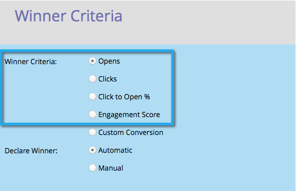
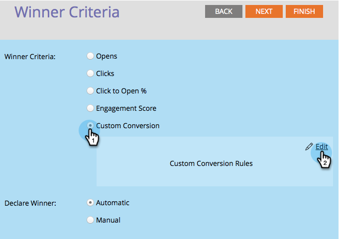

# Kriterien für den A/B-Testsieger definieren {#define-the-a-b-test-winner-criteria}

Beim [Hinzufügen eines A/B](/help/marketo/product-docs/email-marketing/email-programs/email-program-actions/email-test-a-b-test/add-an-a-b-test.md){target="_blank"}Tests zu Ihrem E-Mail-Programm müssen Sie einen Testtyp auswählen, [den A/B-Test planen](/help/marketo/product-docs/email-marketing/email-programs/email-program-actions/email-test-a-b-test/schedule-the-a-b-test.md){target="_blank"} und dann die Kriterien für den Gewinner definieren. So entscheiden Sie, welche E-Mail gewinnt.

>[!PREREQUISITES]
>
>[Hinzufügen eines A/B-Tests](/help/marketo/product-docs/email-marketing/email-programs/email-program-actions/email-test-a-b-test/add-an-a-b-test.md){target="_blank"}

## Gewinnerkriterien {#winner-criteria}

1. Die Standardoptionen **[!UICONTROL Gewinnerkriterien]** werden zuerst aufgeführt.

   

   <table>
   <tr>
   <td><b>[!UICONTROL wird geöffnet]</b></td>
   <td>Ein geöffnetes registriert beim Herunterladen von Bildern in eine E-Mail. Auch wenn Sie kein Bild einbeziehen, fügt Marketo standardmäßig ein einzelnes Tracking-Pixel in alle HTML-E-Mails ein.</td>
   </tr>
   <tr>
   <td><b>[!UICONTROL Klicks]</b></td>
   <td>Standardmäßig sind die Tracking-Funktionen für Links in E-Mails integriert, sodass Sie sehen können, wer auf welchen Link geklickt hat, wie viele Links insgesamt angeklickt wurden usw.</td>
   </tr>
   <tr>
   <td><b>[!UICONTROL Zum Öffnen klicken] %</b></td>
   <td>Prozentsatz der E-Mails, die geöffnet wurden und bei denen auf einen Link in der E-Mail geklickt wurde. Dabei werden Relevanz und Kontext einer E-Mail gemessen. Hierzu wird die Anzahl der Einzelklicks dividiert durch die Anzahl der Einzelöffnungen mit 100 multipliziert, um den Wert als Prozentsatz anzuzeigen.</td>
   </tr>
   <tr>
   <td><b>[!UICONTROL Engagement Score]</b></td>
   <td>Der <a href="https://experienceleague.adobe.com/docs/marketo/using/product-docs/email-marketing/drip-nurturing/reports-and-notifications/understanding-the-engagement-score.html" target="_blank">Interaktionswert</a> hilft Ihnen bei der Bestimmung der Effektivität Ihrer Inhalte.</td>
   </tr>
   </table>

   >[!TIP]
   >
   >Wenn Sie Engagement Score auswählen, muss der Test mindestens 24 Stunden lang ausgeführt werden. Weitere Informationen über [Verstehen des Interaktionswerts](/help/marketo/product-docs/email-marketing/drip-nurturing/reports-and-notifications/understanding-the-engagement-score.md){target="_blank"}.

1. Sie können Ihre Kriterien auch anpassen, indem Sie **[!UICONTROL Benutzerdefinierte Konversion]** auswählen und auf **[!UICONTROL Bearbeiten]** klicken.

   

   >[!NOTE]
   >
   >Benutzerdefinierte Konversion ermöglicht es Ihnen, jedes Ereignis als Konversion auszuwählen, indem Sie Trigger und Filter verwenden.

1. Ein Fenster öffnet sich. Suchen Sie den Trigger Ihrer Wahl und ziehen Sie ihn auf die Arbeitsfläche.

   

1. Definieren Sie den Trigger.

   

   >[!IMPORTANT]
   >
   >Marketo lässt nur Trigger/Filter für Personen zu, die die E-Mail von diesem E-Mail-Programm erhalten haben. Daher ist es nicht erforderlich, den Filter „Wurde E-Mail gesendet“ hinzuzufügen. Darüber hinaus sollten Sie bei der Verwendung eines E-Mail-bezogenen Triggers/Filters „is any“ als Operator verwenden.

1. Klicken Sie auf **[!UICONTROL Schließen]**.

   

   Sehr gut! Jetzt ist es an der Zeit zu entscheiden, wie der Gewinner bestimmt wird.

## Gewinner benennen {#declare-winner}

1. Wählen Sie eine der beiden verfügbaren Optionen aus.

   

   >[!NOTE]
   >
   >Wenn Sie einen A/B **Test mit Datum/Uhrzeit**, können Sie nur &quot;**[!UICONTROL &quot;]**.

   Sobald der A/B-Test abgeschlossen ist, kann Marketo die erfolgreichste E-Mail automatisch zum geplanten Zeitpunkt senden. Alternativ können Sie die Ergebnisse überprüfen und entscheiden, welche E-Mail zu welchem Zeitpunkt gesendet wird.

1. Automatisch ist genial und ist die Standardoption. Klicken Sie einfach **[!UICONTROL Weiter]**.

   

   >[!TIP]
   >
   >Wenn Sie **[!UICONTROL Manuell]** wählen, wird der Test gesendet und Sie müssen warten, bis Sie einen Gewinner bestimmen. Sie erhalten einen Bericht über die Ergebnisse.

Perfekt! Planen wir nun [den A/B-Test](/help/marketo/product-docs/email-marketing/email-programs/email-program-actions/email-test-a-b-test/schedule-the-a-b-test.md){target="_blank"}.
