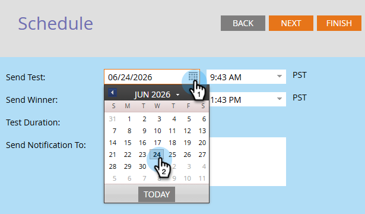
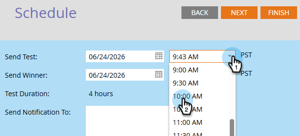
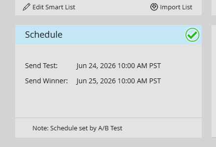

# Planen des A/B Test {#schedule-the-a-b-test}

Nachdem Sie einem E-Mail-Programm einen A/B-Test hinzugefügt und die Kriterien für den Gewinner definiert haben, müssen Sie den Beginn des Tests planen. Und so geht das.

>[!PREREQUISITES]
>
>[Hinzufügen eines A/B-Tests](/help/marketo/product-docs/email-marketing/email-programs/email-program-actions/email-test-a-b-test/add-an-a-b-test.md)

>[!NOTE]
>
>Für Datums-/Uhrzeittests müssen Sie nur festlegen, wann Sie die Zusammenfassung der Testergebnisse erhalten.

1. Wählen Sie das **[!UICONTROL Test senden]** Datum aus.

1. Wählen Sie die Zeit **[!UICONTROL Test senden]** aus.

   

   >[!NOTE]
   >
   >Test senden und Gewinner senden muss mindestens 4 Stunden auseinander liegen. Bei größeren Sendungen sollten Sie jedoch 24 Stunden warten, um genügend Zeit für gute Ergebnisse zu haben.

1. Wiederholen Sie die Schritte 1 und 2 für _Gewinner senden_. Geben Sie die Benachrichtigungsempfänger (optional) ein und klicken Sie auf **[!UICONTROL Weiter]**.

   >[!NOTE]
   >
   >Nur die Testgruppe erhält die Testvarianten.

   

   >[!NOTE]
   >
   >Wenn Sie den Gewinner manuell angeben möchten, definieren Sie **Bericht senden** Datum/Uhrzeit anstelle von **Absendedatum**.

1. Überprüfen Sie die Zusammenfassung und klicken Sie auf **[!UICONTROL Schließen]**.

   

   Sie werden feststellen, dass **[!UICONTROL Kachel]** Zeitplan“ jetzt aktualisiert wurde.

   

   >[!NOTE]
   >
   >Durch die Planung von A/B-Tests wird auch das endgültige Versanddatum oder das Versanddatum des Berichts konfiguriert.

   Angenommen, Sie haben Ihre Audience bereits definiert und eine E-Mail ausgewählt, bleibt nur noch, das Programm zu genehmigen.

   >[!MORELIKETHIS]
   >
   >[Genehmigen/Genehmigung eines E-Mail-Programms aufheben](/help/marketo/product-docs/email-marketing/email-programs/email-program-actions/approve-unapprove-an-email-program.md)
