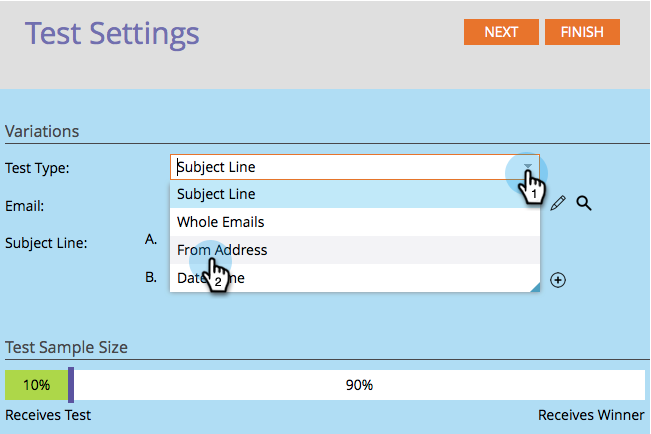
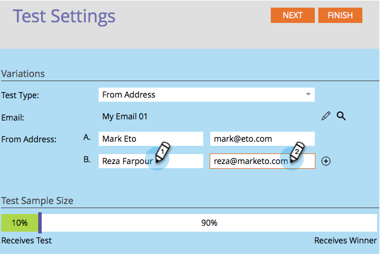

# A/B[!UICONTROL Tests &quot;]&quot; verwenden {#use-from-address-a-b-testing}

Sie können Ihre E-Mails einfach mit A/B-Tests überprüfen. Ein interessanter Test ist der **[!UICONTROL Von Adresse]** Test. So richten Sie es ein.

>[!PREREQUISITES]
>
>[Hinzufügen eines A/B-Tests](/help/marketo/product-docs/email-marketing/email-programs/email-program-actions/email-test-a-b-test/add-an-a-b-test.md)

1. Klicken Sie unter **[!UICONTROL Kachel]** E-Mail“ bei ausgewählter E-Mail auf **[!UICONTROL A/B-Test hinzufügen]**.

   

1. Ein neues Fenster wird geöffnet. Wählen Sie **[!UICONTROL Absenderadresse]** für **[!UICONTROL Testtyp]**.

   

1. Wenn Sie über frühere Testinformationen verfügen (z. B. einen Betrefftest), können Sie sicher auf „Test **[!UICONTROL &quot;]**.

   

1. Geben Sie die zweite **[!UICONTROL Absenderadresse]** ein, die Sie testen möchten.

   >[!NOTE]
   >
   >Bei Auswahl A werden die in der ausgewählten E-Mail enthaltenen Informationen vorab ausgefüllt.

   

   >[!TIP]
   >
   >Sie können auf das **+** klicken, um beliebig viele Absenderadressen hinzuzufügen.

1. Wählen Sie mit dem Schieberegler den gewünschten Prozentsatz der Zielgruppe für Ihren A/B-Test aus und klicken Sie auf **[!UICONTROL Weiter]**.

   

   >[!NOTE]
   >
   >Die verschiedenen Varianten senden an gleiche Teile der ausgewählten Testprobengröße.

   >[!CAUTION]
   >
   >**Es wird empfohlen, die Stichprobengröße nicht auf 100 % festzulegen**. Wenn Sie eine statische Liste verwenden, wird bei Festlegung der Stichprobengröße auf 100 % die E-Mail an alle Personen in der Zielgruppe gesendet und der Gewinner erhält niemanden. Wenn Sie eine **Smart**-Liste verwenden, wird bei einer Stichprobengröße von 100 % die E-Mail an alle Personen in der Zielgruppe _zu diesem Zeitpunkt_ gesendet. Wenn das E-Mail-Programm zu einem späteren Zeitpunkt erneut ausgeführt wird, erhalten alle neuen Personen, die sich für die Smart-Liste qualifizieren, ebenfalls die E-Mail, da sie nun in der Zielgruppe enthalten sind.

   Ok, wir sind fast da. Jetzt müssen wir [die A/B-Testsieger-Kriterien definieren](/help/marketo/product-docs/email-marketing/email-programs/email-program-actions/email-test-a-b-test/define-the-a-b-test-winner-criteria.md).
