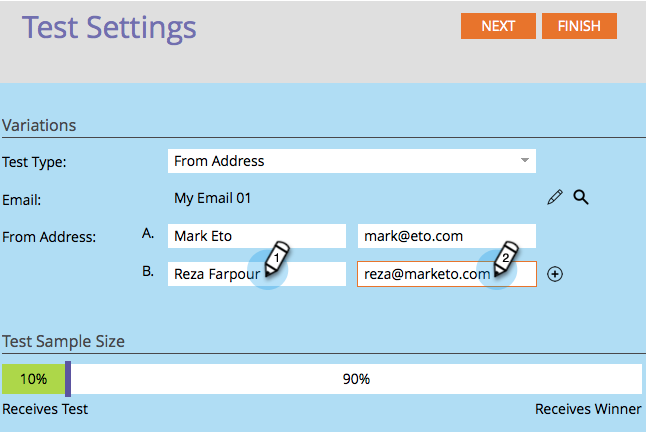

# A/B-Tests mit &quot;Von Adresse&quot;verwenden {#use-from-address-a-b-testing}

Sie können Ihre E-Mails ganz einfach A/B testen. Ein interessanter Test ist der **From Address** Test. So richten Sie es ein:

>[!NOTE]
>
>**Voraussetzungen**
>
>* [hinzufügen eines A/B-Tests](add-an-a-b-test.md)

>

1. Klicken Sie unter der **E-Mail** -Kachel bei ausgewählter E-Mail auf **Hinzufügen A/B-Test**.

   

1. Daraufhin wird ein neues Fenster geöffnet. Wählen Sie **Von Adresse** für **Testtyp**.

   

1. Wenn Sie über vorherige Testinformationen verfügen (z. B. über einen Betreff-Test), können Sie sicher auf Test **zurücksetzen** klicken.

   

1. Geben Sie die zweite **Von-Adresse** -Information ein, die Sie testen möchten.

   >[!NOTE]
   >
   >Auswahl A füllt die in der ausgewählten E-Mail enthaltenen Informationen vorab aus.

   

   >[!TIP]
   >
   >Sie können auf das **Pluszeichen** klicken, um so viele von Adressen hinzuzufügen, wie Sie möchten.

1. Verwenden Sie den Schieberegler, um den Prozentwert der Audience auszuwählen, die Sie im A/B-Test verwenden möchten, und klicken Sie auf **Weiter**.

   

   >[!NOTE]
   >
   >Die verschiedenen Varianten werden an gleiche Teile der ausgewählten Stichprobengröße gesendet.

   >[!CAUTION]
   >
   >**Es wird empfohlen, die Stichprobengröße nicht auf 100%** festzulegen. Wenn Sie eine statische Liste verwenden, wird bei einer Stichprobengröße von 100 % die E-Mail an alle Benutzer in der Audience gesendet und der Gewinner erhält niemanden. Wenn Sie eine **intelligente** Liste verwenden, wird bei einer Stichprobengröße von 100 % die E-Mail an alle Benutzer der Audience *zu diesem Zeitpunkt gesendet. *Wenn das E-Mail-Programm zu einem späteren Zeitpunkt erneut ausgeführt wird, erhalten alle neuen Personen, die sich für die intelligente Liste qualifizieren, ebenfalls die E-Mail, da sie jetzt in der Audience enthalten sind.

   OK, wir sind fast da. Jetzt müssen wir die Kriterien [für den Gewinner des A/B-Tests festlegen](define-the-a-b-test-winner-criteria.md).

   >[!NOTE]
   >
   >**Verwandte Artikel**
   >
   >    
   >    
   >    * [Definieren der Kriterien für den A/B-Test-Gewinner](define-the-a-b-test-winner-criteria.md)

