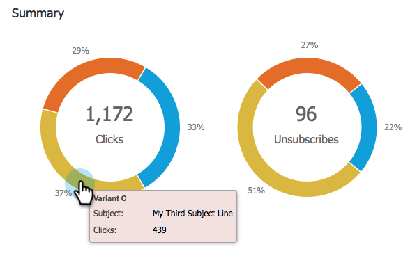

# Verwenden des Dashboards &quot;E-Mail-Programm&quot;- A/B-Testansicht {#use-the-email-program-dashboard-a-b-test-view}

Sehen Sie sich die Leistung Ihres [E-Mail-Programms A/B-Test](/help/marketo/product-docs/email-marketing/email-programs/email-program-actions/email-test-a-b-test/add-an-a-b-test.md) mit diesem Dashboard an.

## Test senden {#send-test}

Hier können Sie die Gesamtzahl der zugestellten Nachrichten und die Aufschlüsselungen nach Varianten sehen.

## Klicks {#clicks}

Hier können Sie sehen, wie viele Klicks jede Variante hat.

## Zum Öffnen klicken {#click-to-open}

Dieses Diagramm zeigt das Verhältnis zwischen Klicks und Öffnungen. ( Anzahl Klicks / Anzahl Öffnungen).

## Zusammenfassung  {#summary}

Hier können Sie eine Aufschlüsselung der Klicks und Abmeldungen nach Varianten sehen, um einen einfachen Vergleich zu ermöglichen.

Cool Dashboard, glaubst du nicht?

>[!MORELIKETHIS]
>
>[Verwenden des Dashboards &quot;E-Mail-Programm&quot;](/help/marketo/product-docs/email-marketing/email-programs/email-program-data/use-the-email-program-dashboard.md)
