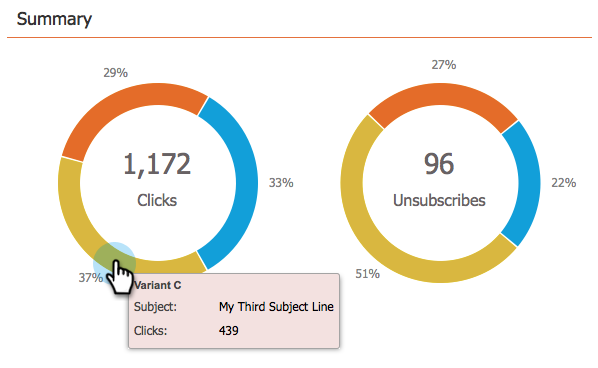

# Verwenden des Dashboards für E-Mail-Programme – A/B-Testansicht {#use-the-email-program-dashboard-a-b-test-view}

Sehen Sie sich an, wie Ihr [E-Mail-Programm A/B](/help/marketo/product-docs/email-marketing/email-programs/email-program-actions/email-test-a-b-test/add-an-a-b-test.md)Test) mit diesem Dashboard funktioniert.

## Test senden {#send-test}

Hier sehen Sie die Gesamtzahl der zugestellten Nachrichten und die Aufschlüsselungen nach Varianten.

## Klicks {#clicks}

Hier können Sie sehen, wie viele Klicks jede Variante hat.

## Zum Öffnen klicken {#click-to-open}

Dieses Diagramm zeigt das Verhältnis von Klick zu Öffnung. (# Klicks / # Öffnungen).

## Zusammenfassung {#summary}

Hier sehen Sie eine Aufschlüsselung der Klicks und Abmeldungen nach Varianten, um einen einfachen Vergleich zu ermöglichen.

Cooles Dashboard, denkst du nicht?

>[!MORELIKETHIS]
>
>[Verwenden des E-Mail-Programm-Dashboards](/help/marketo/product-docs/email-marketing/email-programs/email-program-data/use-the-email-program-dashboard.md)
