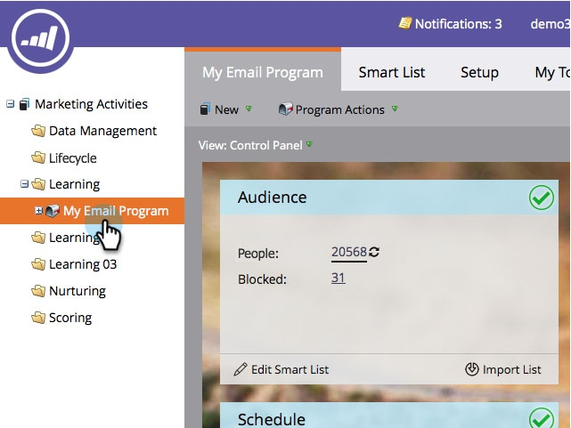

# Aktivieren/Deaktivieren von Kommunikationsbeschränkungen in einem E-Mail-Programm {#enable-disable-communication-limits-in-an-email-program}

Wenn Sie ein E-Mail-Programm ausführen, können Sie die [Kommunikationsbeschränkungen auf Administratorebene“ ignorieren oder ](/help/marketo/product-docs/administration/email-setup/enable-communication-limits.md). So geht das.

>[!NOTE]
>
>Kommunikationsbeschränkungen werden [im Admin-Abschnitt festgelegt](/help/marketo/product-docs/administration/email-setup/enable-communication-limits.md) sodass Sie vermeiden können, eine Person zu viele E-Mails zu senden.

1. Navigieren Sie zu **[!UICONTROL Marketing-Aktivitäten]**.

   

1. Suchen und wählen Sie Ihr E-Mail-Programm.

   

1. Doppelklicken Sie **[!UICONTROL der Registerkarte]** Setup“ auf den Zeileneintrag Kommunikationsbeschränkung .

   

1. Standardmäßig werden nicht-operative E-Mails blockiert, wenn die Kommunikationsbeschränkungen erreicht werden. Wenn Sie sie jedoch umgehen möchten, deaktivieren Sie das Kontrollkästchen und klicken Sie auf **[!UICONTROL Speichern]**.

   

   Wenn **[!UICONTROL Nicht-operative E-Mails blockieren]** aktiviert bleibt, wird der Versand der E-Mail an alle verhindert, die mehr E-Mails erhalten haben, als in den Admin-Einstellungen zulässig ist.
