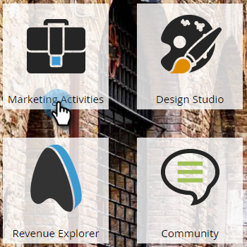

# Vorsprung für E-Mail-Programme {#head-start-for-email-programs}

>[!PREREQUISITES]
>
>[E-Mail-Programm erstellen](/help/marketo/product-docs/email-marketing/email-programs/creating-an-email-program/create-an-email-program.md)

Wenn Sie ein Datum/eine Uhrzeit für ein E-Mail-Programm auswählen, bestimmt dies, wann das Programm mit der Verarbeitung beginnen wird. Wenn Sie möchten, dass Ihre E-Mails zum ausgewählten Zeitpunkt gestartet werden, bietet Ihnen Head Start diese Option, indem Sie das Programm im Voraus verarbeiten.

## Standardkopfstart {#standard-head-start}

1. Klicken Sie **[!UICONTROL Marketing-Aktivitäten]**.

   

1. Suchen und wählen Sie Ihr E-Mail-Programm.

   

   >[!NOTE]
   >
   >Head Start kann nicht mit A/B-Tests verwendet werden.

1. Wählen Sie in [!UICONTROL  Kachel ]Zeitplan“ die Option E-Mail planen und dann das Feld **[!UICONTROL Direktstart]** aus.

   

   Wenn [!UICONTROL Head Start] ausgewählt ist, beginnt das Programm ungefähr 12 Stunden vor der geplanten Zeit mit der Verarbeitung. Sobald die Verarbeitung beginnt, wird das Programm gesperrt.

   >[!CAUTION]
   >
   >Alle Personen aus Ihrer Zielgruppe, die sich nach der Programmsperre abmelden, erhalten weiterhin die E-Mail. Es wird empfohlen, die Abmelde-Benachrichtigung so anzupassen, dass die Bearbeitung von Abmeldungen 1-2 Werktage dauern kann.

1. Klicken Sie **[!UICONTROL Programm genehmigen]**.

   

   Nach der Programmgenehmigung gibt es vier verschiedene Status, die auf der Kachel Genehmigung angezeigt werden können.

   * **[!UICONTROL Warten auf Ausführung]:** Nachdem das Programm genehmigt wurde.
   * **[!UICONTROL Verarbeitung gestartet, wartet auf Ausführung]:** Verarbeitung läuft.
   * **[!UICONTROL Verarbeitung abgeschlossen, wartet auf Ausführung]:** Verarbeitung abgeschlossen, E-Mail wartet jetzt auf den geplanten Start.
   * **[!UICONTROL Beendet]:** Programm abgeschlossen.

   >[!TIP]
   >
   >Möchten Sie den Vorgang abbrechen, nachdem das Programm gesperrt wurde, aber bevor die E-Mail gesendet wird? Kein Problem! Klicken Sie einfach **[!UICONTROL Programm abbrechen]** unten rechts auf der Kachel Genehmigung .

   >[!NOTE]
   >
   >Wenn Sie die Genehmigung für Ihr E-Mail-Programm mit weniger als 12 Stunden vor der geplanten Laufzeit aufheben, aber dann Ihre Meinung ändern, müssen Sie ein neues Datum/eine neue Uhrzeit auswählen, das/die mindestens 12 Stunden vor der Genehmigung liegt.

## Head Start with Recipient Time Zone {#head-start-with-recipient-time-zone}

Unsere bestehende Head Start-Funktion erfordert, dass das Programm mindestens 12 Stunden im Voraus geplant wird. Was bedeutet dies für die Zeitzone des Empfängers? Erinnern Sie sich daran, dass wir, wenn die Zeitzone des Empfängers aktiv ist, das E-Mail-Programm um Mitternacht in der frühesten Zeitzone ausführen (UTC +14:00). Um also **sowohl** Kopfstart- als auch Empfängerzeitzone zu aktivieren, müssen Programme geplant werden **mindestens 12 Stunden vor der frühesten Zeitzone (UTC +14:00**).

Wenn Sie also in Amerika/Los Angeles sind und sowohl die Zeitzone „Head Start“ als auch die Zeitzone „Empfänger“ aktivieren möchten, müssen Sie das Programm **34 Stunden)**. Wie sind wir zu dieser Nummer gekommen?

[Weitere Informationen](/help/marketo/product-docs/email-marketing/email-programs/email-program-actions/scheduling-with-recipient-time-zone/schedule-email-programs-with-recipient-time-zone.md) zum Planen von E-Mail-Programmen mit der Zeitzone des Empfängers.

>[!MORELIKETHIS]
>
>* [E-Mail-Programm planen](/help/marketo/product-docs/email-marketing/email-programs/email-program-actions/schedule-your-email-program.md)
>* [Planen von E-Mail-Programmen mit Zeitzone des Empfängers](/help/marketo/product-docs/email-marketing/email-programs/email-program-actions/scheduling-with-recipient-time-zone/schedule-email-programs-with-recipient-time-zone.md)
>* [Informationen zur Zeitzone des Empfängers](/help/marketo/product-docs/email-marketing/email-programs/email-program-actions/scheduling-with-recipient-time-zone/understanding-recipient-time-zone.md)
