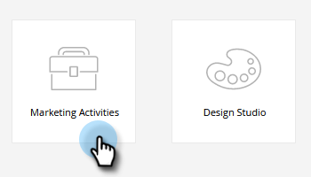

# Verschieben einer E-Mail {#move-an-email}

Sie möchten eine E-Mail von einem Programm in ein anderes verschieben? Und so geht das.

1. Navigieren Sie zu **[!UICONTROL Marketing-Aktivitäten]**.

   

1. Suchen Sie die zu verschiebende E-Mail, klicken Sie mit der rechten Maustaste darauf und wählen Sie **[!UICONTROL Verschieben]**.

   

1. Wählen Sie **[!UICONTROL Ziel]**, **[!UICONTROL Programm]** und optional **[!UICONTROL Ordner]** aus. Wählen Sie **[!UICONTROL Verschieben]** aus.

   

   >[!NOTE]
   >
   >In diesem Beispiel verschieben wir eine E-Mail in ein anderes Programm, aber Sie können auch eine E-Mail in einen Ordner im [!UICONTROL Design Studio] verschieben.

   Ihre E-Mail wird jetzt im anderen Programm angezeigt.

   

   >[!NOTE]
   >
   >Sie können Ihre E-Mail auch einfach per Drag-and-Drop an ein neues Ziel innerhalb der Baumstruktur ziehen.
