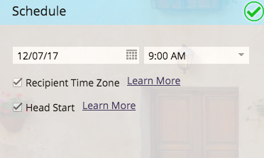

# E-Mail-Programm planen {#schedule-your-email-program}

>[!PREREQUISITES]
>
>* [E-Mail-Programm erstellen](/help/marketo/product-docs/email-marketing/email-programs/creating-an-email-program/create-an-email-program.md)
>* [Definieren einer Zielgruppe mit einer Smart-Liste](/help/marketo/product-docs/email-marketing/email-programs/managing-people-in-email-programs/define-an-audience-with-a-smart-list.md) oder [Definieren einer Zielgruppe durch Importieren einer Liste](/help/marketo/product-docs/email-marketing/email-programs/managing-people-in-email-programs/define-an-audience-by-importing-a-list.md)
>
>* [Wählen Sie eine vorhandene E](/help/marketo/product-docs/email-marketing/email-programs/email-program-actions/choose-an-existing-email.md)Mail aus oder [Erstellen einer E-Mail für ein E-Mail-Programm](/help/marketo/product-docs/email-marketing/email-programs/email-program-actions/create-an-email-for-an-email-program.md)

Nachdem Sie Ihr E-Mail-Programm erstellt, eine Audience definiert und eine E-Mail ausgewählt haben, sollten Sie Ihrem Programm mitteilen *wann* E-Mail gesendet werden soll. So geht&#39;s.

1. Navigieren Sie **[!UICONTROL Marketing-Aktivitäten]**.

   

1. Wählen Sie Ihr E-Mail-Programm.

   

1. Legen Sie unter **[!UICONTROL Kachel]** das Datum fest.

   

1. Und dann die Zeit.

   

1. Sie können auch die Funktionen [[!UICONTROL Zeitzone des Empfängers]](/help/marketo/product-docs/email-marketing/email-programs/email-program-actions/scheduling-with-recipient-time-zone/schedule-email-programs-with-recipient-time-zone.md) und/oder [[!UICONTROL Direktstart]](/help/marketo/product-docs/email-marketing/email-programs/email-program-actions/head-start-for-email-programs.md) verwenden.

   

   Wie einfach war das? Das Einzige, was übrig bleibt, [Genehmigen eines E-Mail](/help/marketo/product-docs/email-marketing/email-programs/email-program-actions/approve-unapprove-an-email-program.md)Programms, und Sie sind bereit zu gehen.

>[!MORELIKETHIS]
>
>* [Planen von E-Mail-Programmen mit Zeitzone des Empfängers](/help/marketo/product-docs/email-marketing/email-programs/email-program-actions/scheduling-with-recipient-time-zone/schedule-email-programs-with-recipient-time-zone.md)
>* [Head Start für E-Mail-Programme](/help/marketo/product-docs/email-marketing/email-programs/email-program-actions/head-start-for-email-programs.md)
