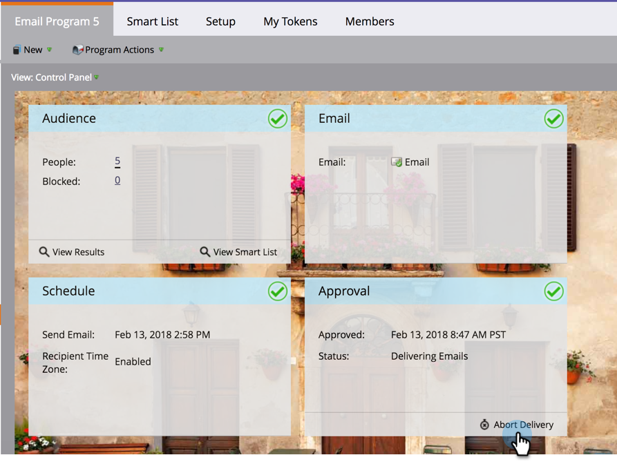

# Versand von E-Mail-Programmen mit Zeitzone des Empfängers abbrechen {#abort-delivery-of-email-programs-scheduled-with-recipient-time-zone}

In Notfällen können Sie den Versand eines E-Mail-Programms abbrechen, das bereits mit aktivierter Zeitzone des Empfängers ausgeführt wird.

Da E-Mail-Programme, die mit der Zeitzone des Empfängers geplant sind, bis zu 24 Stunden laufen können, werden bei Abbruch der Programmauslieferung alle nachfolgenden Sendungen nach diesem Zeitpunkt abgebrochen.

1. Wählen Sie das E-Mail-Programm aus, das Sie abbrechen möchten, und klicken Sie dann unter der Kachel **[!UICONTROL Validierung]** im Control Panel auf [!UICONTROL Versand abbrechen].

   

1. Bestätigen Sie, dass Sie den Versand abbrechen möchten, indem Sie auf **[!UICONTROL Abbrechen]** klicken.

   

1. Nach dem Abbruch sieht **[!UICONTROL Raster]** Ergebnisse“ Ihres E-Mail-Programms in etwa wie folgt aus: Alle nachfolgenden Sendungen werden abgebrochen und in der Spalte **[!UICONTROL Aktivitätstyp“ als „E-Mail-Softbounce]** angezeigt.

   

   >[!NOTE]
   >
   >Abgebrochene E **Mails werden (**) als Softbounce angezeigt *bis)* dem Zeitpunkt, zu dem sie ursprünglich in ihren jeweiligen Zeitzonen zugestellt werden sollten. Bis zu diesem Zeitpunkt werden sie weiterhin als „E-Mail senden“ angezeigt.

1. Im Raster können Sie auf eine beliebige E-Mail klicken, um Aktivitätsdetails anzuzeigen. Bei einem abgebrochenen Versand sieht das Popup-Fenster mit den Details wie folgt aus:

   

>[!MORELIKETHIS]
>
>* [Informationen zur Zeitzone des Empfängers](/help/marketo/product-docs/email-marketing/email-programs/email-program-actions/scheduling-with-recipient-time-zone/understanding-recipient-time-zone.md)
>* [Planen von E-Mail-Programmen mit Zeitzone des Empfängers](/help/marketo/product-docs/email-marketing/email-programs/email-program-actions/scheduling-with-recipient-time-zone/schedule-email-programs-with-recipient-time-zone.md)
