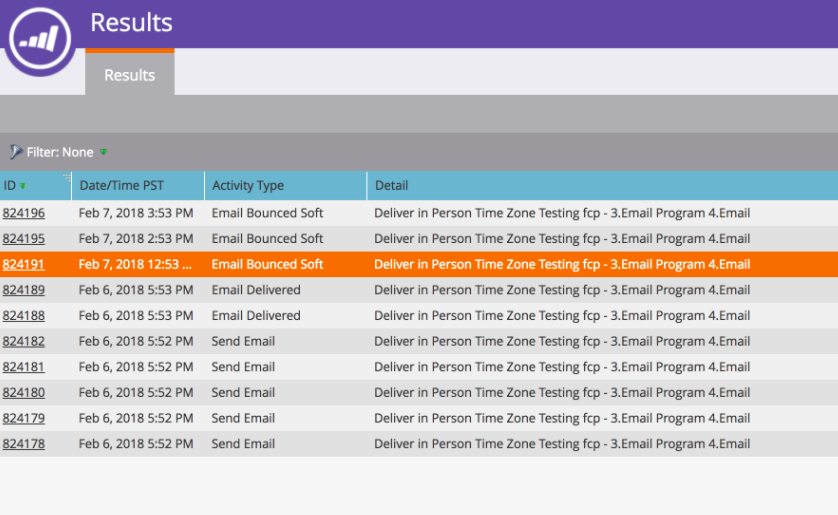

# Abbruch des Versands von E-Mail-Programmen, die mit der Zeitzone des Empfängers {#abort-delivery-of-email-programs-scheduled-with-recipient-time-zone} geplant sind

In Notfällen können Sie den Versand eines E-Mail-Programms abbrechen, das bereits mit aktivierter Zeitzone für den Empfänger ausgeführt wurde.

Da E-Mail-Programm, die mit der Zeitzone des Empfängers geplant sind, bis zu 24 Stunden lang ausgeführt werden können, werden nach diesem Zeitpunkt alle nachfolgenden Sends abgebrochen, wenn der Versand des Programms abgebrochen wird.

1. Wählen Sie das E-Mail-Programm aus, das Sie abbrechen möchten, und klicken Sie dann auf **Versand abbrechen** unter der Genehmigungskachel im Steuerungsbedienfeld.

   

1. Vergewissern Sie sich, dass Sie den Versand abbrechen möchten, indem Sie auf **Abbrechen** klicken.

   

1. Nach der Stornierung sieht das Raster **Ergebnisse** Ihres E-Mail-Programms etwa wie folgt aus. Alle nachfolgenden Sends werden abgebrochen und in der Spalte **Aktivität Typ** als &quot;E-Mail-Bounced Soft&quot; angezeigt.

   

   >[!NOTE]
   >
   >Abgebrochene E-Mails werden erst dann als Soft Bounce *angezeigt, wenn* ursprünglich geplant war, dass sie in den entsprechenden Zeitzonen zugestellt werden. **** Bis zu diesem Zeitpunkt werden sie weiterhin als &quot;E-Mail senden&quot;angezeigt.

1. Im Raster können Sie auf jede beliebige E-Mail-Aktivität klicken, um Details zur Ansicht anzuzeigen. Bei einem abgebrochenen Senden sieht das Popup für Details wie folgt aus:

   

>[!MORELIKETHIS]
>
>* [Die Zeitzone des Empfängers](/help/marketo/product-docs/email-marketing/email-programs/email-program-actions/scheduling-with-recipient-time-zone/understanding-recipient-time-zone.md)
>* [E-Mail-Programm mit Zeitzone des Empfängers planen](/help/marketo/product-docs/email-marketing/email-programs/email-program-actions/scheduling-with-recipient-time-zone/schedule-email-programs-with-recipient-time-zone.md)

