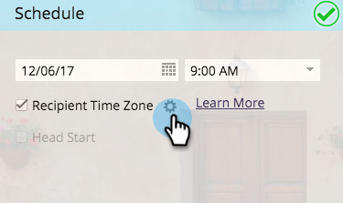
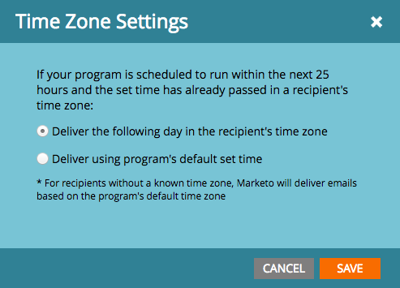
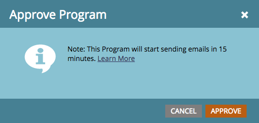

# Planen von E-Mail-Programmen mit Zeitzone der Empfängerin bzw. des Empfängers {#schedule-email-programs-with-recipient-time-zone}

Wenn ein E-Mail-Programm geplant wird, während die Zeitzone des Empfängers aktiviert ist, gibt es zwei mögliche Szenarien:

1. Planen der Ausführung des Programms **innerhalb** nächsten 25 Stunden
1. Planung der Programmausführung (**25** in der Zukunft (d. h. nächste Woche)

## Szenario 1: Innerhalb von 25 Stunden {#scenario-within-hours}

Angenommen, Sie genehmigen ein E-Mail-Programm mit aktivierter Zeitzone des Empfängers und geplanter Versandzeit innerhalb der nächsten 25 Stunden. In Ihrer Smart-Liste befinden sich möglicherweise Personen, die in Zeitzonen leben, in denen die geplante Zeit bereits vergangen ist.

In diesem Szenario können Sie entscheiden, was mit dieser Untergruppe qualifizierter Personen getan werden soll. Klicken Sie auf das Zahnradsymbol neben **[!UICONTROL Zeitzone des Empfängers]** in der Kachel **[!UICONTROL Zeitplan]** des E-Mail-Programms.

Dies bietet Ihnen zwei Optionen:

>[!NOTE]
>
>**Definition**
>
>* **[!UICONTROL Versand am folgenden Tag in der Zeitzone des Empfängers]**: Wenn die E-Mail für Dienstag um 9 Uhr :00am geplant ist, erhalten qualifizierte Personen, die in Zeitzonen leben, in denen die geplante Zeit bereits verstrichen ist, die E-Mail am *Mittwoch* um 9 :00am.
>
>* **[!UICONTROL Versand über die im Programm standardmäßig festgelegte Zeit]**: Wenn die E-Mail am Dienstag um 9 Uhr :00am ausgeführt werden soll, erhalten qualifizierte Personen, die in Zeitzonen leben, in denen die geplante Zeit bereits verstrichen ist, die E-Mail *basierend auf Ihren Einstellungen für die Zeitzone Ihres Abonnements*. Wenn Ihre [Zeitzoneneinstellungen für das Abonnement](/help/marketo/product-docs/administration/settings/select-your-language-locale-and-time-zone.md) also auf PDT America/Los Angeles eingestellt sind, erhalten diese Empfänger die E-Mail immer noch am Dienstag um 9:00amPDT (unabhängig von der Zeit, die in ihren eigenen Zeitzonen liegt).

>[!NOTE]
>
>[Weitere Informationen](/help/marketo/product-docs/email-marketing/email-programs/email-program-actions/scheduling-with-recipient-time-zone/understanding-recipient-time-zone.md#calculating-time-zone) wie Marketo die Zeitzonen für Empfänger berechnet.

Betrachten wir dieses Szenario genauer. Angenommen, Sie sind in San Francisco und planen eine E-Mail um 7 :00am für einen **9:00am**-Versand. In Ihrer Smart-Liste befinden sich Personen aus den folgenden Regionen:

* San Francisco
* Texas
* New York
* Italien

9:00am ist bereits in New York und Italien vergangen, sodass qualifizierte Personen in diesen beiden Zeitzonen die E-Mail auf der Grundlage der **Zeitzoneneinstellungen** erhalten:

* **[!UICONTROL Versand am folgenden Tag in der Zeitzone des Empfängers]:** Mittwoch um 9:00am in der jeweiligen Zeitzone, **OR**

* **[!UICONTROL Versand erfolgt über die standardmäßig eingestellte Zeit des Programms]**: Dienstag um 9:00am.00 Uhr MEZ (New York - 12:00pm MEZ und Italien - 6 :00pm MEZ).

Sobald Sie Ihr Programm genehmigt haben, wird es innerhalb von 15 Minuten ausgeführt.

>[!NOTE]
>
>Obwohl das Programm den *Prozess* des E-Mail-Versands in 15 Minuten startet, werden E *Mails zu diesem* nicht zugestellt. Die Empfänger erhalten weiterhin E-Mails auf der Grundlage **[!UICONTROL von Ihnen]** Zeitzoneneinstellungen.

## Szenario 2: Mehr als 25 Stunden {#scenario-more-than-hours}

In diesem zweiten Szenario genehmigen Sie ein E-Mail-Programm mit **[!UICONTROL Zeitzone des Empfängers]** und einer geplanten Versandzeit, die mehr als 25 Stunden in der Zukunft liegt. In diesem Fall startet das Programm zur geplanten Zeit in der (**)** Zeitzone der Welt (UTC + 14:00). Es kann Personen geben, die sich für Ihre Smart-Liste qualifizieren, und zwar in jeder Zeitzone auf der ganzen Welt. Wenn wir also in der frühesten Zeitzone beginnen, können wir die E-Mail zum geplanten Datum/zur geplanten Uhrzeit an alle Empfänger in ihren jeweiligen Zeitzonen senden.

**Kopfstart**

Sprechen wir nun darüber, wie [[!UICONTROL Kopfstart]](/help/marketo/product-docs/email-marketing/email-programs/email-program-actions/head-start-for-email-programs.md) mit der **[!UICONTROL Zeitzone des Empfängers“]**. Unsere bestehende Head Start-Funktion erfordert, dass das Programm mindestens 12 Stunden im Voraus geplant wird. Was bedeutet das nun für die Zeitzone des Empfängers? Denken Sie daran, dass wir bei aktivierter Zeitzone des Empfängers das E-Mail-Programm zum geplanten Zeitpunkt in der frühesten Zeitzone ausführen (UTC +14:00). Um also (**)**- und Empfängerzeitzone zu aktivieren, müssen E-Mail-Programme geplant werden **mindestens 12 Stunden vor der geplanten Zeit in UTC +14:00.**

Wenn Sie also in Amerika/Los Angeles sind und sowohl die Zeitzone „Head Start“ als auch die Zeitzone „Empfänger“ aktivieren möchten, müssen Sie das Programm **34 Stunden)**. Wie sind wir zu dieser Nummer gekommen?

  

Kurz gesagt: E-Mail-Programme, die mit der Zeitzone des Empfängers geplant sind, müssen zur geplanten Zeit in der frühesten Zeitzone ausgeführt werden (d. h., wenn sie zuerst Mitternacht erreichen), um jede Zeitzone aufzunehmen. Wenn Sie also ein E-Mail-Programm planen…

* **Mit einer Lieferzeit *innerhalb* 25 Stunden** beginnt das Programm innerhalb von 15 Minuten zu laufen. Empfänger, die die geplante Zeit bereits überschritten haben, erhalten die E-Mail basierend auf den von Ihnen ausgewählten Zeitzoneneinstellungen.
* **mit einer Lieferzeit *mehr als* 25 Stunden in der Zukunft** startet das Programm zur geplanten Zeit in der frühesten Zeitzone (UTC +14 :00).
* **mit Head Start** beginnt das Programm 12 Stunden vor der geplanten Zeit in der frühesten Zeitzone mit der Verarbeitung (UTC +14:00).

>[!CAUTION]
>
>Jeder, der sich zwischen dem Beginn des E-Mail-Versands und dem tatsächlichen Versand abmeldet, erhält weiterhin die E-Mail. Es wird empfohlen, die Abmelde-Benachrichtigung anzupassen, um zu erklären, dass die Verarbeitung von Abmeldungen 1-2 Werktage dauern kann.

>[!MORELIKETHIS]
>
>* [Informationen zur Zeitzone des Empfängers](/help/marketo/product-docs/email-marketing/email-programs/email-program-actions/scheduling-with-recipient-time-zone/understanding-recipient-time-zone.md)
>* [Head Start für E-Mail-Programme](/help/marketo/product-docs/email-marketing/email-programs/email-program-actions/head-start-for-email-programs.md)
>* [Abbruch des Versands von E-Mail-Programmen mit geplanter Zeitzone des Empfängers](/help/marketo/product-docs/email-marketing/email-programs/email-program-actions/scheduling-with-recipient-time-zone/abort-delivery-of-email-programs-scheduled-with-recipient-time-zone.md)
