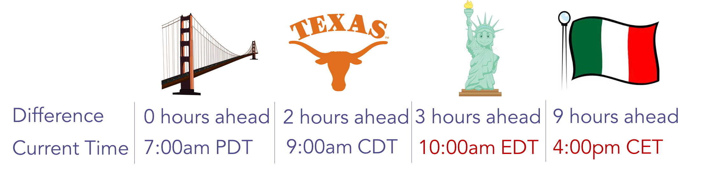

# E-Mail-Programme mit der Zeitzone der Empfänger planen {#schedule-email-programs-with-recipient-time-zone}

Es gibt zwei mögliche Szenarien bei der Planung eines E-Mail-Programms, während die Zeitzone des Empfängers aktiviert ist:

1. Programmausführung planen **Innerhalb** die nächsten 25 Stunden
1. Programmausführung planen **more** über 25 Stunden in der Zukunft (d. h. nächste Woche)

## Szenario 1: Innerhalb von 25 Stunden {#scenario-within-hours}

Angenommen, Sie genehmigen ein E-Mail-Programm mit aktivierter Zeitzone der Empfänger und einer geplanten Versandzeit innerhalb der nächsten 25 Stunden. Möglicherweise befinden sich Personen in Ihrer intelligenten Liste in Zeitzonen, in denen die geplante Zeit bereits verstrichen ist.

In diesem Szenario können Sie entscheiden, was mit dieser Untergruppe qualifizierter Personen zu tun ist. Klicken Sie auf das Zahnradsymbol neben **Zeitzone des Empfängers** im **Zeitplan** Kachel des E-Mail-Programms.

Zwei Optionen stehen zur Verfügung:

>[!NOTE]
>
>**Definition**
>
>* **Den folgenden Tag in der Zeitzone des Empfängers bereitstellen**: Wenn die E-Mail am Dienstag um 9:00 Uhr ausgehen soll, erhalten qualifizierte Personen, die in Zeitzonen leben, in denen die geplante Zeit bereits verstrichen ist, die E-Mail an *Mittwoch* um 9:00 Uhr.
>
>* **Bereitstellung mit der Standardeinstellung des Programms**: Wenn die E-Mail am Dienstag um 9:00 Uhr ausgehen soll, erhalten qualifizierte Personen, die in Zeitzonen leben, in denen die geplante Zeit bereits verstrichen ist, die E-Mail _basierend auf Ihren Zeitzoneneinstellungen für Abonnements_. Wenn Ihr [Zeitzoneneinstellungen für Abonnements](/help/marketo/product-docs/administration/settings/select-your-language-locale-and-time-zone.md) auf PDT America/Los Angeles eingestellt sind, erhalten diese Empfänger die E-Mail am Dienstag um 9:00 Uhr PDT (egal zu welcher Zeit sie in ihrer eigenen Zeitzone liegen).

>[!NOTE]
>
>[Weitere Infos](/help/marketo/product-docs/email-marketing/email-programs/email-program-actions/scheduling-with-recipient-time-zone/understanding-recipient-time-zone.md#calculating-time-zone) darüber, wie Marketo Zeitzonen für Empfänger berechnet.

Betrachten wir dieses Szenario genauer. Angenommen, Sie sind in San Francisco und planen eine E-Mail um 7:00 Uhr für eine **9:00 Uhr** senden. In Ihrer intelligenten Liste befinden sich Personen aus den folgenden Regionen:

* San Francisco
* Texas
* New York
* Italien

9:00 Uhr ist bereits in New York und Italien vergangen, sodass qualifizierte Personen in diesen beiden Zeitzonen die E-Mail auf der Basis der **Zeitzoneneinstellungen**:

* **Geben Sie den folgenden Tag in die Zeitzone des Empfängers ein:** Mittwoch um 9:00 Uhr in den jeweiligen Zeitzonen, **ODER**

* **Bereitstellung mit der Standardeinstellung des Programms**: Dienstag um 9:00 Uhr PDT (New York - 22:00 Uhr EDT und Italien - 18:00 Uhr CET).

Sobald Sie Ihr Programm validieren, wird es innerhalb von 15 Minuten ausgeführt.

>[!NOTE]
>
>Obwohl das Programm die _Prozess_ E-Mails innerhalb von 15 Minuten versenden, werden _geliefert_ zu diesem Zeitpunkt. Die Empfänger erhalten weiterhin E-Mails auf der Basis der **Zeitzoneneinstellungen** auswählen.

## Szenario 2: Mehr als 25 Stunden {#scenario-more-than-hours}

In diesem zweiten Szenario genehmigen Sie ein E-Mail-Programm mit **Zeitzone des Empfängers** aktiviert ist und eine geplante Versandzeit von mehr als 25 Stunden in der Zukunft beträgt. In diesem Fall wird das Programm zur geplanten Zeit im **frühestens** Zeitzone in der Welt (UTC + 14:00). Es kann Personen geben, die sich für Ihre Smart-Liste in jeder Zeitzone auf der ganzen Welt qualifizieren. Deshalb können wir mit der frühesten Zeitzone die E-Mail zum geplanten Datum/zur geplanten Uhrzeit an alle Empfänger in ihrer jeweiligen Zeitzone senden.

**Head Start**

Sprechen wir nun darüber, wie [Head Start](/help/marketo/product-docs/email-marketing/email-programs/email-program-actions/head-start-for-email-programs.md) arbeitet mit **Zeitzone des Empfängers**. Für unsere bestehende Head Start-Funktion muss das Programm mindestens 12 Stunden im Voraus geplant werden. Was bedeutet das für die Zeitzone der Empfänger? Wenn die Zeitzone des Empfängers aktiviert ist, starten wir die Ausführung des E-Mail-Programms zum geplanten Zeitpunkt in der frühesten Zeitzone (UTC +14:00). Um **both** Head Start und Empfänger Time Zone, E-Mail-Programme müssen geplant werden **mindestens 12 Stunden vor der geplanten Zeit in UTC +14:00.**

Wenn Sie sich also in Amerika/Los Angeles befinden und sowohl Head Start als auch Recipient Time Zone aktivieren möchten, müssen Sie das Programm planen **34 Stunden** im Voraus. Wie sind wir auf diese Zahl gekommen?

  

Kurz gesagt, E-Mail-Programme, die mit der Zeitzone des Empfängers geplant sind, müssen zur geplanten Zeit in der frühesten Zeitzone ausgeführt werden (d. h., wo sie zuerst Mitternacht erreichen), um jede Zeitzone aufzunehmen. Wenn Sie also ein E-Mail-Programm planen...

* **mit Versandzeit _Innerhalb_ 25 Stunden**, beginnt das Programm innerhalb von 15 Minuten. Empfänger, die die geplante Zeit bereits überschritten haben, erhalten die E-Mail entsprechend den von Ihnen ausgewählten Zeitzoneneinstellungen.
* **mit Versandzeit _mehr als_ 25 Stunden in der Zukunft**, beginnt das Programm zur geplanten Zeit in der frühesten Zeitzone (UTC +14:00).
* **mit Head Start**, beginnt das Programm die Verarbeitung 12 Stunden vor der geplanten Zeit in der frühesten Zeitzone (UTC +14:00).

>[!CAUTION]
>
>Jeder, der sich zwischen dem Beginn des E-Mail-Versands und dem tatsächlichen Versand abmeldet, erhält weiterhin die E-Mail. Es wird empfohlen, Ihre Abmelde-Benachrichtigung so anzupassen, dass die Verarbeitung von Abmeldungen 1-2 Werktage dauern kann.

>[!MORELIKETHIS]
>
>* [Verstehen der Zeitzone eines Empfängers](/help/marketo/product-docs/email-marketing/email-programs/email-program-actions/scheduling-with-recipient-time-zone/understanding-recipient-time-zone.md)
>* [Abteilungsstart für E-Mail-Programme](/help/marketo/product-docs/email-marketing/email-programs/email-program-actions/head-start-for-email-programs.md)
>* [Abbruch des Versands von E-Mail-Programmen, die mit der Zeitzone des Empfängers geplant sind](/help/marketo/product-docs/email-marketing/email-programs/email-program-actions/scheduling-with-recipient-time-zone/abort-delivery-of-email-programs-scheduled-with-recipient-time-zone.md)

