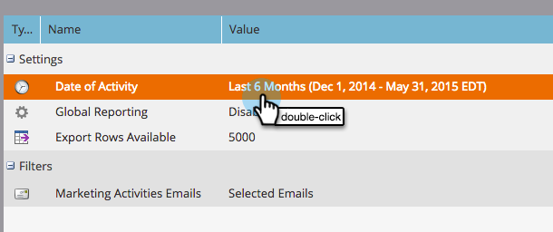

# E-Mail-Link-Leistungsbericht {#email-link-performance-report}

Erstellen Sie einen E-Mail-Link-Leistungsbericht, um zu sehen, wie gut die Links in Ihren E-Mails funktionieren.

1. [Erstellen Sie einen Bericht in einem Programm](/help/marketo/product-docs/reporting/basic-reporting/creating-reports/create-a-report-in-a-program.md) und wählen Sie **[!UICONTROL E-Mail-Link]** Leistung) als Berichtstyp aus.

   

1. Klicken Sie **[!UICONTROL Setup]**.

   

1. Doppelklicken Sie auf **[!UICONTROL Datum der Aktivität]** unter **[!UICONTROL Einstellungen]**.

   

1. Legen Sie einen geeigneten Zeitrahmen für Ihren Bericht fest. Klicken Sie auf **[!UICONTROL Speichern]**.

   

1. Klicken Sie auf **[!UICONTROL Bericht]**.

   

1. Sehr gut! Jetzt haben Sie einen E-Mail-Link-Leistungsbericht erstellt.

   

[Spalten verfügbar](/help/marketo/product-docs/reporting/basic-reporting/editing-reports/select-report-columns.md) für einen E-Mail-Link-Leistungsbericht enthalten:

<table> 
 <thead> 
  <tr> 
   <th colspan="1" rowspan="1">[!UICONTROL Column]</th> 
   <th colspan="1" rowspan="1">Beschreibung</th> 
  </tr> 
 </thead> 
 <tbody> 
  <tr> 
   <td colspan="1" rowspan="1">[!UICONTROL Link]</td> 
   <td colspan="1" rowspan="1">Gruppiert nach E-Mail-Name. Klicken Sie auf das Pluszeichen (+), um alle in dieser E-Mail enthaltenen Links anzuzeigen.</td> 
  </tr> 
  <tr> 
   <td colspan="1" rowspan="1">[!UICONTROL Klicks]</td> 
   <td colspan="1" rowspan="1">Die Anzahl der Klicks auf diesen Link.</td> 
  </tr> 
  <tr> 
   <td colspan="1" rowspan="1">% [!UICONTROL Klicks]</td> 
   <td colspan="1" rowspan="1">Prozentsatz der gesamten Klicks auf alle Links in dieser E-Mail für diesen Link.</td> 
  </tr> 
  <tr> 
   <td colspan="1" rowspan="1">[!UICONTROL Personen]</td> 
   <td colspan="1" rowspan="1">Die Anzahl der Einzelpersonen, die auf den Link geklickt haben.</td> 
  </tr> 
  <tr> 
   <td colspan="1" rowspan="1">% [!UICONTROL Personen]</td> 
   <td colspan="1" rowspan="1">Prozentualer Anteil der eindeutigen Personen, die auf Links in dieser E-Mail geklickt haben, an diesem Link.</td> 
  </tr> 
 </tbody> 
</table>

>[!NOTE]
>
>Dieser Bericht zeigt einen „falsch formatierten Link“ an, wenn einer E-Mail ungültige/leere Links hinzugefügt werden. Wenn diese Meldung angezeigt wird[ prüfen Sie im E-](/help/marketo/product-docs/email-marketing/general/functions-in-the-editor/edit-an-emails-html.md)-Editor die HTML-Quelle auf leere Links oder Token, die keinen vollständigen Link ausfüllen.

>[!TIP]
>
>Wenn Sie genau wissen möchten, was eine einzelne Person getan hat, können Sie das [Aktivitätsprotokoll](/help/marketo/product-docs/core-marketo-concepts/smart-lists-and-static-lists/managing-people-in-smart-lists/filter-activity-types-in-the-activity-log-of-a-person.md) auf der Seite [Personendetails](/help/marketo/product-docs/core-marketo-concepts/smart-lists-and-static-lists/managing-people-in-smart-lists/using-the-person-detail-page.md) auf der Registerkarte Mitglieder des Programms öffnen.

>[!MORELIKETHIS]
>
>* [E-Mail-Leistungsbericht](/help/marketo/product-docs/email-marketing/email-programs/email-program-data/email-performance-report.md)
>* [Filtern von Assets in einem E-Mail-Bericht](/help/marketo/product-docs/reporting/basic-reporting/report-activity/filter-assets-in-an-email-report.md)
